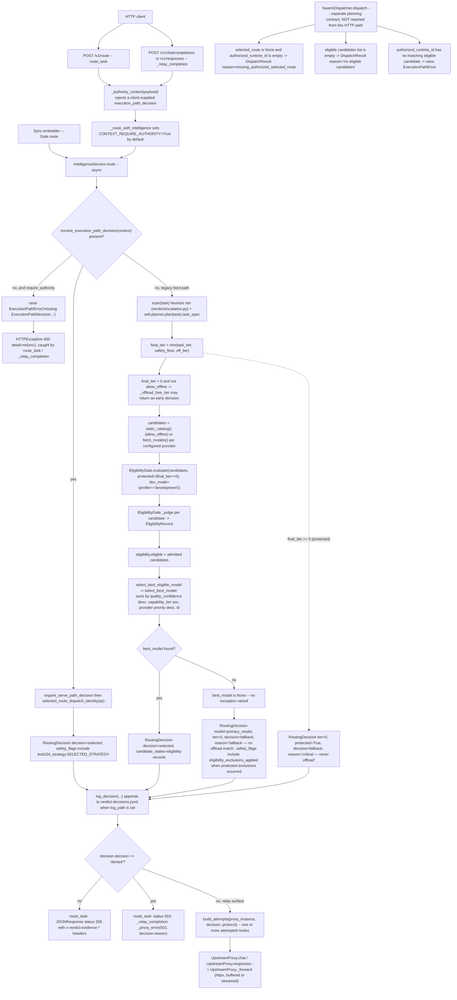
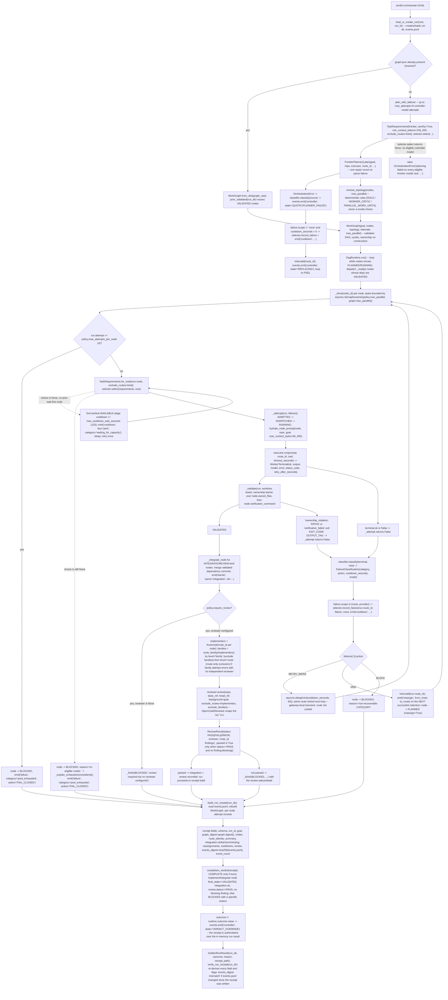

<div align="center">

# Verdict

**A model that fails a safety check cannot be scored back in.**

Verdict is a fail-closed control plane for LLM routing. A hard eligibility gate runs before
any advisory ranking, every dropped candidate carries one of eight named reasons, and every
orchestration run ends in a receipt whose event log is hash-verified after the fact.

[](https://github.com/mrnicholasbcarter-code/verdict-core/actions/workflows/ci.yml)
[](https://github.com/mrnicholasbcarter-code/verdict-core/actions/workflows/security.yml)
[](.github/workflows/ci.yml)
[](pyproject.toml)
[](pyproject.toml)
[](LICENSE)

[Quick start](#quick-start) · [How it works](#how-it-works) · [How Verdict differs](#how-verdict-differs) · [Proof](#proof) · [Install](#install) · [Commands](#commands) · [Docs](#documentation) · [Limits](#limits)

</div>

## Quick start

Run the credential-free fixture from an empty directory, with no API key, no gateway, and no
network access:

```bash
verdict quickstart --non-interactive --dry-run
```

The fixture makes one deterministic routing decision, selects `demo/frontier-tools`, and
names every excluded candidate:

```text
Verdict credential-free quickstart
===================================
Task: Add structured output to the invoice parser
Required capabilities: structured_output, tools
Selected route: demo/frontier-tools
Excluded candidates: 3
Receipt: fixture:issue-35 (deterministic_fixture)
Status: PASS
- demo/no-tools: missing capability: tools
- demo/quota-empty: quota exhausted
- demo/unverified: health unknown
```

Read the last three lines first: `demo/frontier-tools` was selected, and each of the other
three candidates was refused with a named reason (`missing capability: tools`, `quota
exhausted`, `health unknown`). Nothing here calls a provider, reads a credential, or writes
state. The executable source and its regression test are
[`verdict/flagship_demo.py`](verdict/flagship_demo.py) and
[`tests/test_flagship_demo.py`](tests/test_flagship_demo.py); the test asserts this exact
block byte-for-byte against the README.

For a contributor checkout:

```bash
uv sync --extra dev
uv run python -m verdict quickstart --non-interactive --dry-run
```

## Five things this codebase actually does

Each links to the code that does it, at this commit.

1. **The cheaper-first invariant is a runtime assertion, not a lint rule.** `RouteSelection`
   raises in its own constructor if a paid identity was chosen while a cheaper qualified one
   was available, and the same invariant is checked a second, independent way at demo time.
   [`verdict/live_routing.py:85-93`](verdict/live_routing.py#L85-L93) (`RouteSelection.__post_init__`,
   raises `LiveRoutingError("cost", ...)`), [`verdict/routing_demo.py:132-141`](verdict/routing_demo.py#L132-L141)
   (`assert_cheaper_first`, raises `RuntimeError("paid selected while cheaper qualified kept
   exists")`), called at [`verdict/routing_demo.py:286`](verdict/routing_demo.py#L286).

2. **Tamper-evident receipts that actually detect tampering.** Every orchestration run
   receipt stores a SHA-256 digest of its `events.jsonl`. Verification recomputes that hash
   and rebuilds every other field from the same event log, reporting `events_digest mismatch:
   events.jsonl changed after receipt was written` if anything moved.
   [`verdict/orchestration/receipt.py:173`](verdict/orchestration/receipt.py#L173) (`_sha256_file`),
   [`:444`](verdict/orchestration/receipt.py#L444) (`events_digest` written into the receipt),
   [`:481-508`](verdict/orchestration/receipt.py#L481-L508) (`verify_run_receipt`, the diff loop).

3. **A six-stage admission ladder that records exactly where each candidate died.**
   `DISCOVERED → ENTITLED → HEALTHY → AVAILABLE → TASK_ELIGIBLE → SELECTED`, with a
   `failed_stage` and a `reason` string recorded per candidate, and opaque router ids (`auto/*`,
   `combo/*`, `router/*`, `virtual/*`) skipped before stage one.
   [`verdict/orchestration/contracts.py:287-295`](verdict/orchestration/contracts.py#L287-L295)
   (`EligibilityStage`), [`verdict/orchestration/eligibility.py:23`](verdict/orchestration/eligibility.py#L23)
   (`_OPAQUE_PREFIXES`), [`:358-362`](verdict/orchestration/eligibility.py#L358-L362) (opaque ids
   never reach `DISCOVERED`), [`:271-330`](verdict/orchestration/eligibility.py#L271-L330) (every
   named failure reason down the ladder).

4. **Independent review with credentials the reviewer can't leak.** The reviewer model is
   selected with every implementer's route and model family excluded, so the code is never
   reviewed by the model that wrote it. A non-zero exit, a timeout, or unparseable output all
   become `ERROR`, never a false `PASS`. The reviewer CLI runs with an isolated `$HOME` so the
   user's global config is never mutated and the API key never reaches the repo, argv, or logs.
   [`verdict/orchestration/review.py:1-19`](verdict/orchestration/review.py#L1-L19) (module
   docstring states all three guarantees), [`tests/test_orch_review.py`](tests/test_orch_review.py).

5. **Recovery that terminates in a refusal instead of retrying forever.** A node's own retry
   loop resolves to exactly one outcome per failure: retry the same route on a gateway-local
   transient (`RETRY_INFRA`), reassign to a different route (the default), or stop with
   `non-recoverable: <category>` when the classifier says `BLOCK`. Exhausting
   `max_attempts_per_node` (4) also ends in a `pool_exhausted` / `FAIL_CLOSED` failure event,
   not a silent hang.
   [`verdict/orchestration/runtime.py:87`](verdict/orchestration/runtime.py#L87)
   (`max_attempts_per_node: int = 4`), [`:342-355`](verdict/orchestration/runtime.py#L342-L355)
   (attempt-budget exhaustion → `FAIL_CLOSED`), [`:442-451`](verdict/orchestration/runtime.py#L442-L451)
   (`RETRY_INFRA` / reassign / `BLOCK` branching).

## How it works

A single `verdict orchestrate` call runs the full pipeline:

```
goal
 └─ CONTROLLER  frontier planner decomposes into a WorkGraph (DAG)
     └─ PLAN / DAG  topology chosen deterministically (SOLO / WORKER_CRITIC / PARALLEL_WORK_UNITS)
         └─ SELECT  per-node eligibility ladder
             │  DISCOVERED → ENTITLED → HEALTHY → AVAILABLE → TASK_ELIGIBLE → SELECTED
             └─ WORKERS  parallel execution; each node gets its own worktree + route
                 └─ RECOVERY  quota / rate-limit / timeout → same-node reroute → pool exhaustion → FAIL_CLOSED
                     └─ VERIFY  ownership check + per-node tests + integration barrier
                         └─ REVIEW  independent OCR (open-code-review); reviewer excluded from all implementer routes
                             └─ RECEIPT  SHA-256 digest of the event log; `run-receipt` re-verifies it
```

Three-role split:

| Role | Responsibility |
|---|---|
| **Verdict** | plans, selects models, recovers from faults, verifies, writes receipts |
| **Prime Agent harness** | runs worker processes (`prime-agent -p --model <exact route>`); does not select models |
| **OmniRoute transport** | provides `/v1/models` inventory and `/v1/chat/completions` execution; is not a metadata source of truth |

Four properties hold by construction:

- **Paid is never chosen while a cheaper qualified candidate remains.** `RouteSelection`
  raises on construction if this is violated.
- **Every dropped candidate carries a named reason** — `policy`, `health`, `capability`,
  `quota`, `stale`, `opaque_mix`, `cost`, or `unclassified`.
- **Opaque `auto/*` references are not candidates.** They resolve to an unknown model at call
  time and are dropped.
- **An unreachable surface produces `blocked`, not a pass.** Fixture data cannot satisfy a
  live proof.

Orchestration is specified in [ADR-036](docs/adr/ADR-036-goal-to-receipt-orchestration.md).
ADR-023 (governed swarm supervision) is superseded.

Three of the six verified diagrams below; the other three
([ecosystem](diagrams/ecosystem.mmd), [explain-flow](diagrams/explain-flow.mmd),
[setup-detection-flow](diagrams/setup-detection-flow.mmd)) are linked rather than embedded.
Every diagram carries a header comment listing the exact source files it reflects, and
[`tests/test_diagrams.py`](tests/test_diagrams.py) checks that every named source file and
function actually exists.

<details>
<summary><strong>route-flow</strong> — <code>POST /v1/route</code> and the OpenAI-compatible relay surfaces</summary>


```mermaid
%% route-flow.mmd -- POST /v1/route and the OpenAI-compatible relay surfaces
%% Source (verified against code at this commit):
%%   verdict/api.py (route_task, _authority_context, _route_with_intelligence, _relay_completion)
%%   verdict/intelligence.py (IntelligenceService.route)
%%   verdict/eligibility.py (EligibilityGate.evaluate, _judge)
%%   verdict/router.py (select_best_model, select_best_eligible_model)
%%   verdict/proxy.py (UpstreamProxy.chat/.responses/._forward)
%%   verdict/dispatcher.py (SwarmDispatcher.dispatch -- separate planning contract, not on this HTTP path)
flowchart TD
    CLIENT["HTTP client"] --> POST["POST /v1/route -- route_task"]
    CLIENT --> RELAY["POST /v1/chat/completions or /v1/responses -- _relay_completion"]
    EMBED["Sync embedder -- Gate.route"] --> ISVC

    POST --> AUTHCTX["_authority_context(payload) rejects a client-supplied execution_path_decision"]
    AUTHCTX --> RWI["_route_with_intelligence sets CONTEXT_REQUIRE_AUTHORITY=True by default"]
    RWI --> ISVC["IntelligenceService.route -- async"]
    RELAY --> AUTHCTX

    ISVC --> EP{"resolve_execution_path_decision(context) present?"}
    EP -- yes --> AUTHREQ["require_serve_path_decision then selected_route_dispatch_identity(ep)"]
    AUTHREQ --> DEC104["RoutingDecision decision=selected, safety_flags include bod104_strategy:SELECTED_STRATEGY"]
    EP -- "no, and require_authority" --> EPERR["raise ExecutionPathError('missing ExecutionPathDecision...')"]
    EPERR --> H400["HTTPException 400 detail=str(exc), caught by route_task / _relay_completion"]

    EP -- "no, legacy feed path" --> SCAN["scan(task) heuristic tier (verdict/escalation.py) + self.planner.plan(task).task_spec"]
    SCAN --> TIER["final_tier = min(task_tier, safety_floor, eff_tier)"]
    TIER --> OFFLOAD["final_tier > 0 and not allow_offline -> _offload_free_tier may return an early decision"]
    OFFLOAD --> CAND["candidates = static_catalog() (allow_offline) or fetch_models() per configured provider"]
    CAND --> GATE["EligibilityGate.evaluate(candidates, protected=(final_tier==0), dev_mode=(profile=='development'))"]
    GATE --> JUDGE["EligibilityGate._judge per candidate -> EligibilityRecord"]
    JUDGE --> ADMIT["eligibility.eligible = admitted candidates"]

    ADMIT --> RANK["select_best_eligible_model -> select_best_model: sorts by quality_confidence desc, capability_tier asc, provider priority desc, id"]
    RANK --> HASBEST{"best_model found?"}
    HASBEST -- yes --> DECSEL["RoutingDecision decision=selected, candidate_states=eligibility records"]
    HASBEST -- no --> FALLBACK["best_model is None -- no exception raised"]
    FALLBACK --> DECFB["RoutingDecision model=primary_model, tier=0, decision=fallback, reason='fallback — no offload match', safety_flags include eligibility_exclusions_applied when protected exclusions occurred"]
    TIER -. "final_tier == 0 (protected)" .-> DECPROT["RoutingDecision tier=0, protected=True, decision=fallback, reason='critical — never offload'"]

    DEC104 --> LOG["log_decision(...) appends to verdict-decisions.jsonl when log_path is set"]
    DECSEL --> LOG
    DECFB --> LOG
    DECPROT --> LOG
    LOG --> DENIED{"decision.decision == 'denied'?"}
    DENIED -- no --> R200["route_task: JSONResponse status 200 with x-verdict-evidence-* headers"]
    DENIED -- yes --> R503["route_task: status 503; _relay_completion: _proxy_error(503, decision.reason)"]

    DENIED -- "no, relay surface" --> FWD["build_attempts(proxy_instance, decision, protocol) -- one or more attempted routes"]
    FWD --> FORWARD["UpstreamProxy.chat / UpstreamProxy.responses -> UpstreamProxy._forward (httpx, buffered or streamed)"]

    DISP["SwarmDispatcher.dispatch -- separate planning contract, NOT reached from this HTTP path"]
    DISP --> DNOROUTE["selected_route is None and authorized_runtime_id is empty -> DispatchResult reason=missing_authorized_selected_route"]
    DISP --> DNOELIG["eligible candidates list is empty -> DispatchResult reason='no eligible candidates'"]
    DISP --> DMISMATCH["authorized_runtime_id has no matching eligible candidate -> raise ExecutionPathError"]
%% evidence: verdict/api.py:944 async def route_task(request, req)
%% evidence: verdict/api.py:909 def _authority_context(payload, *, task) -- rejects client execution_path_decision
%% evidence: verdict/api.py:923 async def _route_with_intelligence(...)
%% evidence: verdict/api.py:929,932 CONTEXT_REQUIRE_AUTHORITY imported from verdict.serve_path, merged.setdefault(..., True)
%% evidence: verdict/api.py:936-940,949-952 ExecutionPathError caught -> HTTPException(400, str(exc))
%% evidence: verdict/api.py:978 status_code = 200 if decision.decision != "denied" else 503
%% evidence: verdict/api.py:1427 async def _relay_completion(request, *, surface)
%% evidence: verdict/api.py:1515,1606,1608 decision.decision == "denied" branch; proxy_instance.responses / proxy_instance.chat
%% evidence: verdict/gate.py:115,152-155 class Gate.route delegates to self.intelligence.route (sync/async bridge)
%% evidence: verdict/intelligence.py:211,360 class IntelligenceService, async def route(...)
%% evidence: verdict/intelligence.py:392-403 resolve_execution_path_decision / require_serve_path_decision imported and called
%% evidence: verdict/intelligence.py:437 raise ExecutionPathError("missing ExecutionPathDecision; ...")
%% evidence: verdict/intelligence.py:30 from verdict.escalation import scan; :447 self.planner.plan(task_str, ...).task_spec
%% evidence: verdict/intelligence.py:476 final_tier = min(task_tier, safety_floor, eff_tier if eff_tier is not None else 3)
%% evidence: verdict/intelligence.py:478 self._offload_free_tier(...) called when final_tier > 0 and not allow_offline
%% evidence: verdict/intelligence.py:501,507 self.static_catalog() / fetch_models(name, cfg, self.discovery_ttl)
%% evidence: verdict/intelligence.py:514 self.eligibility_gate.evaluate(candidates, protected=(final_tier == 0), dev_mode=...)
%% evidence: verdict/intelligence.py:576-579 select_best_eligible_model(eligibility, final_tier, self.providers) if eligibility is not None else select_best_model(candidates, final_tier, self.providers)
%% evidence: verdict/intelligence.py:623-644 final_tier == 0 or not best_model -> fallback RoutingDecision (decision="fallback" if best_model is None else "selected")
%% evidence: verdict/eligibility.py:143,165,189 class EligibilityGate, def evaluate, def _judge
%% evidence: verdict/router.py:7 select_best_model / router.py:44 select_best_eligible_model
%% evidence: verdict/proxy.py:199 async def chat / proxy.py:205 async def responses / proxy.py:223 async def _forward
%% evidence: verdict/dispatcher.py:135,147 class SwarmDispatcher, def dispatch
%% evidence: verdict/dispatcher.py:181-195 missing_authorized_selected_route / "no eligible candidates"
%% evidence: verdict/dispatcher.py:198-206 authorized_runtime_id mismatch -> raise ExecutionPathError
```

</details>

<details>
<summary><strong>eligibility-ladder</strong> — DISCOVERED → ENTITLED → HEALTHY → AVAILABLE → TASK_ELIGIBLE → SELECTED</summary>

```mermaid
%% eligibility-ladder.mmd -- DISCOVERED -> ENTITLED -> HEALTHY -> AVAILABLE -> TASK_ELIGIBLE -> SELECTED
%% Source (verified against code at this commit):
%%   verdict/orchestration/contracts.py (EligibilityStage, RouteVerdict, TaskRequirements)
%%   verdict/orchestration/eligibility.py (EligibilityLadder._assess, _task_gate, select, _rank_key, cooldown_seconds_for)
stateDiagram-v2
    direction TB
    [*] --> DISCOVERED

    DISCOVERED : present in the inventory rows passed to EligibilityLadder
    ENTITLED : an active provider connection backs the route (conn.isActive)
    HEALTHY : recent probe recorded healthy, or none yet recorded (lazy)
    AVAILABLE : no active route/provider cooldown, no rate-limit window
    TASK_ELIGIBLE : capabilities, context, exclusions, frontier policy fit
    SELECTED : ranked first among selectable candidates and probe-confirmed healthy

    state NotDiscovered {
        [*] --> OpaqueSkipped
        OpaqueSkipped : route id starts with auto/, combo/, router/, virtual/, or owned_by == "combo" -- skipped before assessment, never emitted
    }

    DISCOVERED --> NotDiscovered : opaque prefix or combo owner -> never DISCOVERED, no verdict at all
    DISCOVERED --> ENTITLED : _connection_for(provider) returns a connection and conn.isActive
    DISCOVERED --> FailedEntitled : conn is None or not isActive -> reason=no_active_account
    DISCOVERED --> FailedEntitled2 : harness_visible(route_id) is False -> reason=not_harness_visible (or harness_inventory_unavailable if the harness gate itself is unavailable)

    ENTITLED --> HEALTHY : _health_status returns anything other than unhealthy (healthy, unprobed, or stale all continue)
    ENTITLED --> FailedHealthy : _health_status == unhealthy -> failed_stage=HEALTHY, reason=health_category, cooldown_until set if a route cooldown is active

    HEALTHY --> AVAILABLE : no active cooldown for route:ROUTE_ID or provider:PROVIDER, and no rate_limited_until window covers now
    HEALTHY --> FailedAvailable : active cooldown route:ROUTE_ID -> reason=cooldown:route
    HEALTHY --> FailedAvailable2 : active cooldown provider:PROVIDER -> reason=cooldown:provider
    HEALTHY --> FailedAvailable3 : _rate_limited_until(conn) covers now -> reason=provider_rate_limited

    AVAILABLE --> TASK_ELIGIBLE : _task_gate returns empty string
    AVAILABLE --> FailedTask : missing capability (required_capabilities vs row.capabilities; "tools" maps to tool_calling) -> reason=missing_capability:CAP_NAME
    AVAILABLE --> FailedTask2 : max_input_tokens/context_length below min_context_tokens -> reason=insufficient_context
    AVAILABLE --> FailedTask3 : route_id in exclude_routes, or route_family(route_id) in exclude_families -> reason=excluded_route / excluded_family
    AVAILABLE --> FailedTask4 : route id matches a frontier marker and requirements.frontier_worthy is False -> reason=frontier_restricted
    AVAILABLE --> FailedTask5 : route id is an effort-suffixed duplicate (-low/-medium/-high/-xhigh/-max/-ultra) of a base row that also exists -> reason=effort_duplicate

    TASK_ELIGIBLE --> SELECTED : select() probes candidates in rank order (round-robin across providers within a capacity tier); first one that is healthy or probes healthy is chosen -> reason=selected
    TASK_ELIGIBLE --> FailedSelected : load(route_id) >= max_per_route (2) before probing -> failed_stage=SELECTED, reason=at_capacity
    TASK_ELIGIBLE --> ProbeBudgetExhausted : select() has already used max_probes_per_select (8) probes this call -> reason=probe_budget_exhausted (route stays TASK_ELIGIBLE, just not probed this call)

    SELECTED --> [*]
    FailedEntitled --> [*]
    FailedEntitled2 --> [*]
    FailedHealthy --> [*]
    FailedAvailable --> [*]
    FailedAvailable2 --> [*]
    FailedAvailable3 --> [*]
    FailedTask --> [*]
    FailedTask2 --> [*]
    FailedTask3 --> [*]
    FailedTask4 --> [*]
    FailedTask5 --> [*]
    FailedSelected --> [*]
    ProbeBudgetExhausted --> [*]
%% evidence: verdict/orchestration/contracts.py:287 EligibilityStage enum (DISCOVERED..SELECTED, each with a docstring comment)
%% evidence: verdict/orchestration/contracts.py:311 RouteVerdict (route_id, provider, reached, failed_stage, reason, capacity_class, plan_label, cooldown_until, rank)
%% evidence: verdict/orchestration/contracts.py:339 TaskRequirements (required_capabilities, min_context_tokens, exclude_routes, exclude_families, frontier_worthy)
%% evidence: verdict/orchestration/eligibility.py:23 _OPAQUE_PREFIXES = ("auto/", "combo/", "router/", "virtual/")
%% evidence: verdict/orchestration/eligibility.py:358-362 opaque prefix / owned_by == "combo" skipped before assessment, "opaque routers are never DISCOVERED"
%% evidence: verdict/orchestration/eligibility.py:271-272 conn is None or not isActive -> failed_stage=ENTITLED, reason=no_active_account
%% evidence: verdict/orchestration/eligibility.py:274-277 harness_visible check -> not_harness_visible / harness_inventory_unavailable
%% evidence: verdict/orchestration/eligibility.py:225 _health_status(route_id, now) -> healthy|unhealthy|unprobed|stale (TTL-gated)
%% evidence: verdict/orchestration/eligibility.py:281-282 health == "unhealthy" -> failed_stage=HEALTHY
%% evidence: verdict/orchestration/eligibility.py:288-296 cooldown:route / cooldown:provider -> failed_stage=AVAILABLE
%% evidence: verdict/orchestration/eligibility.py:297-301 provider_rate_limited -> failed_stage=AVAILABLE
%% evidence: verdict/orchestration/eligibility.py:310-330 _task_gate: missing_capability, insufficient_context, excluded_route, excluded_family, frontier_restricted, effort_duplicate
%% evidence: verdict/orchestration/eligibility.py:368-369 load(route_id) >= max_per_route (2) -> failed_stage=SELECTED, reason=at_capacity
%% evidence: verdict/orchestration/eligibility.py:342 _rank_key (capacity order, preferred provider, load, -fit, route_id)
%% evidence: verdict/orchestration/eligibility.py:157,384-418 select(): max_probes_per_select=8, probe_order round-robin, probe_budget_exhausted
%% evidence: verdict/orchestration/eligibility.py:427-433 chosen route emitted with reached=SELECTED, reason="selected"
%% evidence: verdict/orchestration/eligibility.py:86-89,33-44 cooldown_seconds_for / _CATEGORY_COOLDOWN_SECONDS per failure category
```

</details>

<details>
<summary><strong>orchestration-flow</strong> — <code>verdict orchestrate GOAL</code>: goal to receipt</summary>


```mermaid
%% orchestration-flow.mmd -- verdict orchestrate GOAL: goal to receipt
%% Source (verified against code at this commit):
%%   verdict/orchestration/run.py (plan_with_failover, load_or_create_run)
%%   verdict/orchestration/planner.py (FrontierPlanner.plan, choose_topology, parse_plan, hydrate_node_prompt)
%%   verdict/orchestration/contracts.py (WorkGraph, NodeState)
%%   verdict/orchestration/runtime.py (DagRuntime.run, _drive, _attempt, _validate, _integrate_node)
%%   verdict/orchestration/recovery.py (FailureIntelligence.classify, RecoveryBudget)
%%   NOTE: RecoveryBudget.decide is defined but NOT imported/used by runtime.py or run.py -- FailureIntelligence.classify is the wired classifier
%%   verdict/orchestration/review.py (OpenCodeReviewer.review)
%%   verdict/orchestration/receipt.py (build_run_receipt, write_run_receipt, verify_run_receipt, completion_verdict)
flowchart TD
    GOAL["verdict orchestrate GOAL"] --> RUNDIR["load_or_create_run(root, run_id) -- creates/loads run dir, events.jsonl"]
    RUNDIR --> HASGRAPH{"graph.json already present (resume)?"}
    HASGRAPH -- yes --> LOADG["WorkGraph.from_dict(graph_raw); prior_validated(run_dir) reuses VALIDATED nodes"]
    HASGRAPH -- no --> PLAN["plan_with_failover -- up to max_attempts=6 controller-model attempts"]

    PLAN --> PSEL["TaskRequirements(frontier_worthy=True, min_context_tokens=100_000, exclude_routes=tried); selector.select(...)"]
    PSEL --> PRUN["FrontierPlanner().plan(goal, repo, executor, route_id, ...) -- one repair round on parse failure"]
    PRUN --> PFAIL["OrchestrationError -> classifier.classify(source) -> events.emit('controller', state='QUOTA'|'PLANNER_FAILED')"]
    PFAIL --> PCOOL["failure.scope != 'none' and cooldown_seconds > 0 -> selector.record_failure + emit('cooldown', ...)"]
    PCOOL --> PREPLACE["tried.add(route_id); events.emit('controller', state='REPLACING'); loop to PSEL"]
    PRUN --> TOPO["choose_topology(nodes, max_parallel) -- deterministic rules (SOLO / WORKER_CRITIC / PARALLEL_WORK_UNITS), never a model choice"]
    TOPO --> GRAPH["WorkGraph(goal, nodes, topology, rationale, max_parallel) -- validates DAG, cycles, ownership on construction"]
    LOADG --> GRAPH
    PSEL -. "selector.select returns None: no eligible controller model" .-> PBLOCK["raise OrchestrationError('planning failed on every eligible frontier model; last: ...')"]

    GRAPH --> READY["DagRuntime.run() -- loop while nodes remain PLANNED/RUNNING; dispatch _ready() nodes whose deps are VALIDATED"]
    READY --> DRIVE["_drive(node_id) per node, tasks bounded by asyncio.Semaphore(min(policy.max_parallel, graph.max_parallel))"]

    DRIVE --> ATTLOOP{"run.attempt >= policy.max_attempts_per_node (4)?"}
    ATTLOOP -- yes --> POOLX["node -> BLOCKED, emit('failure', category='pool_exhausted', action='FAIL_CLOSED')"]
    ATTLOOP -- no --> LADDER["TaskRequirements.for_node(run.node, exclude_routes=tried); selector.select(requirements, now)"]
    LADDER -. "choice is None, no prior wait this node" .-> COOLWAIT["find earliest AVAILABLE-stage cooldown <= max_cooldown_wait_seconds (120); emit('cooldown', key='pool', category='waiting_for_capacity'); sleep; retry once"]
    COOLWAIT --> LADDER
    LADDER -. "choice is still None" .-> POOLX2["node -> BLOCKED, reason='no eligible model: ' + _explain_exhaustion(considered); emit('failure', category='pool_exhausted', action='FAIL_CLOSED')"]

    LADDER --> ATTEMPT["_attempt(run, failures): ADMITTED -> DISPATCHED -> RUNNING; hydrate_node_prompt(node, repo, goal, max_context_bytes=60_000)"]
    ATTEMPT --> EXEC["executor.run(prompt, route_id, cwd, timeout_seconds) -> WorkerTerminal(ok, output, model, error, status_code, retry_after_seconds)"]
    EXEC --> VALID["_validate(run, worktree, base): ownership barrier over node.owned_files, then node.verification_command"]
    VALID --> OKN["VALIDATED"]
    VALID --> BADV["'ownership_violation: PATHS' or 'verification_failed: exit EXIT_CODE: OUTPUT_TAIL' -> _attempt returns False"]
    EXEC --> BADT["terminal.ok is False -> _attempt returns False"]

    BADT --> CLASS["classifier.classify(terminal, now) -> FailureClassification(category, action, cooldown_seconds, scope)"]
    BADV --> CLASS
    CLASS --> COOL["failure.scope in {route, provider} -> selector.record_failure(run.route_id, failure, now); emit('cooldown', ...)"]
    COOL --> ACTION{"failures[-1].action"}
    ACTION -- "RETRY_INFRA" --> SAMEROUTE["asyncio.sleep(min(cooldown_seconds, 60)); same route retried next loop -- gateway-local transient, route not cooled"]
    ACTION -- other --> REASSIGN["tried.add(run.route_id); emit('reassign', from_route, to_route) on the NEXT successful selection; node -> PLANNED (reassign=True)"]
    ACTION -- "BLOCK" --> NONREC["node -> BLOCKED, reason='non-recoverable: CATEGORY'"]
    SAMEROUTE --> DRIVE
    REASSIGN --> DRIVE

    OKN --> BARRIER["_integrate_node for INTEGRATE/REVIEW kind nodes: merge validated dependency commits, emit('barrier', name='integration', ok=...)"]
    BARRIER --> REVIEW{"policy.require_review?"}
    REVIEW -- "yes, reviewer is None" --> NOREV["_finish(BLOCKED, 'review required but no reviewer configured')"]
    REVIEW -- "yes, reviewer configured" --> INDEP["implementers = frozenset(route_id per node); families = route_family(implementers); try level='family' (exclude families) then level='route' (route-only exclusion) if family attempt errors with 'no independent reviewer'"]
    INDEP --> OCR["reviewer.review(repo, base_ref, head_ref, background=goal, exclude_routes=implementers, exclude_families) -- OpenCodeReviewer wraps the 'ocr' CLI"]
    OCR --> RRES["ReviewResult(status PASS|FAIL|ERROR, reviewer, route_id, findings); .passed is True only when status==PASS and no finding.blocking()"]
    RRES --> RPASS["passed -> integration + review recorded; run proceeds to receipt build"]
    RRES --> RFAIL["not passed -> _finish(BLOCKED, ...) with the review status/detail"]

    RPASS --> RECEIPT["build_run_receipt(run_dir): read events.jsonl, rebuild WorkGraph, per-node attempt records"]
    RFAIL --> RECEIPT
    POOLX --> RECEIPT
    POOLX2 --> RECEIPT
    NONREC --> RECEIPT
    NOREV --> RECEIPT
    RECEIPT --> DIGEST["receipt fields: schema, run_id, goal, graph_digest=graph.digest(), nodes, route_identity_summary, integration.ok/barriers/missing, reassignments, cooldowns, review, events_digest=sha256(events.jsonl), event_count"]
    DIGEST --> VERDICT["completion_verdict(receipt): COMPLETE only if every implement/integrate node final_state==VALIDATED, integration.ok, review.status==PASS, no blocking finding; else BLOCKED with a specific reason"]
    VERDICT --> OVERRIDE["outcome != runtime.outcome.value -> events.emit('controller', state='VERDICT_OVERRIDE') -- the receipt is authoritative over the in-memory run result"]
    OVERRIDE --> RESULT["GoldenRunResult(run_dir, outcome, reason, receipt_path); verify_run_receipt(run_dir) re-derives every field and flags 'events_digest mismatch' if events.jsonl changed since the receipt was written"]
%% evidence: verdict/orchestration/run.py:356 def load_or_create_run(root, run_id)
%% evidence: verdict/orchestration/run.py:363 def prior_validated(run_dir)
%% evidence: verdict/orchestration/run.py:177 async def plan_with_failover(..., max_attempts=6, ...)
%% evidence: verdict/orchestration/run.py:241-242 TaskRequirements(frontier_worthy=True, min_context_tokens=100_000, exclude_routes=frozenset(tried))
%% evidence: verdict/orchestration/run.py:271-275 classifier.classify(source, now=now()); state="QUOTA" if category in {quota_exhausted, rate_limited} else "PLANNER_FAILED"
%% evidence: verdict/orchestration/run.py:286-290 selector.record_failure(...) + events.emit("cooldown", ...)
%% evidence: verdict/orchestration/run.py:300-302 events.emit("controller", state="REPLACING", ...)
%% evidence: verdict/orchestration/run.py:341 raise OrchestrationError("planning failed on every eligible frontier model; last: ...")
%% evidence: verdict/orchestration/planner.py:59 def choose_topology(nodes, max_parallel, risk_hint) -- deterministic rules, docstring states "Never asks a model"
%% evidence: verdict/orchestration/planner.py:230 def parse_plan(text, goal, max_parallel) -> WorkGraph
%% evidence: verdict/orchestration/planner.py:318,321 class FrontierPlanner, async def plan(...) -- one repair round (planner.py:344-360)
%% evidence: verdict/orchestration/planner.py:370-371 def hydrate_node_prompt(node, repo, goal, max_context_bytes=60_000)
%% evidence: verdict/orchestration/contracts.py:182 class WorkGraph -- __post_init__ validates cycles (layers()) and ownership (_check_ownership())
%% evidence: verdict/orchestration/contracts.py:36,52 class NodeState, TRANSITIONS mapping (legal state transitions)
%% evidence: verdict/orchestration/runtime.py:210,241 class DagRuntime, self._slots = asyncio.Semaphore(min(policy.max_parallel, graph.max_parallel))
%% evidence: verdict/orchestration/runtime.py:263,304,314 async def run(self), def _ready(self), def _propagate_blocks(self)
%% evidence: verdict/orchestration/runtime.py:87,342-351 max_attempts_per_node=4; run.attempt >= policy.max_attempts_per_node -> pool_exhausted / FAIL_CLOSED
%% evidence: verdict/orchestration/runtime.py:333,357-358 async def _drive(node_id); TaskRequirements.for_node(run.node, exclude_routes=frozenset(tried)); self.selector.select(requirements, now=self.now())
%% evidence: verdict/orchestration/runtime.py:93,379-395 max_cooldown_wait_seconds=120.0; cooldown-wait retry-once loop; second None -> "no eligible model: " + _explain_exhaustion(considered)
%% evidence: verdict/orchestration/runtime.py:524 async def _attempt(self, run, failures)
%% evidence: verdict/orchestration/runtime.py:730,745,769 async def _validate(...); "ownership_violation: ..."; "verification_failed: exit <code>: ..."
%% evidence: verdict/orchestration/runtime.py:658,675 self.classifier.classify(terminal, now=self.now()); self.selector.record_failure(run.route_id, failure, now=self.now())
%% evidence: verdict/orchestration/runtime.py:432,442,451 "reassign" event; failures[-1].action == "RETRY_INFRA" -> same-route sleep+retry; NodeState.PLANNED with reassign=True
%% evidence: verdict/orchestration/runtime.py:453,465-467 async def _integrate_node(run) -- merge validated dependency commits, "barrier" event name="integration"
%% evidence: verdict/orchestration/runtime.py:799-803 self.policy.require_review; reviewer is None -> BLOCKED "review required but no reviewer configured"
%% evidence: verdict/orchestration/runtime.py:809-820 implementers = frozenset(route_id per node); families = route_family(implementers); family-then-route independence loop calling self.reviewer.review(...)
%% evidence: verdict/orchestration/review.py:118,149 class OpenCodeReviewer, async def review(...)
%% evidence: verdict/orchestration/review.py:202 detail="no independent reviewer eligible" (fail-closed ERROR, never a false PASS)
%% evidence: verdict/orchestration/contracts.py:570,581 class ReviewResult; def passed (status == PASS and not any(f.blocking() for f in findings))
%% evidence: verdict/orchestration/recovery.py:133,141 class FailureIntelligence, def classify(terminal, now)
%% evidence: verdict/orchestration/recovery.py:449,462 class RecoveryBudget, def decide(...) -> REASSIGN|REPAIR|FAIL_CLOSED IS DEFINED but grep confirms it is never imported/instantiated in verdict/orchestration/runtime.py or run.py -- the runtime's actual reassign/retry/block branching (diagrammed above) is the inline failures[-1].action check at runtime.py:442-451, not RecoveryBudget.decide(). Treat RecoveryBudget as unwired/dead code at this commit, not as the live recovery-decision path.
%% evidence: verdict/orchestration/receipt.py:366 def build_run_receipt(run_dir)
%% evidence: verdict/orchestration/receipt.py:428,444 "graph_digest": graph.digest(); "events_digest": _sha256_file(events_path)
%% evidence: verdict/orchestration/receipt.py:173 def _sha256_file(path)
%% evidence: verdict/orchestration/receipt.py:462,481 def write_run_receipt(run_dir); def verify_run_receipt(run_dir)
%% evidence: verdict/orchestration/receipt.py:497-498 events_digest mismatch check: "events_digest mismatch: events.jsonl changed after receipt was written"
%% evidence: verdict/orchestration/receipt.py:511 def completion_verdict(receipt) -> (outcome, reason)
%% evidence: verdict/orchestration/run.py:649,653 outcome != result.outcome.value -> events.emit("controller", state="VERDICT_OVERRIDE", ...)
%% evidence: verdict/orchestration/contracts.py:460 def canonical_digest(value) -- sha256 over sorted-key JSON, used by WorkGraph.digest()
```

</details>

## How Verdict differs

Verdict is admission control, not a gateway. It does not move traffic across providers, load
balance, or retry a failed call against a different model automatically. It decides whether a
model may be used at all, and proves that decision after the fact.

| Capability | Verdict | A typical LLM gateway (LiteLLM/Portkey/Bifrost-shaped) |
|---|---|---|
| Named reason for every dropped candidate | Yes — 8-code vocabulary (`policy`, `health`, `capability`, `quota`, `stale`, `opaque_mix`, `cost`, `unclassified`), [`verdict/live_routing.py:19-21`](verdict/live_routing.py#L19-L21) | Usage logs, not a gate receipt |
| Eligibility ladder with a recorded per-stage reason | Yes — [`verdict/orchestration/eligibility.py`](verdict/orchestration/eligibility.py) | Not typically modeled as stages |
| Cheaper-first as a runtime invariant | Yes — raises on construction, [`verdict/live_routing.py:91-93`](verdict/live_routing.py#L91-L93) | Cost is usually a dashboard metric, not an enforced invariant |
| Tamper-evident run receipts (hash-verified) | Yes — [`verdict/orchestration/receipt.py`](verdict/orchestration/receipt.py) | Traces exist; cryptographic tamper detection over the event log is not the norm |
| Independent review step, reviewer excluded from implementers | Yes — [`verdict/orchestration/review.py`](verdict/orchestration/review.py) | Not part of the gateway's job |
| Fallback / retry chains across providers | **No, on purpose.** Recovery is same-node reroute only ([`verdict/orchestration/recovery.py`](verdict/orchestration/recovery.py)); Verdict does not maintain a fallback chain across arbitrary providers | Yes — this is a core gateway feature |
| Load balancing across providers | No | Yes — also a core gateway feature |
| OpenTelemetry tracing | **Not yet.** No OTel integration exists in this repo at this commit | Common |
| Multi-provider inventory / transport | Delegated to OmniRoute (`verdict/omniroute.py`) — Verdict is transport-and-inventory-agnostic on purpose, not a from-scratch gateway | This is the gateway's primary job |

**Three explicit non-goals, stated rather than left ambiguous:**

- **No fallback chains, on purpose.** [`verdict/orchestration/recovery.py`](verdict/orchestration/recovery.py)
  classifies a failure and reassigns within the same node's eligible pool. It does not chain
  across an arbitrary sequence of providers hoping one answers.
- **No OpenTelemetry yet.** There is no tracing integration in this repository at this
  commit. If you need distributed tracing across a request's lifetime, instrument the caller.
- **OmniRoute is transport and inventory only — not a metadata source of truth.**
  [`verdict/omniroute.py`](verdict/omniroute.py) provides `/v1/models` and
  `/v1/chat/completions`. Capability, context-window, and pricing truth come from Verdict's
  own metadata store ([ADR-032](docs/adr/ADR-032-core-model-metadata-store.md)), not from
  whatever OmniRoute's catalog optimistically reports.

See [`docs/guides/comparison.md`](docs/guides/comparison.md) for a feature-by-feature
comparison against LiteLLM, OpenRouter, and Portkey specifically.

## Proof

| Evidence | Location |
|---|---|
| Latest certification | [`docs/certification/README.md`](docs/certification/README.md) (see CI artifacts for SHA-bound bundles) |
| Scenario matrix A–J (live, faults injected) | [`docs/proof/GOLDEN_PATH_CERTIFICATION.md`](docs/proof/GOLDEN_PATH_CERTIFICATION.md) |
| Evidence index | [`docs/proof/EVIDENCE_INDEX.md`](docs/proof/EVIDENCE_INDEX.md) |
| Claims audit | [`docs/proof/CLAIMS_AUDIT_2026-09-06.md`](docs/proof/CLAIMS_AUDIT_2026-09-06.md) |
| v0.3.0 boundary | [`docs/proof/RELEASE_BOUNDARY_0.3.0.md`](docs/proof/RELEASE_BOUNDARY_0.3.0.md) |

## Install

```bash
pip install verdict-core
```

Python 3.10+. The offline proof path above needs no API key or gateway.

Optional Linux/macOS installer (review the script first):

```bash
curl -fsSL https://raw.githubusercontent.com/mrnicholasbcarter-code/verdict-core/main/install.sh | bash
```

The installer probes for a local gateway, runs setup, and verifies the installation. Live
provider execution is separate from the credential-free proof path above.

## Keys and Dependencies

Verdict uses a secure credential store for API keys, and tracks optional dependencies. This
only matters once you want live provider execution; the quick start above needs none of it.
See [docs/credentials.md](docs/credentials.md).

```bash
verdict credentials list              # Show credential status (name, source, set/missing)
verdict credentials set NAME          # Set a key — reads from a hidden prompt or --stdin, never argv
verdict setup credentials             # Interactive setup for API keys
verdict doctor                        # Health check with repair commands
```

## Live gateway checks

Only run these when a compatible gateway is already running at `http://localhost:20128`:

```bash
verdict detect --json
verdict probe task-coding --base-url http://localhost:20128/v1 --allow-live-probe --json
```

`detect` must show `server_running: true`. `probe` must return `status: ready` for a
**named** model. `auto/*` IDs are opaque and are not live proof. A catalog timeout is
`blocked`, not success. See [`docs/guides/golden-path.md`](docs/guides/golden-path.md) for the
dated live observation and its limitations.

With `OMNIROUTE_BASE_URL` (and `OMNIROUTE_API_KEY` when required) a low-criticality `verdict
route` admits a concrete **free-tier ∩ active-provider** identity, prints an `admit_receipt`
of named drops, and executes through `/v1/chat/completions`. An empty intersection fails
closed instead of falling back to Opus. See
[`docs/guides/free-tier-admit-smoke.md`](docs/guides/free-tier-admit-smoke.md). Keep those
identities proved in the background with
[`verdict prove-at-rest`](docs/guides/prove-at-rest-smoke.md) (free∩active only; paid/frontier
never probed).

## Cost comparison

**Deterministic mock — no provider spend.**

```bash
uv run python -m verdict.routing_demo --mock
```

The current deterministic mock compares 100 requests using fixed Opus/Sonnet/Haiku price
estimates against a class-aware route: approximately **$0.16 routed** versus **$0.52 baseline** in the recorded fixture. The implementation computes routed cost, baseline, and
savings; see [`docs/benchmarks/routing-demo.md`](docs/benchmarks/routing-demo.md) for the baseline definition and live/recorded limitations. These are estimates, not observed invoices.

**Context packing — dated live observation, not offline proof.**

A recorded paired run asked the same cheaper identity one exact check twice — unaided, then
with a compiled `ContextPack`. The recorded receipt reports `unaided=false`, `packed=true`,
and `conclusion=lift`; the run required a compatible live gateway. See
[`docs/benchmarks/context-lift.md`](docs/benchmarks/context-lift.md) and the sanitized receipt
beside it. A blocked or skipped live run makes no lift claim.

**Failover holds without a network.**

```bash
uv run python -m verdict failover-proof --memory-path /tmp/verdict-failover.db --json
VERDICT_MEMORY_DB=/tmp/verdict-failover.db uv run python -m verdict replay <session-id> --json
```

**Test and gate status.** CI runs the repository's test, lint, format, type, security,
CodeQL, OSV, install, build, and contract-parity checks. The current public claim boundary and
limitations are in [`docs/proof/EVIDENCE_INDEX.md`](docs/proof/EVIDENCE_INDEX.md),
[`docs/proof/CLAIMS_AUDIT_2026-09-06.md`](docs/proof/CLAIMS_AUDIT_2026-09-06.md), and
[`docs/proof/RELEASE_BOUNDARY_0.3.0.md`](docs/proof/RELEASE_BOUNDARY_0.3.0.md).

## Architecture

Component map, data flow and the orchestration layer:
[docs/architecture.md](docs/architecture.md). Decisions: [ADR index](docs/adr/README.md),
current orchestration in [ADR-036](docs/adr/ADR-036-goal-to-receipt-orchestration.md).

Six verified Mermaid diagrams live in [`diagrams/`](diagrams/); three are embedded above
([route-flow](diagrams/route-flow.mmd), [eligibility-ladder](diagrams/eligibility-ladder.mmd),
[orchestration-flow](diagrams/orchestration-flow.mmd)) and three are linked only
([ecosystem](diagrams/ecosystem.mmd), [explain-flow](diagrams/explain-flow.mmd),
[setup-detection-flow](diagrams/setup-detection-flow.mmd)).

## Commands

`verdict <command>` — or `uv run python -m verdict <command>` from a checkout. Full flags via `--help`.

**Run**

| Command | Purpose |
|---|---|
| `verdict` | Home screen: gateway status, recent runs, main commands |
| `orchestrate` | Goal → frontier plan → DAG → eligibility → parallel workers → recovery → review → receipt |
| `supervise` | Supervise an orchestration controller |
| `watch` | Live TUI view of a running orchestration |
| `run-receipt` | Show and verify an orchestration run receipt |
| `eligibility` | Show the DISCOVERED → … → SELECTED ladder for a route |
| `route` / `run` | Route a single prompt |
| `simulate` | Forecast tokens, cost, risk, model — no paid call |
| `compare` | Direct frontier call vs. Verdict route side-by-side |

**Evidence**

| Command | Purpose |
|---|---|
| `replay` | Reload a recorded execution session |
| `failover-proof` | Offline forced-failover and replay proof |
| `receipt` | Inspect durable `RoutingReceiptV1` records |
| `stats` | Routing analytics |
| `benchmark` | Reproducible local benchmark harness |
| `certify` | Emit runtime certification passport JSON |

**Models**

| Command | Purpose |
|---|---|
| `models` | Qualified catalog with named drop reasons |
| `inspect` | Inspect one model's catalog record |
| `probe` | 1-token liveness probe |
| `detect` | Detect available providers |
| `catalog` | Qualify and snapshot the OmniRoute catalog |
| `metadata` | Refresh and inspect the independent model metadata store |

**Setup**

| Command | Purpose |
|---|---|
| `setup` | Interactive setup wizard |
| `doctor` | Scan and repair config / connectivity |
| `check` | Validate config file syntax |
| `quickstart` | Credential-free deterministic demo |
| `compat` | Cross-repo contract compatibility gate (ADR-024) |
| `hook` | Manage lifecycle hooks for Claude Code / Codex |
| `memory` | Local-first unified memory management |
| `serve` | FastAPI microservice |
| `ui` | Streamlit analytics dashboard |

## Documentation

| Topic | Location |
|---|---|
| Getting started | [`docs/GETTING_STARTED.md`](docs/GETTING_STARTED.md) |
| Orchestration golden path | [`docs/guides/orchestration-golden-path.md`](docs/guides/orchestration-golden-path.md) |
| Architecture | [`docs/architecture.md`](docs/architecture.md) |
| Configuration (YAML + env) | [`docs/CONFIGURATION.md`](docs/CONFIGURATION.md) |
| ADR index (36 numbered records) | [`docs/adr/README.md`](docs/adr/README.md) |
| Full CLI reference | [`docs/CLI_REFERENCE.md`](docs/CLI_REFERENCE.md) |
| User journey | [`docs/USER_JOURNEY.md`](docs/USER_JOURNEY.md) |
| Unknown ≠ healthy (fail-closed drops) | [`docs/guides/unknown-not-healthy.md`](docs/guides/unknown-not-healthy.md) |
| vs LiteLLM / OpenRouter / Portkey | [`docs/guides/comparison.md`](docs/guides/comparison.md) |
| Contributing | [`CONTRIBUTING.md`](CONTRIBUTING.md) |
| Security policy | [`SECURITY.md`](SECURITY.md) |

## Limits

- **Live orchestration requires a gateway.** OmniRoute must be running at
  `http://localhost:20128`. The credential-free quickstart and benchmark paths need no gateway.
- **Worker model availability is external.** Verdict selects from what OmniRoute reports as
  healthy and entitled. Quota, rate limits, and provider outages are not under Verdict's
  control — it recovers from them, but cannot prevent them.
- **Independent review requires `ocr` on PATH.** `open-code-review` is a separate binary.
  `--no-review` skips it and ends the run `BLOCKED`.
- **ADR-023 (governed swarm supervision) is superseded** by ADR-036. References to Ruflo,
  RuVector, SONA, hivemind, or swarm dispatch describe architecture that is no longer in Core.
- **Receipt integrity is cryptographic over event logs, not over LLM outputs.** The review
  step catches output problems; the receipt proves the run was not altered after the fact.
- **No fallback chains across providers, on purpose; no OpenTelemetry yet.** See
  [How Verdict differs](#how-verdict-differs).
- **Version 0.3.0, active development.** Contracts, schemas, and receipt formats are
  versioned. Breaking changes require an ADR.

## License

MIT. See [`LICENSE`](LICENSE).
