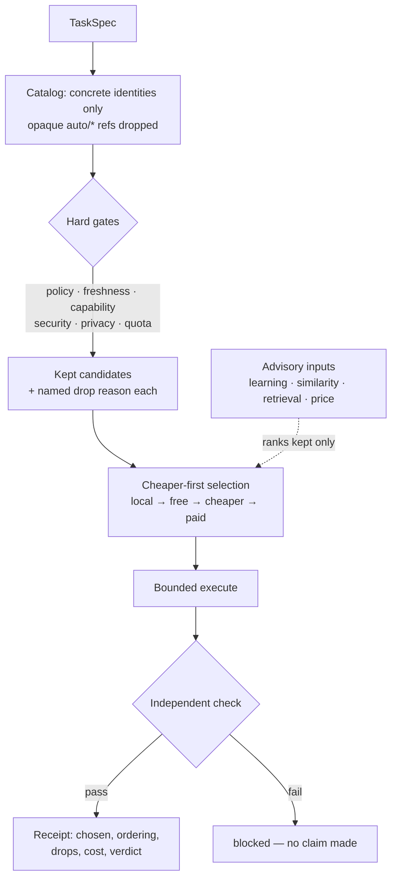

<div align="center">

# Verdict

Local-first, policy-gated control plane for LLM model selection. Routing is explicit and opt-in; the offline proof paths need no provider and no router.

[](https://github.com/mrnicholasbcarter-code/verdict-core/actions/workflows/ci.yml)
[](https://github.com/mrnicholasbcarter-code/verdict-core/actions/workflows/security.yml)
[](.github/workflows/ci.yml)
[](pyproject.toml)
[](pyproject.toml)
[](LICENSE)

[Quickstart](#quickstart) · [Verification](#verification) · [Architecture](#architecture) · [CLI](#cli-reference) · [Docs](#documentation)

</div>

## Problem

An agent that sends every task to one frontier model pays frontier prices for work a cheaper model completes correctly, and it has no record of why any given call was made. Cost dashboards report the bill after the fact; they do not decide anything.

The usual fix — a router that scores models and picks a winner — moves the problem rather than solving it. A scorer can be overridden by a confident heuristic, so a stale, unqualified, or policy-excluded model can still be selected. When a run misbehaves there is no artifact showing which candidates existed, which were excluded, and on what grounds.

Verdict is a control plane rather than a recommendation engine: advisory signals rank the candidates that survive the gates, and never restore one the gates removed.

## Solution

Every routing decision runs a fixed sequence. Eligibility is decided before preference is consulted, and a model that fails any hard gate cannot be re-admitted by a downstream score.


```mermaid
flowchart TD
    T[TaskSpec] --> C[Catalog: concrete identities only<br/>opaque auto/* refs dropped]
    C --> G{Hard gates}
    G -->|policy · freshness · capability<br/>security · privacy · quota| K[Kept candidates<br/>+ named drop reason each]
    K --> S[Cheaper-first selection<br/>local → free → cheaper → paid]
    S --> X[Bounded execute]
    X --> V{Independent check}
    V -->|pass| R[Receipt: chosen, ordering,<br/>drops, cost, verdict]
    V -->|fail| B[blocked — no claim made]
    A[Advisory inputs<br/>learning · similarity · retrieval · price] -.ranks kept only.-> S
```

Four properties hold by construction:

- **Paid is never chosen while a cheaper qualified candidate remains.** `RouteSelection` raises on construction if it is, so the violation cannot be serialized.
- **Every dropped candidate carries a named reason** — `policy`, `health`, `capability`, `unclassified`, `stale`, `opaque_mix`, `cost`, or `quota`.
- **Opaque references are not candidates.** `auto/*`-style refs resolve to an unknown model at call time, so they are dropped rather than gambled on.
- **An unreachable surface produces `blocked`, never a pass.** Fixture data cannot satisfy a live proof.

## Install

```bash
uv sync --extra dev            # or: pip install -e ".[dev]"
uv run python -m verdict --help
```

Python 3.10+. No API key, provider account, or network access is required for anything under [Verification](#verification).

## Quickstart

```bash
uv run python -m verdict setup        # write local config
uv run python -m verdict models       # qualified catalog with drop reasons
uv run python -m verdict simulate "refactor the auth module"
uv run python -m verdict route "refactor the auth module"
```

`simulate` forecasts tokens, cost, risk, and model with no paid call. `route` executes.

## Verification

Every claim below is reproducible from a clean checkout.

**Cost comparison — no provider spend.**

```bash
uv run python -m verdict.routing_demo --mock
```

100 deterministic requests against fixed Opus/Sonnet/Haiku prices versus a class-aware route. Last recorded run: routed **$0.16** vs baseline **$0.52**, a **69.2%** reduction, where the baseline is the costliest still-qualified identity per request. Prices are labeled estimates from Anthropic's published pricing, not observed invoices. See [`docs/benchmarks/routing-demo.md`](docs/benchmarks/routing-demo.md) for the live mode and the recorded-replay path.

**Context packing measurably lifts a cheaper model.**

The same cheaper identity answers one exact named check twice — unaided, then with a compiled `ContextPack`. Lift is claimed only when the unaided attempt fails and the packed attempt passes on that same identity. Recorded receipt: `kc/kilo-auto/free`, unaided `false`, packed `true`. See [`docs/benchmarks/context-lift.md`](docs/benchmarks/context-lift.md) and the sanitized receipt beside it.

**Failover holds without a network.**

```bash
uv run python -m verdict failover-proof
uv run python -m verdict replay <session>
```

**Test and gate status.** 138 test modules; CI enforces a 70% coverage floor, `ruff check`, `ruff format --check`, `mypy verdict --strict`, CodeQL, and OSV scanning, none of them advisory. Evidence index: [`docs/proof/EVIDENCE_INDEX.md`](docs/proof/EVIDENCE_INDEX.md). Release gates: [`ACCEPTANCE_GATES.md`](ACCEPTANCE_GATES.md).

## Architecture

Decisions live in [`docs/adr/`](docs/adr/) — 27 numbered records, indexed in [`docs/adr/README.md`](docs/adr/README.md). Start with these:

| Area | Record |
| --- | --- |
| Deterministic policy and transition graphs | [ADR-016](docs/adr/ADR-016-deterministic-policy-and-transition-graphs.md) |
| Catalog qualification — what becomes a candidate | [ADR-007](docs/adr/ADR-007-omniroute-catalog-qualification.md) |
| Fail-closed capability passports | [ADR-010](docs/adr/ADR-010-fail-closed-capability-passports.md) |
| Portable receipts and evidence authority | [ADR-015](docs/adr/ADR-015-evidence-authority-and-portable-receipts.md) |
| Advisory signals stay shadow-only | [ADR-018](docs/adr/ADR-018-shadow-and-counterfactual-evaluation.md) |
| Cross-repo compatibility gate | [ADR-024](docs/adr/ADR-024-cross-repo-compatibility-gate.md) |
| Python/TypeScript envelope parity | [ADR-025](docs/adr/ADR-025-node-envelope-enforcement.md) |

Python is the reference implementation. [verdict-node](https://github.com/mrnicholasbcarter-code/verdict-node) provides the TypeScript surface; `verdict compat` gates the shared contract.

## CLI reference

`uv run python -m verdict <command>`. Full list via `--help`.

| Command | Purpose |
| --- | --- |
| `setup` · `quickstart` · `doctor` · `check` | Configure, diagnose, and validate a local install |
| `route` · `run` · `simulate` · `compare` | Route a task, or forecast it before any paid call |
| `models` · `inspect` · `catalog` · `detect` · `probe` | Inspect the qualified catalog and provider liveness |
| `replay` · `failover-proof` · `stats` · `benchmark` | Reproduce a recorded run and measure behavior |
| `memory` · `hook` · `mcp` · `serve` · `ui` | Memory plane, lifecycle hooks, MCP server, local UI |
| `compat` · `plan` · `runtime` · `uninstall` | Contract gate, dry-run plan, ownership, reversible removal |

## Documentation

| Topic | Location |
| --- | --- |
| End-to-end walkthrough | [`docs/USER_JOURNEY.md`](docs/USER_JOURNEY.md) |
| Full CLI reference | [`docs/CLI_REFERENCE.md`](docs/CLI_REFERENCE.md) |
| Architecture decisions | [`docs/adr/README.md`](docs/adr/README.md) |
| Benchmarks and receipts | [`docs/benchmarks/`](docs/benchmarks/) |
| Evidence index | [`docs/proof/EVIDENCE_INDEX.md`](docs/proof/EVIDENCE_INDEX.md) |
| Contributing | [`CONTRIBUTING.md`](CONTRIBUTING.md) |
| Security policy | [`SECURITY.md`](SECURITY.md) |

## Project status

Version 0.2.0, active development. Contracts, schemas, and receipt formats are versioned; breaking changes to them require an ADR. The routing gates, receipts, replay, and offline proof paths are implemented and covered by CI. Provider coverage depends on what the local catalog qualifies — Verdict does not ship provider credentials.

## License

MIT. See [`LICENSE`](LICENSE).
