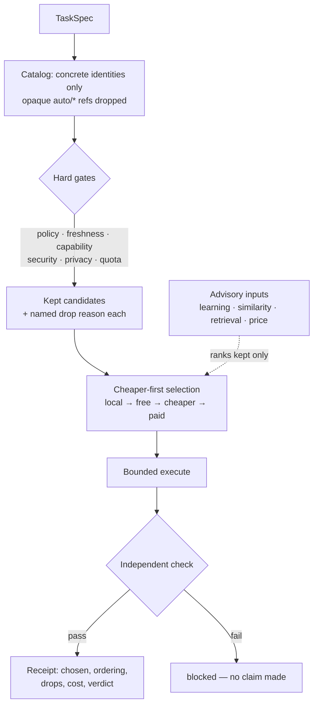

<div align="center">

# Verdict

The LLM router that says no: cheapest qualified model, a named reason for every drop, a receipt for every decision.

Verdict puts a fail-closed control plane between AI coding tools and the models they use. It applies hard eligibility gates before advisory ranking, so an excluded or unverified model cannot be restored by a downstream score.

[](https://github.com/mrnicholasbcarter-code/verdict-core/actions/workflows/ci.yml)
[](https://github.com/mrnicholasbcarter-code/verdict-core/actions/workflows/security.yml)
[](.github/workflows/ci.yml)
[](pyproject.toml)
[](pyproject.toml)
[](LICENSE)

[Quick start](#quick-start) · [Verification](#verification) · [Architecture](#architecture) · [CLI](#cli-reference) · [Docs](#documentation)

</div>

## Install

```bash
pip install verdict-core
```

Python 3.10+. The offline proof path needs no API key or gateway.

## Quick start

Run the credential-free fixture from an empty directory:

```bash
verdict quickstart --non-interactive --dry-run
```

The fixture makes one deterministic routing decision, selects `demo/frontier-tools`, and names every excluded candidate:

```text
Verdict credential-free quickstart
===================================
Selected route: demo/frontier-tools
Excluded candidates: 3
Receipt: fixture:issue-35 (deterministic_fixture)
Status: PASS
- demo/no-tools: missing capability: tools
- demo/quota-empty: quota exhausted
- demo/unverified: health unknown
```

It does not call a provider, read credentials, or write state. The executable source and regression tests are [`verdict/flagship_demo.py`](verdict/flagship_demo.py) and [`tests/test_flagship_demo.py`](tests/test_flagship_demo.py).

For a contributor checkout:

```bash
uv sync --extra dev
uv run python -m verdict quickstart --non-interactive --dry-run
```

Optional Linux/macOS installer (review the script first):

```bash
curl -fsSL https://raw.githubusercontent.com/mrnicholasbcarter-code/verdict-core/main/install.sh | bash
```

The installer probes for a local gateway, runs setup, and verifies the installation. Live provider execution is separate from this credential-free proof path.

## Live gateway checks

Only run these when a compatible gateway is already running at `http://localhost:20128`:

```bash
verdict detect --json
verdict probe task-coding --base-url http://localhost:20128/v1 --allow-live-probe --json
```

`detect` must show `server_running: true`. `probe` must return `status: ready` for a **named** model. `auto/*` IDs are opaque and are not live proof. A catalog timeout is `blocked`, not success. See [`docs/guides/golden-path.md`](docs/guides/golden-path.md) for the dated live observation and its limitations.

## Cost comparison

**Deterministic mock — no provider spend.**

```bash
uv run python -m verdict.routing_demo --mock
```

The current deterministic mock compares 100 requests using fixed Opus/Sonnet/Haiku price estimates against a class-aware route: approximately **$0.16 routed** versus **$0.52 baseline** in the recorded fixture. The implementation computes routed cost, baseline, and savings; see [`docs/benchmarks/routing-demo.md`](docs/benchmarks/routing-demo.md) for the baseline definition and live/recorded limitations. These are estimates, not observed invoices.

## Problem

An agent that sends every task to one frontier model pays frontier prices for work a cheaper model completes correctly, and it has no record of why any given call was made. Cost dashboards report the bill after the fact; they do not decide anything.

The usual fix — a router that scores models and picks a winner — moves the problem rather than solving it. A scorer can be overridden by a confident heuristic, so a stale, unqualified, or policy-excluded model can still be selected. When a run misbehaves there is no artifact showing which candidates existed, which were excluded, and on what grounds.

Verdict is a control plane rather than a recommendation engine: advisory signals rank the candidates that survive the gates, and never restore one the gates removed. Unknown availability is not a pass — [Unknown ≠ healthy](docs/guides/unknown-not-healthy.md). LiteLLM, OpenRouter, and Portkey route or catalog; Verdict admits or blocks — [comparison](docs/guides/comparison.md).

## Solution

Every routing decision runs a fixed sequence. Eligibility is decided before preference is consulted, and a model that fails any hard gate cannot be re-admitted by a downstream score.


```mermaid
flowchart TD
    T[TaskSpec] --> C[Catalog: concrete identities only<br/>opaque auto/* refs dropped]
    C --> G{Hard gates}
    G -->|policy · freshness · capability<br/>security · privacy · quota| K[Kept candidates<br/>+ named drop reason each]
    K --> S[Cheaper-first selection<br/>local → free → cheaper → paid]
    S --> X[Bounded execute]
    X --> V{Independent check}
    V -->|pass| R[Receipt: chosen, ordering,<br/>drops, cost, verdict]
    V -->|fail| B[blocked — no claim made]
    A[Advisory inputs<br/>learning · similarity · retrieval · price] -.ranks kept only.-> S
```

Four properties hold by construction:

- **Paid is never chosen while a cheaper qualified candidate remains.** `RouteSelection` raises on construction if it is, so the violation cannot be serialized.
- **Every dropped candidate carries a named reason** — `policy`, `health`, `capability`, `unclassified`, `stale`, `opaque_mix`, `cost`, or `quota`.
- **Opaque references are not candidates.** `auto/*`-style refs resolve to an unknown model at call time, so they are dropped rather than gambled on.
- **An unreachable surface produces `blocked`, never a pass.** Fixture data cannot satisfy a live proof.

## Quickstart

```bash
verdict setup        # write local config
verdict models       # qualified catalog with drop reasons
verdict simulate "refactor the auth module"
verdict route "refactor the auth module"
```

From a contributor checkout, prefix with `uv run python -m`. `simulate` forecasts tokens, cost, risk, and model with no paid call. `route` executes.

## Verification

Every claim below is reproducible from a clean checkout.

**Cost comparison — deterministic mock, no provider spend.**

```bash
uv run python -m verdict.routing_demo --mock
```

The current deterministic mock compares 100 requests using fixed Opus/Sonnet/Haiku price estimates against a class-aware route: approximately **$0.16 routed** versus **$0.52 baseline** in the recorded fixture. The implementation computes routed cost, baseline, and savings; see [`docs/benchmarks/routing-demo.md`](docs/benchmarks/routing-demo.md) for the baseline definition and live/recorded limitations. These are estimates, not observed invoices.

**Context packing — dated live observation, not offline proof.**

A recorded paired run asked the same cheaper identity one exact check twice — unaided, then with a compiled `ContextPack`. The recorded receipt reports `unaided=false`, `packed=true`, and `conclusion=lift`; the run required a compatible live gateway. See [`docs/benchmarks/context-lift.md`](docs/benchmarks/context-lift.md) and the sanitized receipt beside it. A blocked or skipped live run makes no lift claim.

**Failover holds without a network.**

```bash
uv run python -m verdict failover-proof
uv run python -m verdict replay <session>
```

**Test and gate status.** CI runs the repository's test, lint, format, type, security, CodeQL, OSV, install, build, and contract-parity checks. The current public claim boundary and limitations are in [`docs/proof/EVIDENCE_INDEX.md`](docs/proof/EVIDENCE_INDEX.md), [`docs/proof/CLAIMS_AUDIT_2026-09-06.md`](docs/proof/CLAIMS_AUDIT_2026-09-06.md), and [`docs/proof/RELEASE_BOUNDARY_0.3.0.md`](docs/proof/RELEASE_BOUNDARY_0.3.0.md).

## Architecture

Decisions live in [`docs/adr/`](docs/adr/) — 30 numbered records, indexed in [`docs/adr/README.md`](docs/adr/README.md). Start with these:

| Area | Record |
| --- | --- |
| Deterministic policy and transition graphs | [ADR-016](docs/adr/ADR-016-deterministic-policy-and-transition-graphs.md) |
| Catalog qualification — what becomes a candidate | [ADR-007](docs/adr/ADR-007-omniroute-catalog-qualification.md) |
| Fail-closed capability passports | [ADR-010](docs/adr/ADR-010-fail-closed-capability-passports.md) |
| Portable receipts and evidence authority | [ADR-015](docs/adr/ADR-015-evidence-authority-and-portable-receipts.md) |
| Advisory signals stay shadow-only | [ADR-018](docs/adr/ADR-018-shadow-and-counterfactual-evaluation.md) |
| Cross-repo compatibility gate | [ADR-024](docs/adr/ADR-024-cross-repo-compatibility-gate.md) |
| Python/TypeScript envelope parity | [ADR-025](docs/adr/ADR-025-node-envelope-enforcement.md) |

Python is the reference implementation. [verdict-node](https://github.com/mrnicholasbcarter-code/verdict-node) provides the TypeScript surface; `verdict compat` gates the shared contract.

## CLI reference

`uv run python -m verdict <command>`. Full list via `--help`.

| Command | Purpose |
| --- | --- |
| `setup` · `quickstart` · `doctor` · `check` | Configure, diagnose, and validate a local install |
| `route` · `run` · `simulate` · `compare` | Route a task, or forecast it before any paid call |
| `models` · `inspect` · `catalog` · `detect` · `probe` | Inspect the qualified catalog and provider liveness |
| `replay` · `failover-proof` · `stats` · `benchmark` | Reproduce a recorded run and measure behavior |
| `memory` · `hook` · `mcp` · `serve` · `ui` | Memory plane, Claude Code gate (`verdict hook claude-gate`), MCP, local UI |
| `compat` · `plan` · `runtime` · `uninstall` | Contract gate, dry-run plan, ownership, reversible removal |

## Documentation

| Topic | Location |
| --- | --- |
| End-to-end walkthrough | [`docs/USER_JOURNEY.md`](docs/USER_JOURNEY.md) |
| Golden path (install → live probe) | [`docs/guides/golden-path.md`](docs/guides/golden-path.md) |
| Unknown ≠ healthy (fail-closed drops) | [`docs/guides/unknown-not-healthy.md`](docs/guides/unknown-not-healthy.md) |
| vs LiteLLM / OpenRouter / Portkey | [`docs/guides/comparison.md`](docs/guides/comparison.md) |
| Claude Code / Codex / Cursor gate | [`docs/guides/coding-agent-gate.md`](docs/guides/coding-agent-gate.md) |
| Full CLI reference | [`docs/CLI_REFERENCE.md`](docs/CLI_REFERENCE.md) |
| Architecture decisions | [`docs/adr/README.md`](docs/adr/README.md) |
| Benchmarks and receipts | [`docs/benchmarks/`](docs/benchmarks/) |
| Evidence index | [`docs/proof/EVIDENCE_INDEX.md`](docs/proof/EVIDENCE_INDEX.md) |
| Claims audit and v0.3.0 boundary | [`docs/proof/CLAIMS_AUDIT_2026-09-06.md`](docs/proof/CLAIMS_AUDIT_2026-09-06.md) · [`docs/proof/RELEASE_BOUNDARY_0.3.0.md`](docs/proof/RELEASE_BOUNDARY_0.3.0.md) |
| Contributing | [`CONTRIBUTING.md`](CONTRIBUTING.md) |
| Security policy | [`SECURITY.md`](SECURITY.md) |

## Project status

Version 0.2.0, active development. Contracts, schemas, and receipt formats are versioned; breaking changes to them require an ADR. The routing gates, receipts, replay, and offline proof paths are implemented and covered by CI. Provider coverage depends on what the local catalog qualifies — Verdict does not ship provider credentials.

## License

MIT. See [`LICENSE`](LICENSE).
