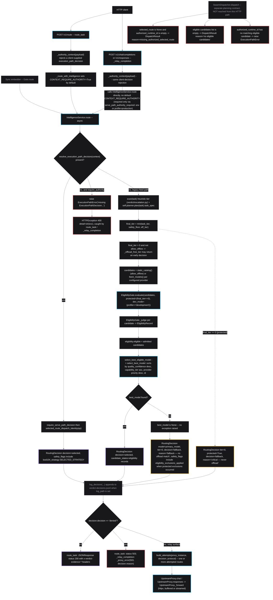
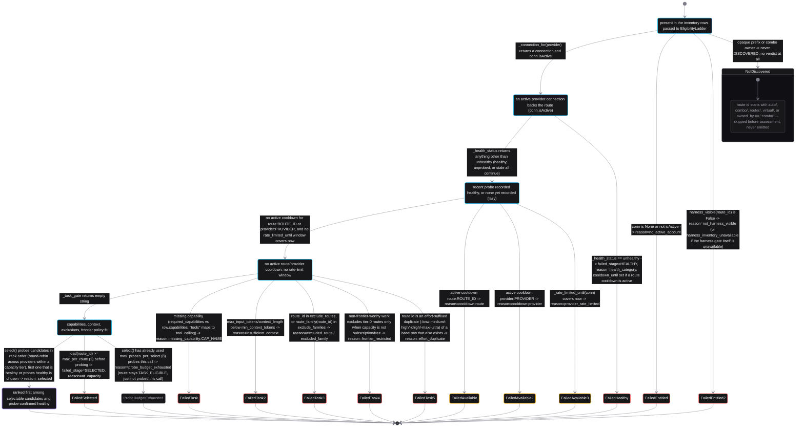
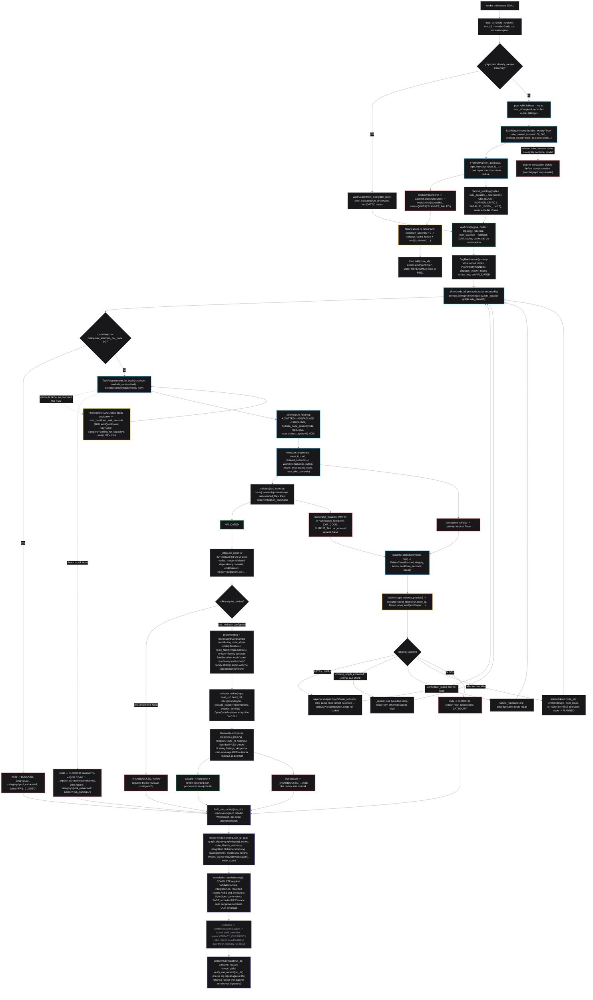

<div align="center">

# Verdict

**Give it a goal. Verdict picks the right AI models, splits the work, checks the results, gets a second opinion, and hands you a receipt you can verify.**

Point Verdict at a goal and a git repository. It plans the work, picks models from live
evidence instead of guesses, runs the work in parallel, recovers on its own when a model
fails, asks an independent model to review the result, and writes a tamper-evident receipt
you can check yourself afterward. A model that fails a safety check cannot be scored back in.

[](https://github.com/mrnicholasbcarter-code/verdict-core/actions/workflows/ci.yml)
[](https://github.com/mrnicholasbcarter-code/verdict-core/actions/workflows/security.yml)
[](.github/workflows/ci.yml)
[](pyproject.toml)
[](pyproject.toml)
[](LICENSE)

[Why Verdict](#why-verdict) · [Try it](#try-it-in-60-seconds-no-keys) · [What's new](#whats-new-in-050) · [How it works](#how-it-works) · [Install](#install) · [Commands](#commands) · [Limits](#limits)

<picture><source media="(prefers-reduced-motion: reduce)" srcset="docs/assets/demo-poster.svg"></picture>

<sub>Fixture run, credential-free, no model calls, replayed at real time. Recorded with <a href="scripts/record_tui_demo.py"><code>scripts/record_tui_demo.py --scenario</code></a>. This cast is separate from the three-fault <a href="docs/proof/demo-run/"><code>docs/proof/demo-run/</code></a> fixture. Full cast: <a href="docs/assets/demo.cast"><code>docs/assets/demo.cast</code></a>. Still frame: <a href="docs/assets/demo-poster.svg"><code>docs/assets/demo-poster.svg</code></a>.</sub>

</div>

## Why Verdict

- **Picks models that actually work right now, not just ones that are listed.** Verdict checks live account, health and quota evidence before it trusts a model, and names the reason it dropped anything else.
- **Saves money by default.** Already-paid subscription capacity and free tiers are tried before metered, pay-per-token models — never the other way round.
- **Recovers on its own when a model fails.** A quota limit, rate limit, timeout or bad answer moves the same work to another admitted model automatically, with a bounded number of tries.
- **Gets an independent second opinion.** A separate model, on a separate route from whoever did the work, has to approve the result before a run can finish.
- **Hands you a receipt you can verify.** Every run ends with a tamper-evident digest; `verdict run-receipt` recomputes it and tells you if anything changed.
- **Safe by default.** Spending real money needs your confirmation first, and anything that could change your settings shows you a preview and a one-step undo before it touches a file.

## Try it in 60 seconds (no keys)

With `pipx` available, install and run the offline demo. The demo needs no API key,
gateway or network (the install downloads from PyPI):

```bash
pipx install verdict-core
verdict demo
```

Alternatively, with `uvx` available, run a separate credential-free quickstart fixture
without a persistent install:

```bash
uvx --from verdict-core verdict quickstart --non-interactive --dry-run
```

`pip install verdict-core` followed by `verdict demo` is also supported. The [fresh-install workflow](.github/workflows/fresh-install.yml) is configured to check
`pipx`, `uvx --from verdict-core verdict demo --speed 0`, and the
integrity-verified `install.sh` on Linux Python 3.12 and 3.13 containers.
The linked [v0.4.2 run](https://github.com/mrnicholasbcarter-code/verdict-core/actions/runs/36956585091)
and a separate published-package `uvx` quickstart transcript are not retained here, so
their results are not independently verified from this checkout. The retained
[fresh-install bundle](docs/proof/fresh-install-0.4.1-2026-09-30/README.md) covers 0.4.1.
These are offline scripted demonstrations, not live provider runs.

`verdict demo` ships in `verdict-core` on PyPI (since 0.4.0). From a source checkout, `pip install -e .`
gives the same command.

`verdict demo` is an **offline scenario** with scripted workers and injected faults. It runs
the real orchestration pipeline (planner, admission, DAG runtime, failure intelligence,
integration barrier, reviewer-independence policy, receipt writer) against fixture routes.
No model is called. The output:

```text
trace  run=offline-flagship-failover
goal: flagship failover test
steps: 34  schema: trace-view-v1

seq   kind            node      detail
--------------------------------------
1     request                   goal=flagship failover test
2     classification            
3     plan                      
4     plan                      
5     routing         node-1    
6     selection       node-1    route=alpha/claude-a
8     routing         node-2    
9     selection       node-2    route=alpha/claude-a
12    dispatch        node-1    
14    context         node-1    
15    terminal        node-1    model=alpha/claude-a  failed
17    failure         node-1    category=rate_limited
18    cooldown        node-1    key=alpha  until=...
20    dispatch        node-2    
22    context         node-2    
23    terminal        node-2    model=alpha/claude-a  ok
26    routing         node-1    
27    selection       node-1    route=beta/gpt-b
28    reassign        node-1    alpha/claude-a -> beta/gpt-b
30    barrier         node-2    
31    verify          node-2    passed=True
33    dispatch        node-1    
35    context         node-1    
36    terminal        node-1    model=beta/gpt-b  ok
38    barrier         node-1    
39    verify          node-1    passed=True
45    terminal        integrate model=(mechanical merge)  ok
47    verify          integrate passed=True
48    barrier         integrate 
50    integrate                 
51    barrier                   
53    review                    attempt 1  reviewer=gamma/gemini-c  PASS
54    review                    verdict  blocking=0  reviewer=gamma/gemini-c  PASS
55    run_finished              outcome=COMPLETE

OFFLINE SCENARIO: scripted workers, injected faults

CLAIMS VERIFIED
------------------------------------------------------------
  + VERIFIED  Task-aware model selection  (event:6, event:9, event:27)
  + VERIFIED  Capability filtering reduced candidate pool  (event:5, event:8, event:26)
  + VERIFIED  Provider/model health considered in routing  (event:5, event:26)
  + VERIFIED  Explicit concrete worker assignment  (event:12, event:20, event:33)
  + VERIFIED  Worker failure isolated from controller  (event:17, event:20, event:55)
  + VERIFIED  Automatic bounded failover  (event:28)
  + VERIFIED  Cooldown recorded  (event:18)
  + VERIFIED  Context assembled within budget  (event:14, event:22, event:35)
  + VERIFIED  Replacement completed successfully on alternate route  (event:36)
  + VERIFIED  Validation passed  (event:31, event:40, event:47)
  + VERIFIED  Independent review passed  (event:54)
  + VERIFIED  Receipt integrity verified  (receipt:verify)
```

What happened: `node-1` was assigned to `alpha/claude-a`, hit an injected `rate_limited`
fault, was cooled down, reassigned to `beta/gpt-b`, and passed. `node-2` ran on
`alpha/claude-a` without fault. An independent reviewer on `gamma/gemini-c` (a route no
worker used) passed the merged result. Each CLAIM VERIFIED line cites the event sequence
numbers that prove it.

The demo is tested in CI ([`tests/test_demo_trace.py`](tests/test_demo_trace.py)).

You can also inspect the committed fixture run the same way:

```bash
verdict trace docs/proof/demo-run
verdict run-receipt --runs-dir . docs/proof/demo-run
```

The [`docs/proof/demo-run/`](docs/proof/demo-run) directory is a verified fixture run with
three injected faults. `run-receipt` recomputes the SHA-256 digest and confirms integrity:

```text
COMPLETE: all implement/integrate nodes validated, barrier ok, review PASS
integrity: OK (events digest verified)
  parser             VALIDATED        demo-sub/atlas-coder[failure:quota_exhausted*] -> demo-free/birch-coder[failure:rate_limited*] -> demo-free2/elm-coder[success]
  cli_flag           VALIDATED        demo-sub/atlas-coder[failure:no_final_answer*] -> demo-free/cedar-coder[success]
  integrate          VALIDATED        merge[success]
  review: PASS by fixture-reviewer (no model call) on demo-metered/delta-coder
```

`*` marks an injected fault. `parser` started on the subscription route, hit an injected quota
fault, moved to a free route, hit an injected rate limit, then passed on a third provider.
`cli_flag` got `no_final_answer` and moved to another free route. The review went to the only
admitted candidate left (metered) because all cooled providers and routes without tool calling
were excluded.

Source: [`scripts/demo_orchestrate.py`](scripts/demo_orchestrate.py).
Test: [`tests/test_readme_assets.py`](tests/test_readme_assets.py).

## What's new in 0.5.0

Verdict 0.5.0 adds four ways to see — and safely act on — what it knows before you commit to a run.

**See which models actually work right now.**

```bash
verdict eligibility --verified
```

Shows every model's real status (verified, stale, unverified, failed, excluded) from evidence
Verdict already checked, with a reason for every drop. In the TUI prompt, the same view is
`/eligibility`.

**Refresh that list safely, with a cost cap and your confirmation.**

```text
/eligibility refresh
```

A bounded refresh probe that can spend prepaid quota — Verdict tells you that before it runs,
and nothing is sent until you say yes.

**Pick your Prime Agent models with a preview and a one-step undo.**

```bash
verdict harness prime select
verdict harness prime restore
```

`select` shows you the exact change before it touches `~/.prime/agent/models.json`, backs up the
file first, and `restore` reverses it. In the TUI prompt: `/bootstrap prime`.

**An honest Claude Code compatibility report.**

```text
/bootstrap claude
```

Read-only: it tells you what would work if Claude Code pointed at Verdict, and changes nothing.

**Smart Tab-completion in the prompt.** Commands, flags, model ids and run ids all complete as
you type — see [docs/guides/tui-completion.md](docs/guides/tui-completion.md).

## Quick start

The fixture makes one deterministic routing decision (also credential-free):

```bash
verdict quickstart --non-interactive --dry-run
```

```text
Verdict credential-free quickstart
===================================
Task: Add structured output to the invoice parser
Required capabilities: structured_output, tools
Selected route: demo/frontier-tools
Excluded candidates: 3
Receipt: fixture:issue-35 (deterministic_fixture)
Status: PASS
- demo/no-tools: missing capability: tools
- demo/quota-empty: quota exhausted
- demo/unverified: health unknown
```

Each excluded candidate gets a named refusal reason. Source:
[`verdict/flagship_demo.py`](verdict/flagship_demo.py).
Test: [`tests/test_flagship_demo.py`](tests/test_flagship_demo.py) (asserts this block
byte-for-byte).

For a contributor checkout:

```bash
uv sync --extra dev
uv run python -m verdict quickstart --non-interactive --dry-run
```

## Proof from a live run

The [`docs/proof/dogfood-bod-225-live-2026-09-29/`](docs/proof/dogfood-bod-225-live-2026-09-29)
directory contains a live `verdict orchestrate` run for a real Linear story (BOD-225), with
real providers reached through [OmniRoute](#how-it-works) (a local OpenAI-compatible gateway that
lists the available models and runs model calls). It is **not** a fixture.

Routes are written `provider/model`: the prefix (`cx/`, `cc/`, `gc/`, `kr/` below) names the
OmniRoute provider connection, and the rest names the model. So `cx/gpt-5.6-sol` is the model
`gpt-5.6-sol` reached through the `cx` connection.

**Chain summary** (from that proof's [README](docs/proof/dogfood-bod-225-live-2026-09-29/README.md)):

| seq | event | route | outcome |
|---|---|---|---|
| 4–8 | planner | cx/gpt-5.5 → cx/gpt-5.6-sol | `no_final_answer` then HEALTHY |
| 20–27 | reassign producer_receipt | cx/gpt-5.6-sol → gc/grok-4.5 | injected `rate_limited` |
| 37 | VALIDATED producer_receipt | gc/grok-4.5 | verify PASS |
| 45–65 | reassign rehearsal_guard | cx/gpt-5.5 → cx/gpt-5.6-sol → gc/grok-4.5 | timeout, `no_final_answer` |
| 71–75 | RESUMED | | 1 validated node reused after controller restart |
| 89 | VALIDATED rehearsal_guard | gc/grok-4.5 | verify PASS |
| 97–99 | integrate | mechanical | combined verify PASS |
| 100–102 | RESUMED | | 3 validated nodes reused; reboot cause is operator-reported |
| 109–111 | review | cc/claude-opus-4-6 | PASS |
| 112 | run_finished | | COMPLETE |

**What this proves** (quoting the proof README): worker assignment across live OmniRoute
providers; failover on one injected fault and two real worker faults, with cooldown and
reassignment to a different route; controller survival across restart and resume, reusing
already-validated nodes; recorded reviewer PASS on a route no final contributing worker used; a verified receipt. The raw OCR output and coverage are not retained, so semantic review cannot be re-audited from this bundle.

**What this does NOT prove** (quoting the proof README): the reviewer is `cc/claude-opus-4-6`,
which is also the controller-family model used by the session's merge captain (not by the run's
workers). It is a single run. The VM reboot and its cause are operator-reported; the
retained events prove resume and validated-node reuse, not the reboot cause.

Verify locally:

```bash
verdict run-receipt --runs-dir . docs/proof/dogfood-bod-225-live-2026-09-29
```

See the full proof bundle in [`docs/proof/dogfood-bod-225-live-2026-09-29/`](docs/proof/dogfood-bod-225-live-2026-09-29/).

---

**Recorded TUI walkthrough** (offline scenario: scripted workers, one injected fault, failover to another route, a scripted review PASS, then a receipt check and a tampered copy that fails it)

<picture><source media="(prefers-reduced-motion: reduce)" srcset="docs/assets/demo-tui-poster.svg"></picture>

<sub>Offline scenario, no model calls: scripted workers, a scripted reviewer, and an injected rate limit, replayed at 1x from the recorded terminal timing (gaps over 1.5 s capped). It opens on the Verdict home, plays the cockpit to COMPLETE, then runs `verdict run-receipt` on the run (integrity OK, exit 0) and on a copy with one event byte changed (digest mismatch, exit 1). Recorded with `python scripts/record_tui_demo.py --scenario --speed 1`. The live-model evidence is the [proof bundle above](#proof-from-a-live-run); replay a real run yourself with `verdict watch docs/proof/live-controller-run --replay --speed 1`. Still frame: [`docs/assets/demo-tui-poster.svg`](docs/assets/demo-tui-poster.svg).</sub>

## How it works

Give Verdict a goal and a git repository. It walks through five steps:

1. **Plan.** A planner model breaks your goal into a small to-do list of work items ("nodes"), each with its own files to touch and a way to check the work.
2. **Pick models.** Verdict checks live evidence — accounts, health, quota — and builds a list of models that can actually be used right now. It picks from that list, and tries already-paid or free capacity before anything that costs per call.
3. **Run in parallel.** Each item runs as its own worker. If a worker hits a quota limit, a rate limit, a timeout, or gives a bad answer, Verdict quietly reassigns that one item to another admitted model — automatically, within a bounded number of tries.
4. **Check and review.** Each item's own check must pass, the pieces must merge cleanly, and a separate model — one that did not do the work — has to review and approve the result.
5. **Receipt.** The run writes a tamper-evident receipt: a stored digest of everything that happened. `verdict run-receipt` recomputes that digest later and tells you if anything in the log changed.

### Under the hood (for engineers)

The five steps above map onto this loop:

1. **Plan.** A planner model splits the goal into a small DAG of work nodes. Each node has owned files and a verification command.
2. **Admit.** Verdict builds one admitted set of models from live gateway evidence: inventory, provider accounts, health, cooldowns and quota. Every dropped model gets a named reason. A model with no runtime evidence is kept as `unknown`, never counted as healthy, and it must pass a live check of that exact route before it launches.
3. **Assign.** Each node gets its own model from that set. Already-paid subscription capacity and free tiers rank before metered, pay-per-token routes.
4. **Recover.** A quota, rate-limit, timeout or empty-answer failure cools down the route or the whole provider. The same node then goes to another admitted model. When no admitted model is left, or after 4 attempts, the node stops with a named `FAIL_CLOSED` and the run ends `BLOCKED`. It does not retry forever.
5. **Verify and review.** Each node must pass its own check and an ownership check. The merged result must pass an integration check. Then the run requires a recorded reviewer PASS from a route other than the final contributing implementer routes. Retained non-skipped raw coverage is needed to claim semantic review.
6. **Receipt.** The run ends with a receipt that stores a SHA-256 digest of its event log. `verdict run-receipt` recomputes the digest and rebuilds the receipt. It detects edits to the event log against the retained receipt, but does not protect against replacing both or cover independent OCR output.

**Root-controller failover is supervisor-owned.** The external supervisor can restart a failed
or stalled controller as a new generation, reselecting an eligible route after recording
cooldowns. A bare controller launch has no automatic replacement
([`verdict/orchestration/supervisor.py`](verdict/orchestration/supervisor.py),
[`docs/guides/controller-routing.md`](docs/guides/controller-routing.md#root-controller-failover-generations),
[`tests/test_root_controller_failover.py`](tests/test_root_controller_failover.py)).

This repository is the control plane: planning, admission, assignment, recovery and proof. Three
external tools do the execution, and Verdict only calls them:

- **OmniRoute** is a local OpenAI-compatible gateway. It supplies the model inventory and runs model calls ([`verdict/omniroute.py`](verdict/omniroute.py)).
- **Prime Agent** is a headless coding-agent CLI. It runs each worker process (`prime-agent -p --model <exact route>`) and does not select models.
- **`ocr`** (open-code-review) is the reviewer CLI ([`verdict/orchestration/review.py`](verdict/orchestration/review.py)).

Three-role split:

| Role | Responsibility |
|---|---|
| **Verdict** | plans, selects models, recovers from faults, verifies, writes receipts |
| **Prime Agent harness** | runs worker processes (`prime-agent -p --model <exact route>`); does not select models |
| **OmniRoute transport** | provides `/v1/models` inventory and `/v1/chat/completions` execution; is not a metadata source of truth |

The following boundaries apply to the stated paths (not every routing entry point):

- **RouteSelection-based paths assert cheaper-first among kept candidates.** `RouteSelection`
  raises on construction if paid is selected while cheaper kept capacity exists. Legacy catalog
  routing ranks quality and does not enforce that assertion.
- **Every dropped candidate carries a named reason** — `policy`, `health`, `capability`,
  `quota`, `stale`, `opaque_mix`, `cost`, or `unclassified`.
- **Opaque `auto/*` references are not candidates.** They resolve to an unknown model at call
  time and are dropped.
- **An unreachable surface produces `blocked`, not a pass.** Fixture data cannot satisfy a
  live proof.

Orchestration is specified in [ADR-036](docs/adr/ADR-036-goal-to-receipt-orchestration.md).
ADR-023 (governed swarm supervision) is superseded.

Three of the nine verified diagrams are embedded below. The other six
([ecosystem](diagrams/ecosystem.mmd), [explain-flow](diagrams/explain-flow.mmd),
[setup-detection-flow](diagrams/setup-detection-flow.mmd),
[failover-sequence](diagrams/failover-sequence.mmd),
[goal-to-receipt](diagrams/goal-to-receipt.mmd),
[ownership-map](diagrams/ownership-map.mmd)) are linked rather than embedded.
Every diagram carries a header comment listing the exact source files it reflects, and
[`tests/test_diagrams.py`](tests/test_diagrams.py) checks that every named source file and
function actually exists.

<details>
<summary><strong>route-flow</strong> — <code>POST /v1/route</code> and the OpenAI-compatible relay surfaces</summary>


```mermaid
%% route-flow.mmd -- POST /v1/route and the OpenAI-compatible relay surfaces
%% Source (verified against code at this commit):
%%   verdict/api.py (route_task, _authority_context, _route_with_intelligence, _relay_completion)
%%   verdict/intelligence.py (IntelligenceService.route)
%%   verdict/eligibility.py (EligibilityGate.evaluate, _judge)
%%   verdict/router.py (select_best_model, select_best_eligible_model)
%%   verdict/proxy.py (UpstreamProxy.chat/.responses/._forward)
%%   verdict/dispatcher.py (SwarmDispatcher.dispatch -- separate planning contract, not on this HTTP path)
%% Verdict visual theme. Hex from verdict/design.py PALETTE:
%% background #101014  surface #18181b  text #f4f4f5  secondary #a1a1aa  muted #92929e
%% purple #a78bfa  cyan #22b8eb  success #4ade80  amber #f5b00b  red #f87171  border #52525b
%% Edges/lines use #7c7c88 (>=3:1 on #ffffff and #0d1117; measured 4.12:1 / 4.59:1).
%% fontFamily omitted: Mermaid sanitizeDirective drops hyphenated themeVariable values.
%%{init: {'theme':'base','themeVariables':{'darkMode':true,'background':'#101014','fontSize':'15px','primaryColor':'#18181b','primaryTextColor':'#f4f4f5','primaryBorderColor':'#52525b','secondaryColor':'#18181b','secondaryTextColor':'#f4f4f5','secondaryBorderColor':'#52525b','tertiaryColor':'#101014','tertiaryTextColor':'#f4f4f5','tertiaryBorderColor':'#52525b','lineColor':'#7c7c88','textColor':'#f4f4f5','mainBkg':'#18181b','nodeTextColor':'#f4f4f5','nodeBorder':'#52525b','clusterBkg':'#101014','clusterBorder':'#52525b','titleColor':'#f4f4f5','edgeLabelBackground':'#18181b','noteBkgColor':'#18181b','noteTextColor':'#f4f4f5','noteBorderColor':'#52525b','actorBkg':'#18181b','actorBorder':'#a78bfa','actorTextColor':'#f4f4f5','actorLineColor':'#7c7c88','signalColor':'#7c7c88','signalTextColor':'#f4f4f5','labelBoxBkgColor':'#18181b','labelTextColor':'#f4f4f5','loopTextColor':'#f4f4f5','activationBkgColor':'#101014','activationBorderColor':'#22b8eb','sequenceNumberColor':'#101014'}}}%%
flowchart TD
    CLIENT["HTTP client"] --> POST["POST /v1/route -- route_task"]
    CLIENT --> RELAY["POST /v1/chat/completions or /v1/responses -- _relay_completion"]
    EMBED["Sync embedder -- Gate.route"] --> ISVC

    POST --> AUTHCTX["_authority_context(payload) rejects a client-supplied execution_path_decision"]
    AUTHCTX --> RWI["_route_with_intelligence sets CONTEXT_REQUIRE_AUTHORITY=True by default"]
    RWI --> ISVC["IntelligenceService.route -- async"]
    RELAY --> AUTHCTXR["_authority_context(payload) -- same client-decision rejection"]
    AUTHCTXR -- "calls IntelligenceService.route directly, no default CONTEXT_REQUIRE_AUTHORITY (required only via serve_path_authority_required: env or profile=production)" --> ISVC

    ISVC --> EP{"resolve_execution_path_decision(context) present?"}
    EP -- yes --> AUTHREQ["require_serve_path_decision then selected_route_dispatch_identity(ep)"]
    AUTHREQ --> DEC104["RoutingDecision decision=selected, safety_flags include bod104_strategy:SELECTED_STRATEGY"]
    EP -- "no, and require_authority" --> EPERR["raise ExecutionPathError('missing ExecutionPathDecision...')"]
    EPERR --> H400["HTTPException 400 detail=str(exc), caught by route_task / _relay_completion"]

    EP -- "no, legacy feed path" --> SCAN["scan(task) heuristic tier (verdict/escalation.py) + self.planner.plan(task).task_spec"]
    SCAN --> TIER["final_tier = min(task_tier, safety_floor, eff_tier)"]
    TIER --> OFFLOAD["final_tier > 0 and not allow_offline -> _offload_free_tier may return an early decision"]
    OFFLOAD --> CAND["candidates = static_catalog() (allow_offline) or fetch_models() per configured provider"]
    CAND --> GATE["EligibilityGate.evaluate(candidates, protected=(final_tier==0), dev_mode=(profile=='development'))"]
    GATE --> JUDGE["EligibilityGate._judge per candidate -> EligibilityRecord"]
    JUDGE --> ADMIT["eligibility.eligible = admitted candidates"]

    ADMIT --> RANK["select_best_eligible_model -> select_best_model: sorts by quality_confidence desc, capability_tier asc, provider priority desc, id"]
    RANK --> HASBEST{"best_model found?"}
    HASBEST -- yes --> DECSEL["RoutingDecision decision=selected, candidate_states=eligibility records"]
    HASBEST -- no --> FALLBACK["best_model is None -- no exception raised"]
    FALLBACK --> DECFB["RoutingDecision model=primary_model, tier=0, decision=fallback, reason='fallback — no offload match', safety_flags include eligibility_exclusions_applied when protected exclusions occurred"]
    TIER -. "final_tier == 0 (protected)" .-> DECPROT["RoutingDecision tier=0, protected=True, decision=fallback, reason='critical — never offload'"]

    DEC104 --> LOG["log_decision(...) appends to verdict-decisions.jsonl when log_path is set"]
    DECSEL --> LOG
    DECFB --> LOG
    DECPROT --> LOG
    LOG --> DENIED{"decision.decision == 'denied'?"}
    DENIED -- no --> R200["route_task: JSONResponse status 200 with x-verdict-evidence-* headers"]
    DENIED -- yes --> R503["route_task: status 503; _relay_completion: _proxy_error(503, decision.reason)"]

    DENIED -- "no, relay surface" --> FWD["build_attempts(proxy_instance, decision, protocol) -- one or more attempted routes"]
    FWD --> FORWARD["UpstreamProxy.chat / UpstreamProxy.responses -> UpstreamProxy._forward (httpx, buffered or streamed)"]

    DISP["SwarmDispatcher.dispatch -- separate planning contract, NOT reached from this HTTP path"]
    DISP --> DNOROUTE["selected_route is None and authorized_runtime_id is empty -> DispatchResult reason=missing_authorized_selected_route"]
    DISP --> DNOELIG["eligible candidates list is empty -> DispatchResult reason='no eligible candidates'"]
    DISP --> DMISMATCH["authorized_runtime_id has no matching eligible candidate -> raise ExecutionPathError"]
%% evidence: verdict/api.py:1271 async def route_task(request, req)
%% evidence: verdict/api.py:1236 def _authority_context(payload, *, task) -- rejects client execution_path_decision
%% evidence: verdict/api.py:1250 async def _route_with_intelligence(...)
%% evidence: verdict/api.py:1256,1259 CONTEXT_REQUIRE_AUTHORITY imported from verdict.serve_path, merged.setdefault(..., True)
%% evidence: verdict/api.py:1263-1266,1276-1279 ExecutionPathError caught -> HTTPException(400, str(exc))
%% evidence: verdict/api.py:1305 status_code = 200 if decision.decision != "denied" else 503
%% evidence: verdict/api.py:1754 async def _relay_completion(request, *, surface)
%% evidence: verdict/api.py:1848,1940,1942 decision.decision == "denied" branch; proxy_instance.responses / proxy_instance.chat
%% evidence: verdict/gate.py:144,181-184 class Gate.route delegates to self.intelligence.route (sync/async bridge)
%% evidence: verdict/intelligence.py:211,360 class IntelligenceService, async def route(...)
%% evidence: verdict/intelligence.py:392-403 resolve_execution_path_decision / require_serve_path_decision imported and called
%% evidence: verdict/intelligence.py:437 raise ExecutionPathError("missing ExecutionPathDecision; ...")
%% evidence: verdict/intelligence.py:30 from verdict.escalation import scan; :447 self.planner.plan(task_str, ...).task_spec
%% evidence: verdict/intelligence.py:476 final_tier = min(task_tier, safety_floor, eff_tier if eff_tier is not None else 3)
%% evidence: verdict/intelligence.py:478 self._offload_free_tier(...) called when final_tier > 0 and not allow_offline
%% evidence: verdict/intelligence.py:501,507 self.static_catalog() / fetch_models(name, cfg, self.discovery_ttl)
%% evidence: verdict/intelligence.py:514 self.eligibility_gate.evaluate(candidates, protected=(final_tier == 0), dev_mode=...)
%% evidence: verdict/intelligence.py:576-579 select_best_eligible_model(eligibility, final_tier, self.providers) if eligibility is not None else select_best_model(candidates, final_tier, self.providers)
%% evidence: verdict/intelligence.py:626-647 final_tier == 0 or not best_model -> fallback RoutingDecision (decision="fallback" if best_model is None else "selected")
%% evidence: verdict/eligibility.py:143,165,189 class EligibilityGate, def evaluate, def _judge
%% evidence: verdict/router.py:7 select_best_model / router.py:44 select_best_eligible_model
%% evidence: verdict/proxy.py:199 async def chat / proxy.py:205 async def responses / proxy.py:223 async def _forward
%% evidence: verdict/dispatcher.py:135,148 class SwarmDispatcher, def dispatch
%% evidence: verdict/dispatcher.py:182-196 missing_authorized_selected_route / "no eligible candidates"
%% evidence: verdict/dispatcher.py:199-207 authorized_runtime_id mismatch -> raise ExecutionPathError

classDef active fill:#18181b,stroke:#22b8eb,color:#f4f4f5,stroke-width:2px
classDef selected fill:#18181b,stroke:#a78bfa,color:#f4f4f5,stroke-width:2px
classDef cooldown fill:#18181b,stroke:#f5b00b,color:#f4f4f5,stroke-width:2px
classDef failed fill:#18181b,stroke:#f87171,color:#f4f4f5,stroke-width:2px
classDef validated fill:#18181b,stroke:#4ade80,color:#f4f4f5,stroke-width:2px
classDef muted fill:#18181b,stroke:#52525b,color:#a1a1aa,stroke-width:1px
class POST,RELAY,ISVC,GATE,RANK,FWD,FORWARD active
class DEC104,DECSEL,R200 selected
class EPERR,H400,R503,DNOROUTE,DNOELIG,DMISMATCH failed
class DECFB,DECPROT cooldown
class EMBED,DISP,LOG muted
```

</details>

<details>
<summary><strong>eligibility-ladder</strong> — DISCOVERED → ENTITLED → HEALTHY → AVAILABLE → TASK_ELIGIBLE → SELECTED</summary>


```mermaid
%% eligibility-ladder.mmd -- DISCOVERED -> ENTITLED -> HEALTHY -> AVAILABLE -> TASK_ELIGIBLE -> SELECTED
%% Source (verified against code at this commit):
%%   verdict/orchestration/contracts.py (EligibilityStage, RouteVerdict, TaskRequirements)
%%   verdict/orchestration/eligibility.py (EligibilityLadder._assess, _task_gate, select, _rank_key, cooldown_seconds_for)
%% Verdict visual theme. Hex from verdict/design.py PALETTE:
%% background #101014  surface #18181b  text #f4f4f5  secondary #a1a1aa  muted #92929e
%% purple #a78bfa  cyan #22b8eb  success #4ade80  amber #f5b00b  red #f87171  border #52525b
%% Edges/lines use #7c7c88 (>=3:1 on #ffffff and #0d1117; measured 4.12:1 / 4.59:1).
%% fontFamily omitted: Mermaid sanitizeDirective drops hyphenated themeVariable values.
%%{init: {'theme':'base','themeVariables':{'darkMode':true,'background':'#101014','fontSize':'15px','primaryColor':'#18181b','primaryTextColor':'#f4f4f5','primaryBorderColor':'#52525b','secondaryColor':'#18181b','secondaryTextColor':'#f4f4f5','secondaryBorderColor':'#52525b','tertiaryColor':'#101014','tertiaryTextColor':'#f4f4f5','tertiaryBorderColor':'#52525b','lineColor':'#7c7c88','textColor':'#f4f4f5','mainBkg':'#18181b','nodeTextColor':'#f4f4f5','nodeBorder':'#52525b','clusterBkg':'#101014','clusterBorder':'#52525b','titleColor':'#f4f4f5','edgeLabelBackground':'#18181b','noteBkgColor':'#18181b','noteTextColor':'#f4f4f5','noteBorderColor':'#52525b','actorBkg':'#18181b','actorBorder':'#a78bfa','actorTextColor':'#f4f4f5','actorLineColor':'#7c7c88','signalColor':'#7c7c88','signalTextColor':'#f4f4f5','labelBoxBkgColor':'#18181b','labelTextColor':'#f4f4f5','loopTextColor':'#f4f4f5','activationBkgColor':'#101014','activationBorderColor':'#22b8eb','sequenceNumberColor':'#101014'}}}%%
stateDiagram-v2
    direction TB
    [*] --> DISCOVERED

    DISCOVERED : present in the inventory rows passed to EligibilityLadder
    ENTITLED : an active provider connection backs the route (conn.isActive)
    HEALTHY : recent probe recorded healthy, or none yet recorded (lazy)
    AVAILABLE : no active route/provider cooldown, no rate-limit window
    TASK_ELIGIBLE : capabilities, context, exclusions, frontier policy fit
    SELECTED : ranked first among selectable candidates and probe-confirmed healthy

    state NotDiscovered {
        [*] --> OpaqueSkipped
        OpaqueSkipped : route id starts with auto/, combo/, router/, virtual/, or owned_by == "combo" -- skipped before assessment, never emitted
    }

    DISCOVERED --> NotDiscovered : opaque prefix or combo owner -> never DISCOVERED, no verdict at all
    DISCOVERED --> ENTITLED : _connection_for(provider) returns a connection and conn.isActive
    DISCOVERED --> FailedEntitled : conn is None or not isActive -> reason=no_active_account
    DISCOVERED --> FailedEntitled2 : harness_visible(route_id) is False -> reason=not_harness_visible (or harness_inventory_unavailable if the harness gate itself is unavailable)

    ENTITLED --> HEALTHY : _health_status returns anything other than unhealthy (healthy, unprobed, or stale all continue)
    ENTITLED --> FailedHealthy : _health_status == unhealthy -> failed_stage=HEALTHY, reason=health_category, cooldown_until set if a route cooldown is active

    HEALTHY --> AVAILABLE : no active cooldown for route:ROUTE_ID or provider:PROVIDER, and no rate_limited_until window covers now
    HEALTHY --> FailedAvailable : active cooldown route:ROUTE_ID -> reason=cooldown:route
    HEALTHY --> FailedAvailable2 : active cooldown provider:PROVIDER -> reason=cooldown:provider
    HEALTHY --> FailedAvailable3 : _rate_limited_until(conn) covers now -> reason=provider_rate_limited

    AVAILABLE --> TASK_ELIGIBLE : _task_gate returns empty string
    AVAILABLE --> FailedTask : missing capability (required_capabilities vs row.capabilities, "tools" maps to tool_calling) -> reason=missing_capability:CAP_NAME
    AVAILABLE --> FailedTask2 : max_input_tokens/context_length below min_context_tokens -> reason=insufficient_context
    AVAILABLE --> FailedTask3 : route_id in exclude_routes, or route_family(route_id) in exclude_families -> reason=excluded_route / excluded_family
    AVAILABLE --> FailedTask4 : non-frontier-worthy work excludes tier-0 routes only when capacity is not subscription/free -> reason=frontier_restricted
    AVAILABLE --> FailedTask5 : route id is an effort-suffixed duplicate (-low/-medium/-high/-xhigh/-max/-ultra) of a base row that also exists -> reason=effort_duplicate

    TASK_ELIGIBLE --> SELECTED : select() probes candidates in rank order (round-robin across providers within a capacity tier), first one that is healthy or probes healthy is chosen -> reason=selected
    TASK_ELIGIBLE --> FailedSelected : load(route_id) >= max_per_route (2) before probing -> failed_stage=SELECTED, reason=at_capacity
    TASK_ELIGIBLE --> ProbeBudgetExhausted : select() has already used max_probes_per_select (8) probes this call -> reason=probe_budget_exhausted (route stays TASK_ELIGIBLE, just not probed this call)

    SELECTED --> [*]
    FailedEntitled --> [*]
    FailedEntitled2 --> [*]
    FailedHealthy --> [*]
    FailedAvailable --> [*]
    FailedAvailable2 --> [*]
    FailedAvailable3 --> [*]
    FailedTask --> [*]
    FailedTask2 --> [*]
    FailedTask3 --> [*]
    FailedTask4 --> [*]
    FailedTask5 --> [*]
    FailedSelected --> [*]
    ProbeBudgetExhausted --> [*]
%% evidence: verdict/orchestration/contracts.py:296 EligibilityStage enum (DISCOVERED..SELECTED, each with a docstring comment)
%% evidence: verdict/orchestration/contracts.py:335 RouteVerdict (route_id, provider, reached, failed_stage, reason, capacity_class, plan_label, cooldown_until, rank)
%% evidence: verdict/orchestration/contracts.py:410 TaskRequirements (required_capabilities, min_context_tokens, exclude_routes, exclude_families, frontier_worthy)
%% evidence: verdict/orchestration/eligibility.py:38 _OPAQUE_PREFIXES = ("auto/", "combo/", "router/", "virtual/")
%% evidence: verdict/orchestration/eligibility.py:753-757 opaque prefix / owned_by == "combo" skipped before assessment, "opaque routers are never DISCOVERED"
%% evidence: verdict/orchestration/eligibility.py:494-495 conn is None or not isActive -> failed_stage=ENTITLED, reason=no_active_account
%% evidence: verdict/orchestration/eligibility.py:497-500 harness_visible check -> not_harness_visible / harness_inventory_unavailable
%% evidence: verdict/orchestration/eligibility.py:399 _health_status(route_id, now) -> healthy|unhealthy|unprobed|stale (TTL-gated)
%% evidence: verdict/orchestration/eligibility.py:504-505 health == "unhealthy" -> failed_stage=HEALTHY
%% evidence: verdict/orchestration/eligibility.py:513-519 cooldown:route / cooldown:provider -> failed_stage=AVAILABLE
%% evidence: verdict/orchestration/eligibility.py:523-527 provider_rate_limited -> failed_stage=AVAILABLE
%% evidence: verdict/orchestration/eligibility.py:559,572,575,577,579,597,600 _task_gate: missing_capability, insufficient_context, excluded_route, excluded_family, frontier_restricted, effort_duplicate
%% evidence: verdict/orchestration/eligibility.py:763-764 load(route_id) >= max_per_route (2) -> failed_stage=SELECTED, reason=at_capacity
%% evidence: verdict/orchestration/eligibility.py:706 _rank_key (capacity order, preferred provider, load, -fit, route_id)
%% evidence: verdict/orchestration/eligibility.py:229,244,800,820 select(): max_probes_per_select=8, probe_order round-robin, probe_budget_exhausted
%% evidence: verdict/orchestration/eligibility.py:855-861 chosen route emitted with reached=SELECTED, reason="selected"
%% evidence: verdict/orchestration/eligibility.py:60,127 cooldown_seconds_for / _CATEGORY_COOLDOWN_SECONDS per failure category

classDef active fill:#18181b,stroke:#22b8eb,color:#f4f4f5,stroke-width:2px
classDef selected fill:#18181b,stroke:#a78bfa,color:#f4f4f5,stroke-width:2px
classDef cooldown fill:#18181b,stroke:#f5b00b,color:#f4f4f5,stroke-width:2px
classDef failed fill:#18181b,stroke:#f87171,color:#f4f4f5,stroke-width:2px
classDef validated fill:#18181b,stroke:#4ade80,color:#f4f4f5,stroke-width:2px
classDef muted fill:#18181b,stroke:#52525b,color:#a1a1aa,stroke-width:1px
class DISCOVERED,ENTITLED,HEALTHY,AVAILABLE,TASK_ELIGIBLE active
class SELECTED selected
class FailedAvailable,FailedAvailable2,FailedAvailable3 cooldown
class FailedEntitled,FailedEntitled2,FailedHealthy,FailedTask,FailedTask2,FailedTask3,FailedTask4,FailedTask5,FailedSelected failed
class ProbeBudgetExhausted muted
class OpaqueSkipped muted

```

</details>

<details>
<summary><strong>orchestration-flow</strong> — <code>verdict orchestrate GOAL</code>: goal to receipt</summary>


```mermaid
%% orchestration-flow.mmd -- verdict orchestrate GOAL: goal to receipt
%% Source symbols verified against source at 1be7217; see evidence-by-symbol annotations:
%%   verdict/orchestration/run.py (plan_with_failover, load_or_create_run)
%%   verdict/orchestration/planner.py (FrontierPlanner.plan, choose_topology, parse_plan, hydrate_node_prompt)
%%   verdict/orchestration/contracts.py (WorkGraph, NodeState)
%%   verdict/orchestration/runtime.py (DagRuntime.run, _drive, _attempt, _validate, _integrate_node)
%%   verdict/orchestration/recovery.py (FailureIntelligence.classify, RecoveryBudget)
%%   NOTE: FailureIntelligence.classify drives live attempt failure/cooldown; RecoveryBudget.decide is used by DagRuntime._handle_retry_node (operator retry), not the inline attempt loop
%%   verdict/orchestration/review.py (OpenCodeReviewer.review)
%%   verdict/orchestration/receipt.py (build_run_receipt, write_run_receipt, verify_run_receipt, completion_verdict)
%% Verdict visual theme. Hex from verdict/design.py PALETTE:
%% background #101014  surface #18181b  text #f4f4f5  secondary #a1a1aa  muted #92929e
%% purple #a78bfa  cyan #22b8eb  success #4ade80  amber #f5b00b  red #f87171  border #52525b
%% Edges/lines use #7c7c88 (>=3:1 on #ffffff and #0d1117; measured 4.12:1 / 4.59:1).
%% fontFamily omitted: Mermaid sanitizeDirective drops hyphenated themeVariable values.
%%{init: {'theme':'base','themeVariables':{'darkMode':true,'background':'#101014','fontSize':'15px','primaryColor':'#18181b','primaryTextColor':'#f4f4f5','primaryBorderColor':'#52525b','secondaryColor':'#18181b','secondaryTextColor':'#f4f4f5','secondaryBorderColor':'#52525b','tertiaryColor':'#101014','tertiaryTextColor':'#f4f4f5','tertiaryBorderColor':'#52525b','lineColor':'#7c7c88','textColor':'#f4f4f5','mainBkg':'#18181b','nodeTextColor':'#f4f4f5','nodeBorder':'#52525b','clusterBkg':'#101014','clusterBorder':'#52525b','titleColor':'#f4f4f5','edgeLabelBackground':'#18181b','noteBkgColor':'#18181b','noteTextColor':'#f4f4f5','noteBorderColor':'#52525b','actorBkg':'#18181b','actorBorder':'#a78bfa','actorTextColor':'#f4f4f5','actorLineColor':'#7c7c88','signalColor':'#7c7c88','signalTextColor':'#f4f4f5','labelBoxBkgColor':'#18181b','labelTextColor':'#f4f4f5','loopTextColor':'#f4f4f5','activationBkgColor':'#101014','activationBorderColor':'#22b8eb','sequenceNumberColor':'#101014'}}}%%
flowchart TD
    GOAL["verdict orchestrate GOAL"] --> RUNDIR["load_or_create_run(root, run_id) -- creates/loads run dir, events.jsonl"]
    RUNDIR --> HASGRAPH{"graph.json already present (resume)?"}
    HASGRAPH -- yes --> LOADG["WorkGraph.from_dict(graph_raw); prior_validated(run_dir) reuses VALIDATED nodes"]
    HASGRAPH -- no --> PLAN["plan_with_failover -- up to max_attempts=6 controller-model attempts"]

    PLAN --> PSEL["TaskRequirements(frontier_worthy=True, min_context_tokens=100_000, exclude_routes=tried); selector.select(...)"]
    PSEL --> PRUN["FrontierPlanner().plan(goal, repo, executor, route_id, ...) -- one repair round on parse failure"]
    PRUN --> PFAIL["OrchestrationError -> classifier.classify(source) -> events.emit('controller', state='QUOTA'|'PLANNER_FAILED')"]
    PFAIL --> PCOOL["failure.scope != 'none' and cooldown_seconds > 0 -> selector.record_failure + emit('cooldown', ...)"]
    PCOOL --> PREPLACE["tried.add(route_id); events.emit('controller', state='REPLACING'); loop to PSEL"]
    PRUN --> TOPO["choose_topology(nodes, max_parallel) -- deterministic rules (SOLO / WORKER_CRITIC / PARALLEL_WORK_UNITS), never a model choice"]
    TOPO --> GRAPH["WorkGraph(goal, nodes, topology, rationale, max_parallel) -- validates DAG, cycles, ownership on construction"]
    LOADG --> GRAPH
    PSEL -. "selector.select returns None: no eligible controller model" .-> PBLOCK["planner exhaustion blocks before receipt creation (events/graph may remain)"]

    GRAPH --> READY["DagRuntime.run() -- loop while nodes remain PLANNED/RUNNING; dispatch _ready() nodes whose deps are VALIDATED"]
    READY --> DRIVE["_drive(node_id) per node, tasks bounded by asyncio.Semaphore(min(policy.max_parallel, graph.max_parallel))"]

    DRIVE --> ATTLOOP{"run.attempt >= policy.max_attempts_per_node (4)?"}
    ATTLOOP -- yes --> POOLX["node -> BLOCKED, emit('failure', category='pool_exhausted', action='FAIL_CLOSED')"]
    ATTLOOP -- no --> LADDER["TaskRequirements.for_node(run.node, exclude_routes=tried); selector.select(requirements, now)"]
    LADDER -. "choice is None, no prior wait this node" .-> COOLWAIT["find earliest AVAILABLE-stage cooldown <= max_cooldown_wait_seconds (120); emit('cooldown', key='pool', category='waiting_for_capacity'); sleep; retry once"]
    COOLWAIT --> LADDER
    LADDER -. "choice is still None" .-> POOLX2["node -> BLOCKED, reason='no eligible model: ' + _explain_exhaustion(considered); emit('failure', category='pool_exhausted', action='FAIL_CLOSED')"]

    LADDER --> ATTEMPT["_attempt(run, failures): ADMITTED -> DISPATCHED -> RUNNING; hydrate_node_prompt(node, repo, goal, max_context_bytes=60_000)"]
    ATTEMPT --> EXEC["executor.run(prompt, route_id, cwd, timeout_seconds) -> WorkerTerminal(ok, output, model, error, status_code, retry_after_seconds)"]
    EXEC --> VALID["_validate(run, worktree, base): ownership barrier over node.owned_files, then node.verification_command"]
    VALID --> OKN["VALIDATED"]
    VALID --> BADV["'ownership_violation: PATHS' or 'verification_failed: exit EXIT_CODE: OUTPUT_TAIL' -> _attempt returns False"]
    EXEC --> BADT["terminal.ok is False -> _attempt returns False"]

    BADT --> CLASS["classifier.classify(terminal, now) -> FailureClassification(category, action, cooldown_seconds, scope)"]
    BADV --> CLASS
    CLASS --> COOL["failure.scope in {route, provider} -> selector.record_failure(run.route_id, failure, now); emit('cooldown', ...)"]
    COOL --> ACTION{"failures[-1].action"}
    ACTION -- "RETRY_INFRA" --> SAMEROUTE["asyncio.sleep(min(cooldown_seconds, 60)); same route retried next loop -- gateway-local transient, route not cooled"]
    ACTION -- "context_length_exceeded; prompt can shrink" --> REPACK["_repack; one bounded same-route retry, otherwise add to tried"]
    ACTION -- "verification_failed; first on route" --> REHYDRATE["failure_feedback; one bounded same-route repair"]
    ACTION -- "other recoverable" --> REASSIGN["tried.add(run.route_id); emit('reassign', from_route, to_route) on NEXT selection; node -> PLANNED"]
    ACTION -- "BLOCK" --> NONREC["node -> BLOCKED, reason='non-recoverable: CATEGORY'"]
    SAMEROUTE --> DRIVE
    REPACK --> DRIVE
    REHYDRATE --> DRIVE
    REASSIGN --> DRIVE

    OKN --> BARRIER["_integrate_node for INTEGRATE/REVIEW kind nodes: merge validated dependency commits, emit('barrier', name='integration', ok=...)"]
    BARRIER --> REVIEW{"policy.require_review?"}
    REVIEW -- "yes, reviewer is None" --> NOREV["_finish(BLOCKED, 'review required but no reviewer configured')"]
    REVIEW -- "yes, reviewer configured" --> INDEP["implementers = frozenset(final/resumed contributing route_id per node); families = route_family(implementers); try level='family' (exclude families) then level='route' (route-only exclusion) if family attempt errors with 'no independent reviewer'"]
    INDEP --> OCR["reviewer.review(repo, base_ref, head_ref, background=goal, exclude_routes=implementers, exclude_families) -- OpenCodeReviewer wraps the 'ocr' CLI"]
    OCR --> RRES["ReviewResult(status PASS|FAIL|ERROR, reviewer, route_id, findings); recorded PASS checks blocking findings; skipped or zero-coverage OCR output is rejected as ERROR"]
    RRES --> RPASS["passed -> integration + review recorded; run proceeds to receipt build"]
    RRES --> RFAIL["not passed -> _finish(BLOCKED, ...) with the review status/detail"]

    RPASS --> RECEIPT["build_run_receipt(run_dir): read events.jsonl, rebuild WorkGraph, per-node attempt records"]
    RFAIL --> RECEIPT
    POOLX --> RECEIPT
    POOLX2 --> RECEIPT
    NONREC --> RECEIPT
    NOREV --> RECEIPT
    RECEIPT --> DIGEST["receipt fields: schema, run_id, goal, graph_digest=graph.digest(), nodes, route_identity_summary, integration.ok/barriers/missing, reassignments, cooldowns, review, events_digest=sha256(events.jsonl), event_count"]
    DIGEST --> VERDICT["completion_verdict(receipt): COMPLETE requires validated nodes, integration.ok, recorded review PASS and any bound OpenSpec conformance PASS; recorded PASS alone does not prove semantic OCR coverage"]
    VERDICT --> OVERRIDE["outcome != runtime.outcome.value -> events.emit('controller', state='VERDICT_OVERRIDE') -- the receipt is authoritative over the in-memory run result"]
    OVERRIDE --> RESULT["GoldenRunResult(run_dir, outcome, reason, receipt_path); verify_run_receipt(run_dir) checks log digest against the retained receipt (not against an external signature)"]
%% evidence by symbol: verdict/orchestration/run.py plan_with_failover(), load_or_create_run(), prior_validated(), run_golden_path(); a planner-admission failure may leave no receipt.
%% evidence by symbol: verdict/orchestration/planner.py FrontierPlanner.plan(), choose_topology(), hydrate_node_prompt().
%% evidence by symbol: verdict/orchestration/contracts.py WorkGraph, NodeState, ReviewResult, canonical_digest().
%% evidence by symbol: verdict/orchestration/runtime.py DagRuntime._drive(), _attempt(), _validate(), _integrate_node(), _run_review(); context overflow can repack/retry one route and verification failure can pass feedback for one same-route retry, both bounded by max_attempts_per_node.
%% evidence by symbol: verdict/orchestration/recovery.py FailureIntelligence.classify(); RecoveryBudget applies to operator retries, not inline attempt recovery.
%% evidence by symbol: verdict/orchestration/review.py OpenCodeReviewer.review(); skipped or zero-coverage raw review is rejected as ERROR, never PASS; a recorded PASS is still not itself proof of full semantic coverage.
%% evidence by symbol: verdict/orchestration/receipt.py build_run_receipt(), write_run_receipt(), verify_run_receipt(), completion_verdict(); event digest is checked against retained receipt, without external authenticity anchor.

classDef active fill:#18181b,stroke:#22b8eb,color:#f4f4f5,stroke-width:2px
classDef selected fill:#18181b,stroke:#a78bfa,color:#f4f4f5,stroke-width:2px
classDef cooldown fill:#18181b,stroke:#f5b00b,color:#f4f4f5,stroke-width:2px
classDef failed fill:#18181b,stroke:#f87171,color:#f4f4f5,stroke-width:2px
classDef validated fill:#18181b,stroke:#4ade80,color:#f4f4f5,stroke-width:2px
classDef muted fill:#18181b,stroke:#52525b,color:#a1a1aa,stroke-width:1px
class PLAN,PSEL,PRUN,DRIVE,LADDER,ATTEMPT,EXEC,CLASS active
class OKN,RPASS,GRAPH validated
class PFAIL,PBLOCK,POOLX,POOLX2,BADV,BADT,NONREC,RFAIL,NOREV failed
class PCOOL,COOLWAIT,COOL cooldown
class RECEIPT,DIGEST,VERDICT,RESULT selected
class OVERRIDE muted
```

</details>


## How Verdict differs

Verdict is admission control, not a gateway. It decides whether a model may be used at all,
and proves that decision after the fact. Retries stay inside the admitted set: the relay may try
at most 3 gate-admitted alternatives, only when the request is safe to retry (ADR-016), and
orchestration recovery reassigns a failed node within its own eligible pool. Controller and worker
launches start from one canonical live admission set; the relay's live-admission boundary is
described in [docs/CONFIGURATION.md](docs/CONFIGURATION.md#admission-boundary).

| Design area | Verdict behavior | Comparison boundary |
|---|---|---|
| Named reasons for dropped candidates | Eight-code vocabulary (`policy`, `health`, `capability`, `quota`, `stale`, `opaque_mix`, `cost`, `unclassified`) in [`verdict/live_routing.py`](verdict/live_routing.py) | Compare other systems against their own documented behavior |
| Eligibility ladder with a recorded per-stage reason | Implemented in [`verdict/orchestration/eligibility.py`](verdict/orchestration/eligibility.py) | No competitor-wide absence asserted |
| Cheaper-first on `RouteSelection` paths | Constructor assertion in [`verdict/live_routing.py`](verdict/live_routing.py); not universal legacy catalog routing | No competitor-wide cost-invariant claim |
| Event-log digest against a retained receipt | [`verdict/orchestration/receipt.py`](verdict/orchestration/receipt.py); not signed or externally anchored | No competitor-wide absence asserted |
| Reviewer exclusion from final contributing implementer routes | [`verdict/orchestration/runtime.py`](verdict/orchestration/runtime.py); recorded PASS alone may lack raw non-skipped coverage | No competitor-wide absence asserted |
| Fallback / retry chains across providers | **Bounded, admitted-only.** The relay tries at most 3 gate-admitted alternatives on a retryable failure ([`verdict/relay.py`](verdict/relay.py) `build_attempts`, ADR-016); orchestration recovery reassigns within the node's eligible pool ([`verdict/orchestration/recovery.py`](verdict/orchestration/recovery.py)). There is no configured static fallback chain, and an excluded model is never tried | Other products need dated documentation for a feature-by-feature comparison |
| Load balancing across providers | No request-level load balancing. The orchestration selector spreads probes round-robin across providers within a capacity tier and caps concurrent nodes per route | No claim about specific gateway implementations |
| OpenTelemetry tracing | **Optional.** `verdict[tracing]` + `VERDICT_TRACING=1` enables OTLP span export. Metadata keys exclude prompt/header/key fields; producers must sanitize free-text `detail` values. | Available gateway support varies |
| Multi-provider inventory / transport | Delegated to OmniRoute (`verdict/omniroute.py`) — Verdict is transport-and-inventory-agnostic on purpose, not a from-scratch gateway | Gateway capabilities vary by product/version |

**Three explicit non-goals, stated rather than left ambiguous:**

- **No static fallback chains, on purpose.** Retries only ever use gate-admitted candidates:
  the relay tries at most 3 admitted alternatives when the request is safe to retry, and
  [`verdict/orchestration/recovery.py`](verdict/orchestration/recovery.py) reassigns within the
  same node's eligible pool. Verdict does not walk a configured list of providers hoping one answers.
- **OpenTelemetry is optional.** Install `verdict[tracing]` and set `VERDICT_TRACING=1`.
  See `verdict/tracing.py`.
- **Metadata authority differs by path.** Verdict owns an independent metadata store
  ([ADR-032](docs/adr/ADR-032-core-model-metadata-store.md)) on the metadata-aware single-route
  path. Orchestration currently reads capability, context-window and pricing fields from
  gateway `/v1/models` inventory; it does not enrich those rows from the metadata store.

See [`docs/guides/comparison.md`](docs/guides/comparison.md) for a feature-by-feature
comparison against LiteLLM, OpenRouter, and Portkey specifically.

## What it does

The links below point to source and focused tests; they do not imply every claim has been re-tested at this commit.

**One admitted set, narrowed but never widened.** `admit()` builds the admitted set from live inventory,
provider connections and runtime evidence. A missing input fails closed, and there is no catalog-only
fallback ([`verdict/admission.py:945`](verdict/admission.py#L945)). The set cannot be built any other way
([`:390`](verdict/admission.py#L390)). Scope, provider family and the active controller can only narrow it
([`verdict/orchestration/eligibility_report.py:139-140`](verdict/orchestration/eligibility_report.py#L139-L140), through [`AdmittedSet.restrict_prefixes`/`restrict_families`/`exclude_controller`](verdict/admission.py)). The ladder raises
`AdmissionBypassError` if it ever picks a route outside the set
([`verdict/orchestration/eligibility.py:841`](verdict/orchestration/eligibility.py#L841), through
[`AdmittedSet.require_launchable`](verdict/admission.py)).
Tests: [`tests/test_admission.py`](tests/test_admission.py), [`tests/test_orchestration_admission.py`](tests/test_orchestration_admission.py).

**Per-node assignment, paid-for and free capacity first.** Every node runs the eligibility ladder
`DISCOVERED → ENTITLED → HEALTHY → AVAILABLE → TASK_ELIGIBLE → SELECTED` and records the failed stage and
the reason for each candidate. The ladder ranks by capacity class first
([`verdict/orchestration/eligibility.py:46-58`](verdict/orchestration/eligibility.py#L46-L58)).
Planning, controller and review tasks use subscription, then free, then metered, then unknown.
Implementation workers use free, then subscription, then metered, then unknown, but a free route
qualifies as a worker only with a fresh agentic probe PASS in the health cache, and unknown
capacity needs an explicit opt-in ([`:596-625`](verdict/orchestration/eligibility.py#L596-L625);
[health cache guide](docs/guides/health-cache.md)). `verdict orchestrate` builds its ladder without a
health cache ([`eligibility_report.py:158`](verdict/orchestration/eligibility_report.py#L158)), so
`verdict orchestrate` admits no free route as a worker yet. Within a class the ladder ranks by
capability slack (tiers above the task floor), price, provider preference, load and task fit
([`:706`](verdict/orchestration/eligibility.py#L706)). Capacity class comes from account evidence,
never from a model name. Probes go round-robin across providers within a class, so one failing provider
cannot use up the probe budget ([`:917`](verdict/orchestration/eligibility.py#L917)).
Test: [`tests/test_orch_eligibility.py`](tests/test_orch_eligibility.py).

**Cheaper-first on the single-route path is a runtime assertion.** `RouteSelection` raises in its own
constructor when a paid identity was chosen while a cheaper kept candidate existed
([`verdict/live_routing.py:85-93`](verdict/live_routing.py#L85-L93)). For low-criticality `verdict route`
calls, `_offload_free_tier` admits only concrete **free-tier ∩ active-provider** identities and fails closed
on an empty intersection ([`verdict/intelligence.py:1030`](verdict/intelligence.py#L1030),
[`verdict/free_tier_admit.py`](verdict/free_tier_admit.py)). Test: [`tests/test_free_tier_admit.py`](tests/test_free_tier_admit.py).

**Recovery by reassignment, with a hard stop.** `FailureIntelligence` maps each failure to a category, an
action, a cooldown and a scope: route or provider
([`verdict/orchestration/recovery.py:148`](verdict/orchestration/recovery.py#L148)). Each failure resolves to
exactly one outcome. `RETRY_INFRA` retries the same route after a gateway-local shed. `BLOCK` stops with
`non-recoverable: <category>`. Context overflow can repack and retry the same route once;
verification failure can pass failure feedback for one bounded same-route repair. Other
recoverable failures reselect from admitted routes and emit a `reassign` event ([`verdict/orchestration/runtime.py:788-794`](verdict/orchestration/runtime.py#L788-L794)).
After `max_attempts_per_node` (4), or with no admitted route left, the node ends in `pool_exhausted` /
`FAIL_CLOSED` ([`:637-648`](verdict/orchestration/runtime.py#L637-L648)). Tests:
[`tests/test_orch_recovery.py`](tests/test_orch_recovery.py), [`tests/test_orch_runtime.py`](tests/test_orch_runtime.py).

**Relay retries stay inside the admitted set.** The OpenAI-compatible relay tries an alternative only when
the decision marked it admitted, and only when the live admitted set (if wired) also holds it. If the
selected model is outside the live set, the relay makes no attempt
([`verdict/relay.py:152-170`](verdict/relay.py#L152-L170)). Test: [`tests/test_relay_admission.py`](tests/test_relay_admission.py).

**Independent review.** A successful run requires a recorded reviewer PASS from a route
other than its final contributing implementer routes. Historical failed/discarded attempt routes
are not universally excluded. Another model family is preferred; if none has capacity, route-level
independence is used and recorded ([`verdict/orchestration/runtime.py:1316-1346`](verdict/orchestration/runtime.py#L1316-L1346)). A
non-zero exit, a timeout or output that does not parse all become `ERROR`, never `PASS`
([`verdict/orchestration/review.py:1-19`](verdict/orchestration/review.py#L1-L19)).
Retained raw OCR output must show non-skipped coverage to count as semantic review evidence;
skipped or zero-coverage OCR output is rejected as `ERROR`, not recorded as `PASS`. Older proof bundles recorded before that check show `PASS` over skipped output; inspect retained raw OCR output before treating a `PASS` as semantic review.
Tests: [`tests/test_orch_review.py`](tests/test_orch_review.py), [`tests/test_orch_resume.py`](tests/test_orch_resume.py).

**Tamper-evident receipts.** The receipt stores the SHA-256 of `events.jsonl`
([`_sha256_file` and `build_run_receipt`](verdict/orchestration/receipt.py)). Verification recomputes it and rebuilds every other field
from the same log ([`verify_run_receipt`](verdict/orchestration/receipt.py)).
Tests: [`tests/test_orch_receipt.py`](tests/test_orch_receipt.py), [`tests/test_readme_assets.py`](tests/test_readme_assets.py)
(verifies the committed demo run).

## Demo charts


<sub>Data: [`docs/proof/demo-run/admission.json`](docs/proof/demo-run/admission.json), the canonical admission receipt of the demo inventory. Fixture data.</sub>


<sub>Data: [`docs/proof/demo-run/receipt.json`](docs/proof/demo-run/receipt.json), the demo run receipt. Fixture data with injected faults.</sub>

To regenerate the run, the cast and the charts, see [Regenerating the demo assets](#regenerating-the-demo-assets).

## Decision signals (OpenJev)

Verdict can ask an external decision-signal provider how complex, how frontier-worthy and how ambiguous a
task looks. The shipped provider is OpenJev System-One, reached through the Codiv API
([`verdict/decision_signals/openjev.py`](verdict/decision_signals/openjev.py)). Signals are inputs to
Verdict. They never make the decision.

`VERDICT_DECISION_SIGNALS_MODE` selects the mode ([`verdict/decision_signals/shadow.py:21-36`](verdict/decision_signals/shadow.py#L21-L36)).
The provider is built only when the mode is not `OFF` and `TYPESAFE_API_KEY` is set
([`verdict/decision_signals/factory.py`](verdict/decision_signals/factory.py)).

| Mode | What it can change | What it cannot change |
|---|---|---|
| `OFF` (default) | Nothing. The provider is never called. | — |
| `SHADOW` | Nothing. `verdict orchestrate` asks once per run, before planning, and records the answer next to the actual planner choice as a `decision_signals` event in the receipt ([`verdict/orchestration/run.py:281-303`](verdict/orchestration/run.py#L281-L303), [`:402-415`](verdict/orchestration/run.py#L402-L415)). | Planner selection, node requirements, the DAG. Test: [`tests/test_shadow_integration.py`](tests/test_shadow_integration.py). |
| `ADVISORY` | On the single-route path (`IntelligenceService.route`), the order of already-admitted candidates, so it can change which admitted model is picked ([`verdict/intelligence.py:526-608`](verdict/intelligence.py#L526-L608)). Every outcome is recorded as an `advisory:*` safety flag. | Membership: it never adds, removes or restores a candidate. It is skipped for protected (tier 0) tasks, restricted-privacy tasks, confidence below 0.6 (default), a provider error, and no answer within the timeout (default 1,500 ms) ([`verdict/decision_signals/advisory.py:1-31`](verdict/decision_signals/advisory.py#L1-L31)). In `verdict orchestrate`, `ADVISORY` does not alter the planner selection or DAG but can set initial per-node context budgets; `SHADOW` records only. Test: [`tests/test_decision_signals_advisory.py`](tests/test_decision_signals_advisory.py). |

The demo run records one `SHADOW` signal from a fixture provider in its receipt. The test above shows that opposite `SHADOW` signals produce the same requirements and the same DAG.

## Roadmap (in progress)

These are not done at this commit. They are listed so nothing above is read as covering them.

The items below and the rest of the open issue backlog are planned after the alpha.
Open work is tracked in Linear under `phase:post-alpha`; alpha-blocking work is tracked
under `phase:alpha-gate`.

- **Cross-provider fencing on the first worker failure.** Today a failure cools down only the failed route or its own provider. Other providers stay eligible until they fail themselves.
- **A single retry authority.** Node recovery, the relay and the reviewer each keep their own bounded retry loop today.
- **Subscription headroom-aware selection.** Admission uses fresh subscription pool evidence to drop exhausted routes and requires bounded confirmation for unknown headroom. Selection does not yet rank eligible routes by the headroom left in their subscription windows ([`verdict/subscription_headroom.py`](verdict/subscription_headroom.py), [`verdict/admission.py`](verdict/admission.py), [`tests/test_subscription_headroom.py`](tests/test_subscription_headroom.py)).
- **Automatic gateway restart and upgrade.** Verdict can start a configured local gateway when explicitly opted in. It does not restart an unhealthy running gateway or upgrade OmniRoute automatically ([`verdict/gateway_lifecycle.py`](verdict/gateway_lifecycle.py), [gateway lifecycle config](docs/CONFIGURATION.md#gateway-lifecycle), [`tests/test_gateway_lifecycle.py`](tests/test_gateway_lifecycle.py)).

## Proof

| Evidence | Location |
|---|---|
| Demo run (fixture, verified by `run-receipt`) | [`docs/proof/demo-run/`](docs/proof/demo-run) |
| Certification status | [Certification workflow](.github/workflows/certification.yml): no CERTIFIED bundle exists yet. Latest retained certification evidence is INCOMPLETE (see workflow artifacts); main pushes retain only a source receipt, with no full suite or rehearsals. The certified SHA will be recorded here once certification is achievable. |
| Historical operator-reported scenario A–J observations; no retained public certification packet | [`docs/proof/GOLDEN_PATH_CERTIFICATION.md`](docs/proof/GOLDEN_PATH_CERTIFICATION.md) |
| Evidence index | [`docs/proof/EVIDENCE_INDEX.md`](docs/proof/EVIDENCE_INDEX.md) |
| Claims audit | [`docs/proof/CLAIMS_AUDIT_2026-09-06.md`](docs/proof/CLAIMS_AUDIT_2026-09-06.md) |
| v0.3.0 boundary | [`docs/proof/RELEASE_BOUNDARY_0.3.0.md`](docs/proof/RELEASE_BOUNDARY_0.3.0.md) |

Release certification is optional until a real CERTIFIED producer exists. In
[the release workflow](.github/workflows/release.yml), set repository variable
`VERDICT_REQUIRE_CERTIFIED_BUNDLE` to exactly `true` to fail closed before any
publication. The gate queries successful manual certification workflow runs
for the exact release tag commit (`github.sha`) via the GitHub Actions API. It
requires an unexpired artifact named
`certification-evidence-certified-<sha>-<run_id>-<run_attempt>`, downloads it by
artifact ID and run ID, and checks the manifest's exact SHA, `CERTIFIED` verdict,
clean tree, and passing steps. Current manual runs only publish artifacts named
`certification-evidence-incomplete-...`, so enabling the variable now blocks
releases. With the variable unset, releases continue with an explicit warning
that they are **NOT certification-gated**; no CERTIFIED status is implied.

## Regenerating the demo assets

All assets come from committed code and committed data. None of the tools below is a project dependency.

| Asset | Size | Source data | Regenerate |
|---|---|---|---|
| [`docs/proof/demo-run/`](docs/proof/demo-run) | ~35 KB | fixture inventory in `scripts/demo_orchestrate.py` | `python scripts/demo_orchestrate.py --out docs/proof/demo-run` |
| [`docs/assets/demo.cast`](docs/assets/demo.cast) | ~1 MB | separate offline scenario with an injected rate limit, recorded in a pty | `python scripts/record_tui_demo.py --scenario --speed 1` (stdlib only; does not regenerate `docs/proof/demo-run/`) |
| [`docs/assets/demo.svg`](docs/assets/demo.svg) | ~165 KB | `demo.cast` | `python scripts/render_demo_svg.py docs/assets/demo.cast docs/assets/demo.svg docs/assets/demo-poster.svg` |
| [`docs/assets/demo-poster.svg`](docs/assets/demo-poster.svg) | ~22 KB | first COMPLETE cockpit frame of `demo.cast` | same command as `demo.svg` |
| [`docs/assets/demo-tui.cast`](docs/assets/demo-tui.cast) | ~1 MB | offline scenario (scripted workers, injected fault), replayed at 1x; gaps over 1.5 s capped | `python scripts/record_tui_demo.py --scenario --speed 1` |
| [`docs/assets/demo-tui.svg`](docs/assets/demo-tui.svg) | ~290 KB | `demo-tui.cast` | `python scripts/render_demo_svg.py docs/assets/demo-tui.cast docs/assets/demo-tui.svg docs/assets/demo-tui-poster.svg` |
| [`docs/assets/demo-tui-poster.svg`](docs/assets/demo-tui-poster.svg) | ~23 KB | first COMPLETE cockpit frame of `demo-tui.cast` | same command as `demo-tui.svg` |
| `docs/assets/chart-*.svg` | ~65-95 KB each (text as paths) | `docs/proof/demo-run/*.json`, `benchmarks/fixtures/legit_paired_savings.json` | `uv run --with matplotlib==3.10.* --no-project python scripts/render_charts.py` |

The recording's typing and line pacing are synthetic. Its text is the real output of each command.
[`tests/test_readme_assets.py`](tests/test_readme_assets.py) checks that every linked asset and chart
source exists, that the cast is valid asciinema v2, and that the committed demo run still verifies.

## Install

```bash
pip install verdict-core
```

Python 3.10+. The offline proof path above needs no API key or gateway.

Optional Linux/macOS installer (review the script first):

```bash
curl -fsSL https://raw.githubusercontent.com/mrnicholasbcarter-code/verdict-core/main/install.sh | bash
```

The installer downloads the pinned release, checks its SHA-256 against PyPI, probes for a local
gateway, runs setup, and runs the offline `verdict demo` to prove the install works. It runs
`verdict check` once a configuration file exists. Live provider execution is separate from the
credential-free proof path above.

## Keys and Dependencies

Verdict uses a secure credential store for API keys, and tracks optional dependencies. This
only matters once you want live provider execution; the quick start above needs none of it.
See [docs/credentials.md](docs/credentials.md).

```bash
verdict credentials list              # Show credential status (name, source, set/missing)
verdict credentials set NAME          # Set a key — reads from a hidden prompt or --stdin, never argv
verdict setup credentials             # Interactive setup for API keys
verdict doctor                        # Health check with repair commands
```

## Live gateway checks

Only run these when a compatible gateway is already running at `http://localhost:20128`:

```bash
verdict detect --json
verdict probe task-coding --base-url http://localhost:20128/v1 --allow-live-probe --json
```

`detect` must show `server_running: true`. `probe` must return `status: ready` for a
**named** model. `auto/*` IDs are opaque and are not live proof. A catalog timeout is
`blocked`, not success. See [`docs/guides/golden-path.md`](docs/guides/golden-path.md) for the
dated live observation and its limitations.

With `OMNIROUTE_BASE_URL` (and `OMNIROUTE_API_KEY` when required) a low-criticality `verdict
route` admits a concrete **free-tier ∩ active-provider** identity, prints an `admit_receipt`
of named drops, and executes through `/v1/chat/completions`. An empty intersection fails
closed instead of falling back to Opus. See
[`docs/guides/free-tier-admit-smoke.md`](docs/guides/free-tier-admit-smoke.md). Keep those
identities proved in the background with
[`verdict prove-at-rest`](docs/guides/health-cache.md) (every admitted route;
the health cache is separate from selection, which is unchanged).

## Cost comparison

**No routing saving measured yet.** A live run on real models found that Verdict's
offline router chose the same model as the baseline for every task, so the two arms
cost the same apart from run-to-run token variance.

Setup: fifteen coding tasks (10 standalone + 5 repo-context), each run twice per arm,
graded by executable unit tests. Both arms sent the same prompt.

- **Baseline arm**: every task sent to `cc/claude-opus-5`.
- **Verdict arm**: model chosen by `Gate.route(allow_offline=True)`, the CLI catalog path.
  This path has no live `EligibilityGate`, provider health or quota input, so this run
  does **not** measure the live admission/eligibility router. It chose `cc/claude-opus-5`
  for all 15 tasks.

| Measure (list price x observed tokens) | Overall | Standalone (n=10) | Repo-context (n=5) |
|---|---|---|---|
| Baseline list-price cost | $0.7668 | $0.6225 | $0.1443 |
| Verdict list-price cost | $0.8386 | $0.6756 | $0.1631 |
| (task, repeat) pairs compared | 26 | 20 | 6 |

Same model and same prompt in both arms: the cost difference is token variance between
runs, not a routing effect. Pass rates were 26/30 (baseline arm) and 30/30 (Verdict arm);
with identical model and input this is also run-to-run variance, not a Verdict advantage.
Costs are compared only over (task, repeat) pairs where both arms passed; the four
excluded pairs are cooldown_sentinel r1/r2 and ladder_stages r1/r2 (baseline failed).

Costs are **not billed amounts**: [published list prices](https://www.anthropic.com/pricing)
(fetched at run time; page SHA-256 in the proof dir) applied to observed token usage on
subscription capacity (no invoice). Small n (15 tasks x 2 repeats).


<sub>Data: [`docs/proof/live-savings-2026-09-28/report.json`](docs/proof/live-savings-2026-09-28/report.json).
Observed token usage x published list prices; subscription capacity, no invoice.
Method: [`scripts/live_savings_bench.py`](scripts/live_savings_bench.py);
run with `VERDICT_LIVE_SMOKE=1` (opt-in, spends real capacity).</sub>

**Deterministic mock — no provider spend.**

```bash
uv run python -m verdict.routing_demo --mock
```

The deterministic mock compares 100 requests using fixed price estimates against a
class-aware route. See [`docs/benchmarks/routing-demo.md`](docs/benchmarks/routing-demo.md)
for the baseline definition and live/recorded limitations.


<sub>Data: [`benchmarks/fixtures/legit_paired_savings.json`](benchmarks/fixtures/legit_paired_savings.json). Fixture values
stated for the offline simulation, not observed. The bench refuses to claim savings from them
(`claims_allowed=false`); see [`docs/benchmarks/paired-savings.md`](docs/benchmarks/paired-savings.md) for what a live claim requires.</sub>

**Context packing — dated live observation, not offline proof.**

A recorded paired run asked the same cheaper identity one exact check twice — unaided, then
with a compiled `ContextPack`. The recorded receipt reports `unaided=false`, `packed=true`,
and `conclusion=lift`; the run required a compatible live gateway. See
[`docs/benchmarks/context-lift.md`](docs/benchmarks/context-lift.md) and the sanitized receipt
beside it. A blocked or skipped live run makes no lift claim.

**Failover holds without a network.**

```bash
uv run python -m verdict failover-proof --memory-path /tmp/verdict-failover.db --json
VERDICT_MEMORY_DB=/tmp/verdict-failover.db uv run python -m verdict replay <session-id> --json
```

**Test and gate status.** CI runs the repository's test, lint, format, type, security,
CodeQL, OSV, install, build, and contract-parity checks. The current public claim boundary and
limitations are in [`docs/proof/EVIDENCE_INDEX.md`](docs/proof/EVIDENCE_INDEX.md),
[`docs/proof/CLAIMS_AUDIT_2026-09-06.md`](docs/proof/CLAIMS_AUDIT_2026-09-06.md), and
[`docs/proof/RELEASE_BOUNDARY_0.3.0.md`](docs/proof/RELEASE_BOUNDARY_0.3.0.md).

## Architecture

Component map, data flow and the orchestration layer:
[docs/architecture.md](docs/architecture.md). Decisions: [ADR index](docs/adr/README.md),
current orchestration in [ADR-036](docs/adr/ADR-036-goal-to-receipt-orchestration.md).

Nine verified Mermaid diagrams live in [`diagrams/`](diagrams/); three are embedded above
([route-flow](diagrams/route-flow.mmd), [eligibility-ladder](diagrams/eligibility-ladder.mmd),
[orchestration-flow](diagrams/orchestration-flow.mmd)) and six are linked only
([ecosystem](diagrams/ecosystem.mmd), [explain-flow](diagrams/explain-flow.mmd),
[setup-detection-flow](diagrams/setup-detection-flow.mmd),
[failover-sequence](diagrams/failover-sequence.mmd),
[goal-to-receipt](diagrams/goal-to-receipt.mmd),
[ownership-map](diagrams/ownership-map.mmd)).

## Commands

`verdict <command>` — or `uv run python -m verdict <command>` from a checkout. Full flags via `--help`.

**Run**

| Command | Purpose |
|---|---|
| `verdict` | Home screen: gateway status, recent runs, main commands |
| `orchestrate` | Goal → frontier plan → DAG → eligibility → parallel workers → recovery → review → receipt (`--inject` adds chaos faults) |
| `supervise` | Supervise an orchestration controller |
| `watch` | Live TUI view of a running orchestration |
| `run-receipt` | Show and verify an orchestration run receipt |
| `eligibility` | Show the DISCOVERED → … → SELECTED ladder for a route |
| `route` / `run` | Route a single prompt |
| `simulate` | Forecast tokens, cost, risk, model — no paid call |
| `compare` | Direct frontier call vs. Verdict route side-by-side |

**Evidence**

| Command | Purpose |
|---|---|
| `replay` | Reload a recorded execution session |
| `failover-proof` | Offline forced-failover and replay proof |
| `receipt` | Inspect durable `RoutingReceiptV1` records |
| `stats` | Routing analytics |
| `benchmark` | Reproducible local benchmark harness |
| `certify` | Emit runtime certification passport JSON |

**Models**

| Command | Purpose |
|---|---|
| `models` | Qualified catalog with named drop reasons |
| `inspect` | Inspect one model's catalog record |
| `probe` | 1-token liveness probe |
| `detect` | Detect available providers |
| `catalog` | Qualify and snapshot the OmniRoute catalog |
| `metadata` | Refresh and inspect the independent model metadata store |

**Setup**

| Command | Purpose |
|---|---|
| `setup` | Interactive setup wizard |
| `doctor` | Scan and repair config / connectivity |
| `check` | Validate config file syntax |
| `quickstart` | Credential-free deterministic demo |
| `compat` | Cross-repo contract compatibility gate (ADR-024) |
| `hook` | Manage lifecycle hooks for Claude Code / Codex |
| `memory` | Local-first unified memory management |
| `serve` | FastAPI microservice |
| `ui` | Streamlit analytics dashboard |

## Documentation

| Topic | Location |
|---|---|
| Getting started | [`docs/GETTING_STARTED.md`](docs/GETTING_STARTED.md) |
| Orchestration golden path | [`docs/guides/orchestration-golden-path.md`](docs/guides/orchestration-golden-path.md) |
| Architecture | [`docs/architecture.md`](docs/architecture.md) |
| Configuration (YAML + env) | [`docs/CONFIGURATION.md`](docs/CONFIGURATION.md) |
| ADR index | [`docs/adr/README.md`](docs/adr/README.md) |
| Full CLI reference | [`docs/CLI_REFERENCE.md`](docs/CLI_REFERENCE.md) |
| User journey | [`docs/USER_JOURNEY.md`](docs/USER_JOURNEY.md) |
| Unknown ≠ healthy (fail-closed drops) | [`docs/guides/unknown-not-healthy.md`](docs/guides/unknown-not-healthy.md) |
| vs LiteLLM / OpenRouter / Portkey | [`docs/guides/comparison.md`](docs/guides/comparison.md) |
| Contributing | [`CONTRIBUTING.md`](CONTRIBUTING.md) |
| Security policy | [`SECURITY.md`](SECURITY.md) |

## Limits

- **Live orchestration requires a gateway.** OmniRoute must be running at
  `http://localhost:20128`. The credential-free quickstart and benchmark paths need no gateway.
- **Worker model availability is external.** Verdict combines gateway inventory and account evidence with its own runtime health
  and admission evidence before selection. Quota, rate limits, and provider outages are not under Verdict's
  control — it recovers from them, but cannot prevent them.
- **Independent review requires `ocr` on PATH.** `open-code-review` is a separate binary.
  `--no-review` skips it and ends the run `BLOCKED`.
- **ADR-023 (governed swarm supervision) is superseded** by ADR-036. References to Ruflo,
  RuVector, SONA, hivemind, or swarm dispatch describe architecture that is no longer in Core.
- **Receipt integrity covers event logs, not LLM or OCR output.** Verification detects event-log
  changes against the retained receipt. Recorded reviewer PASS alone can lack semantic coverage.
  Neither the receipt nor the log is signed or externally anchored against replacing both files.
- **No static fallback chains (retries stay inside the admitted set); OpenTelemetry is optional (`verdict[tracing]`).** See
  [How Verdict differs](#how-verdict-differs).
- **Version 0.5.0, active development.** Contracts, schemas, and receipt formats are
  versioned. Breaking changes require an ADR.

## License

MIT. See [`LICENSE`](LICENSE).
