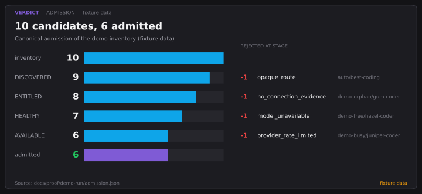
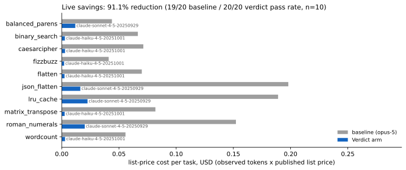
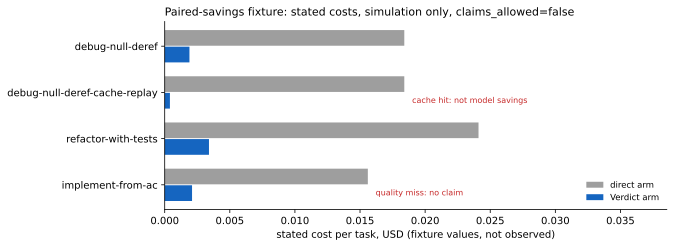

<div align="center">

# Verdict

**An autonomous development control plane: a goal goes in, and a verified, independently reviewed, receipted change comes out.**

A model that fails a safety check cannot be scored back in.

[](https://github.com/mrnicholasbcarter-code/verdict-core/actions/workflows/ci.yml)
[](https://github.com/mrnicholasbcarter-code/verdict-core/actions/workflows/security.yml)
[](.github/workflows/ci.yml)
[](pyproject.toml)
[](pyproject.toml)
[](LICENSE)

[Quick start](#quick-start) · [Demo](#demo-goal-to-receipt) · [What it does](#what-it-does) · [How it works](#how-it-works) · [How Verdict differs](#how-verdict-differs) · [Roadmap](#roadmap-in-progress) · [Install](#install) · [Commands](#commands) · [Limits](#limits)


<sub>Fixture run, credential-free, no model calls. Recorded from <a href="scripts/demo_orchestrate.py"><code>scripts/demo_orchestrate.py</code></a>. Full cast: <a href="docs/assets/demo.cast"><code>docs/assets/demo.cast</code></a>.</sub>

</div>

Give Verdict a goal and a git repository. It runs this loop:

1. **Plan.** A planner model splits the goal into a small DAG of work nodes. Each node has owned files and a verification command.
2. **Admit.** Verdict builds one admitted set of models from live gateway evidence: inventory, provider accounts, health, cooldowns and quota. Every dropped model gets a named reason. A model with no runtime evidence is kept as `unknown`, never counted as healthy, and it must pass a live check of that exact route before it launches.
3. **Assign.** Each node gets its own model from that set. Already-paid subscription capacity and free tiers rank before metered, pay-per-token routes.
4. **Recover.** A quota, rate-limit, timeout or empty-answer failure cools down the route or the whole provider. The same node then goes to another admitted model. When no admitted model is left, or after 4 attempts, the node stops with a named `FAIL_CLOSED` and the run ends `BLOCKED`. It does not retry forever.
5. **Verify and review.** Each node must pass its own check and an ownership check. The merged result must pass an integration check. Then a reviewer that did not write any of the code reviews it.
6. **Receipt.** The run ends with a receipt that stores a SHA-256 digest of its event log. `verdict run-receipt` recomputes the digest and rebuilds the receipt, so any later edit to the log shows up.

This repository is the control plane: planning, admission, assignment, recovery and proof. Three
external tools do the execution, and Verdict only calls them:

- **OmniRoute** is a local OpenAI-compatible gateway. It supplies the model inventory and runs model calls ([`verdict/omniroute.py`](verdict/omniroute.py)).
- **Prime Agent** is a headless coding-agent CLI. It runs each worker process (`prime-agent -p --model <exact route>`) and does not select models.
- **`ocr`** (open-code-review) is the reviewer CLI ([`verdict/orchestration/review.py`](verdict/orchestration/review.py)).

## Quick start

Run the credential-free fixture from an empty directory, with no API key, no gateway, and no
network access:

```bash
verdict quickstart --non-interactive --dry-run
```

The fixture makes one deterministic routing decision, selects `demo/frontier-tools`, and
names every excluded candidate:

```text
Verdict credential-free quickstart
===================================
Task: Add structured output to the invoice parser
Required capabilities: structured_output, tools
Selected route: demo/frontier-tools
Excluded candidates: 3
Receipt: fixture:issue-35 (deterministic_fixture)
Status: PASS
- demo/no-tools: missing capability: tools
- demo/quota-empty: quota exhausted
- demo/unverified: health unknown
```

Read the last three lines first: `demo/frontier-tools` was selected, and each of the other
three candidates was refused with a named reason (`missing capability: tools`, `quota
exhausted`, `health unknown`). Nothing here calls a provider, reads a credential, or writes
state. The executable source and its regression test are
[`verdict/flagship_demo.py`](verdict/flagship_demo.py) and
[`tests/test_flagship_demo.py`](tests/test_flagship_demo.py); the test asserts this exact
block byte-for-byte against the README.

For a contributor checkout:

```bash
uv sync --extra dev
uv run python -m verdict quickstart --non-interactive --dry-run
```

## Demo: goal to receipt

**Real-model run replay: visual TUI walkthrough** (kr/* workers, controller failover, independent review PASS)


<sub>Replay of the recorded real-model run [`docs/proof/live-controller-run`](docs/proof/live-controller-run), sped up; recorded with [`scripts/record_tui_demo.py`](scripts/record_tui_demo.py). You can run this yourself: `verdict watch docs/proof/live-controller-run --replay --speed 20`</sub>

---

**Fixture run. Credential-free, deterministic, no model calls, no network.**

```bash
python scripts/demo_orchestrate.py --out docs/proof/demo-run
verdict run-receipt docs/proof/demo-run
```

[`scripts/demo_orchestrate.py`](scripts/demo_orchestrate.py) runs the real orchestration code:
`run_golden_path`, the planner parser, canonical `admit()`, the `EligibilityLadder`, `DagRuntime` with one
git worktree per attempt, `FailureIntelligence`, the integration barrier, the reviewer-independence
policy and the receipt writer. Only the edges are fixtures:

| Edge | In the demo | In `verdict orchestrate` |
|---|---|---|
| Model inventory and provider accounts | 10 fixture routes, 5 fixture accounts | OmniRoute `/v1/models` and `/api/providers` |
| Health probe | fixture: every probed route is healthy | 1-token probe through the gateway |
| Workers | scripted: write the owned file, answer `RESULT: DONE` | Prime Agent on the selected route |
| Faults | `FaultInjectingExecutor`: quota and rate limit on `parser`, no final answer on `cli_flag` | real provider failures (or the same injector via `--inject`) |
| Reviewer | fixture: selects an independent route through the ladder, returns `PASS` | `ocr` on the selected route |

The committed run is in [`docs/proof/demo-run/`](docs/proof/demo-run). Verifying it prints:

```text
COMPLETE: all implement/integrate nodes validated, barrier ok, review PASS
integrity: OK (events digest verified)
  parser             VALIDATED        demo-sub/atlas-coder[failure:quota_exhausted*] -> demo-free/birch-coder[failure:rate_limited*] -> demo-free2/elm-coder[success]
  cli_flag           VALIDATED        demo-sub/atlas-coder[failure:no_final_answer*] -> demo-free/cedar-coder[success]
  integrate          VALIDATED        merge[success]
  review: PASS by fixture-reviewer (no model call) on demo-metered/delta-coder
```

`*` marks an injected fault. Here is how to read the run:

- `parser` started on the subscription route. An injected quota failure put the whole `demo-sub`
  provider on cooldown. The node moved to a free route and got an injected rate limit, which cooled
  down `demo-free`. It then moved to a free route at a third provider and passed.
- `cli_flag` got `no_final_answer`, which cools down only that route, and moved to another free route.
- No route that wrote code could review it, and neither could any of its model families. The two
  cooled providers were out, and `fir-mini` has no tool calling. So the review went to the metered
  route: it was the only admitted candidate left.
- Change one byte of `events.jsonl` and `run-receipt` reports
  `events_digest mismatch: events.jsonl changed after receipt was written`. The end of the recording shows this.



<sub>Data: [`docs/proof/demo-run/admission.json`](docs/proof/demo-run/admission.json), the canonical admission receipt of the demo inventory. Fixture data.</sub>


<sub>Data: [`docs/proof/demo-run/receipt.json`](docs/proof/demo-run/receipt.json), the demo run receipt. Fixture data with injected faults.</sub>

To regenerate the run, the cast and the charts, see [Regenerating the demo assets](#regenerating-the-demo-assets).


## What it does

Each claim links to the code that does it and a test that checks it, at this commit.

**One admitted set, narrowed but never widened.** `admit()` builds the admitted set from live inventory,
provider connections and runtime evidence. A missing input fails closed, and there is no catalog-only
fallback ([`verdict/admission.py:940`](verdict/admission.py#L940)). The set cannot be built any other way
([`:389`](verdict/admission.py#L389)). Scope, provider family and the active controller can only narrow it
([`verdict/orchestration/cli.py:219-227`](verdict/orchestration/cli.py#L219-L227)). The ladder raises
`AdmissionBypassError` if it ever picks a route outside the set
([`verdict/orchestration/eligibility.py:207`](verdict/orchestration/eligibility.py#L207)).
Tests: [`tests/test_admission.py`](tests/test_admission.py), [`tests/test_orchestration_admission.py`](tests/test_orchestration_admission.py).

**Per-node assignment, paid-for and free capacity first.** Every node runs the eligibility ladder
`DISCOVERED → ENTITLED → HEALTHY → AVAILABLE → TASK_ELIGIBLE → SELECTED` and records the failed stage and
the reason for each candidate. The ladder ranks by capacity class first: subscription, then free, then
metered, then unknown ([`verdict/orchestration/eligibility.py:30-35`](verdict/orchestration/eligibility.py#L30-L35)).
Within a class it ranks by provider preference, then by current load, then by task fit
([`:478`](verdict/orchestration/eligibility.py#L478)). Capacity class comes from account evidence,
never from a model name. Probes go round-robin across providers within a class, so one failing provider
cannot use up the probe budget ([`:539-621`](verdict/orchestration/eligibility.py#L539-L621)).
Test: [`tests/test_orch_eligibility.py`](tests/test_orch_eligibility.py).

**Cheaper-first on the single-route path is a runtime assertion.** `RouteSelection` raises in its own
constructor when a paid identity was chosen while a cheaper kept candidate existed
([`verdict/live_routing.py:85-93`](verdict/live_routing.py#L85-L93)). For low-criticality `verdict route`
calls, `_offload_free_tier` admits only concrete **free-tier ∩ active-provider** identities and fails closed
on an empty intersection ([`verdict/intelligence.py:1030`](verdict/intelligence.py#L1030),
[`verdict/free_tier_admit.py`](verdict/free_tier_admit.py)). Test: [`tests/test_free_tier_admit.py`](tests/test_free_tier_admit.py).

**Recovery by reassignment, with a hard stop.** `FailureIntelligence` maps each failure to a category, an
action, a cooldown and a scope: route or provider
([`verdict/orchestration/recovery.py:148`](verdict/orchestration/recovery.py#L148)). Each failure resolves to
exactly one outcome. `RETRY_INFRA` retries the same route after a gateway-local shed. `BLOCK` stops with
`non-recoverable: <category>`. Every other failure reassigns the same node to the next admitted route and
emits a `reassign` event ([`verdict/orchestration/runtime.py:430-451`](verdict/orchestration/runtime.py#L430-L451)).
After `max_attempts_per_node` (4), or with no admitted route left, the node ends in `pool_exhausted` /
`FAIL_CLOSED` ([`:361-371`](verdict/orchestration/runtime.py#L361-L371)). Tests:
[`tests/test_orch_recovery.py`](tests/test_orch_recovery.py), [`tests/test_orch_runtime.py`](tests/test_orch_runtime.py).

**Relay retries stay inside the admitted set.** The OpenAI-compatible relay tries an alternative only when
the decision marked it admitted, and only when the live admitted set (if wired) also holds it. If the
selected model is outside the live set, the relay makes no attempt
([`verdict/relay.py:152-170`](verdict/relay.py#L152-L170)). Test: [`tests/test_relay_admission.py`](tests/test_relay_admission.py).

**Independent review.** The reviewer must not be any route that wrote code in the run. It should also be
from a different model family; if no other family has capacity, route-level independence is used and
recorded ([`verdict/orchestration/runtime.py:989-1014`](verdict/orchestration/runtime.py#L989-L1014)). A
non-zero exit, a timeout or output that does not parse all become `ERROR`, never `PASS`
([`verdict/orchestration/review.py:1-19`](verdict/orchestration/review.py#L1-L19)).
Tests: [`tests/test_orch_review.py`](tests/test_orch_review.py), [`tests/test_orch_resume.py`](tests/test_orch_resume.py).

**Tamper-evident receipts.** The receipt stores the SHA-256 of `events.jsonl`
([`verdict/orchestration/receipt.py:173`](verdict/orchestration/receipt.py#L173),
[`:476`](verdict/orchestration/receipt.py#L476)). Verification recomputes it and rebuilds every other field
from the same log ([`:525`](verdict/orchestration/receipt.py#L525)).
Tests: [`tests/test_orch_receipt.py`](tests/test_orch_receipt.py), [`tests/test_readme_assets.py`](tests/test_readme_assets.py)
(verifies the committed demo run).

## Decision signals (OpenJev)

Verdict can ask an external decision-signal provider how complex, how frontier-worthy and how ambiguous a
task looks. The shipped provider is OpenJev System-One, reached through the Codiv API
([`verdict/decision_signals/openjev.py`](verdict/decision_signals/openjev.py)). Signals are inputs to
Verdict. They never make the decision.

`VERDICT_DECISION_SIGNALS_MODE` selects the mode ([`verdict/decision_signals/shadow.py:21-36`](verdict/decision_signals/shadow.py#L21-L36)).
The provider is built only when the mode is not `OFF` and `TYPESAFE_API_KEY` is set
([`verdict/decision_signals/factory.py`](verdict/decision_signals/factory.py)).

| Mode | What it can change | What it cannot change |
|---|---|---|
| `OFF` (default) | Nothing. The provider is never called. | — |
| `SHADOW` | Nothing. `verdict orchestrate` asks once per run, before planning, and records the answer next to the actual planner choice as a `decision_signals` event in the receipt ([`verdict/orchestration/run.py:208-230`](verdict/orchestration/run.py#L208-L230), [`:316-331`](verdict/orchestration/run.py#L316-L331)). | Planner selection, node requirements, the DAG. Test: [`tests/test_shadow_integration.py`](tests/test_shadow_integration.py). |
| `ADVISORY` | On the single-route path (`IntelligenceService.route`), the order of already-admitted candidates, so it can change which admitted model is picked ([`verdict/intelligence.py:526-608`](verdict/intelligence.py#L526-L608)). Every outcome is recorded as an `advisory:*` safety flag. | Membership: it never adds, removes or restores a candidate. It is skipped for protected (tier 0) tasks, restricted-privacy tasks, confidence below 0.6 (default), a provider error, and no answer within the timeout (default 1,500 ms) ([`verdict/decision_signals/advisory.py:1-31`](verdict/decision_signals/advisory.py#L1-L31)). In `verdict orchestrate`, `ADVISORY` behaves like `SHADOW`. Test: [`tests/test_decision_signals_advisory.py`](tests/test_decision_signals_advisory.py). |

The demo run records one `SHADOW` signal from a fixture provider in its receipt. The test above shows that opposite `SHADOW` signals produce the same requirements and the same DAG.

## Roadmap (in progress)

These are not done at this commit. They are listed so nothing above is read as covering them.

- **Cross-provider fencing on the first worker failure.** Today a failure cools down only the failed route or its own provider. Other providers stay eligible until they fail themselves.
- **Root-controller failover.** Worker nodes are reassigned. A failing root controller is not yet replaced automatically.
- **A single retry authority.** Node recovery, the relay and the reviewer each keep their own bounded retry loop today.
- **Subscription headroom.** Quota rows are evidence only: exhausted means drop. Admission does not yet plan around the headroom left in a subscription window.
- **Automatic gateway lifecycle.** Verdict does not start, restart or upgrade OmniRoute. The gateway must already be running for live runs.

## How it works

A single `verdict orchestrate` call runs the full pipeline:

```
goal
 └─ CONTROLLER  frontier planner decomposes into a WorkGraph (DAG)
     └─ PLAN / DAG  topology chosen deterministically (SOLO / WORKER_CRITIC / PARALLEL_WORK_UNITS)
         └─ SELECT  per-node eligibility ladder
             │  DISCOVERED → ENTITLED → HEALTHY → AVAILABLE → TASK_ELIGIBLE → SELECTED
             └─ WORKERS  parallel execution; each node gets its own worktree + route
                 └─ RECOVERY  quota / rate-limit / timeout → same-node reroute → pool exhaustion → FAIL_CLOSED
                     └─ VERIFY  ownership check + per-node tests + integration barrier
                         └─ REVIEW  independent OCR (open-code-review); reviewer excluded from all implementer routes
                             └─ RECEIPT  SHA-256 digest of the event log; `run-receipt` re-verifies it
```

Three-role split:

| Role | Responsibility |
|---|---|
| **Verdict** | plans, selects models, recovers from faults, verifies, writes receipts |
| **Prime Agent harness** | runs worker processes (`prime-agent -p --model <exact route>`); does not select models |
| **OmniRoute transport** | provides `/v1/models` inventory and `/v1/chat/completions` execution; is not a metadata source of truth |

Four properties hold by construction, on both the orchestration and the single-route paths:

- **Paid is never chosen while a cheaper qualified candidate remains.** `RouteSelection`
  raises on construction if this is violated.
- **Every dropped candidate carries a named reason** — `policy`, `health`, `capability`,
  `quota`, `stale`, `opaque_mix`, `cost`, or `unclassified`.
- **Opaque `auto/*` references are not candidates.** They resolve to an unknown model at call
  time and are dropped.
- **An unreachable surface produces `blocked`, not a pass.** Fixture data cannot satisfy a
  live proof.

Orchestration is specified in [ADR-036](docs/adr/ADR-036-goal-to-receipt-orchestration.md).
ADR-023 (governed swarm supervision) is superseded.

Three of the six verified diagrams below; the other three
([ecosystem](diagrams/ecosystem.mmd), [explain-flow](diagrams/explain-flow.mmd),
[setup-detection-flow](diagrams/setup-detection-flow.mmd)) are linked rather than embedded.
Every diagram carries a header comment listing the exact source files it reflects, and
[`tests/test_diagrams.py`](tests/test_diagrams.py) checks that every named source file and
function actually exists.

<details>
<summary><strong>route-flow</strong> — <code>POST /v1/route</code> and the OpenAI-compatible relay surfaces</summary>


```mermaid
%% route-flow.mmd -- POST /v1/route and the OpenAI-compatible relay surfaces
%% Source (verified against code at this commit):
%%   verdict/api.py (route_task, _authority_context, _route_with_intelligence, _relay_completion)
%%   verdict/intelligence.py (IntelligenceService.route)
%%   verdict/eligibility.py (EligibilityGate.evaluate, _judge)
%%   verdict/router.py (select_best_model, select_best_eligible_model)
%%   verdict/proxy.py (UpstreamProxy.chat/.responses/._forward)
%%   verdict/dispatcher.py (SwarmDispatcher.dispatch -- separate planning contract, not on this HTTP path)
flowchart TD
    CLIENT["HTTP client"] --> POST["POST /v1/route -- route_task"]
    CLIENT --> RELAY["POST /v1/chat/completions or /v1/responses -- _relay_completion"]
    EMBED["Sync embedder -- Gate.route"] --> ISVC

    POST --> AUTHCTX["_authority_context(payload) rejects a client-supplied execution_path_decision"]
    AUTHCTX --> RWI["_route_with_intelligence sets CONTEXT_REQUIRE_AUTHORITY=True by default"]
    RWI --> ISVC["IntelligenceService.route -- async"]
    RELAY --> AUTHCTXR["_authority_context(payload) -- same client-decision rejection"]
    AUTHCTXR -- "calls IntelligenceService.route directly, no default CONTEXT_REQUIRE_AUTHORITY (required only via serve_path_authority_required: env or profile=production)" --> ISVC

    ISVC --> EP{"resolve_execution_path_decision(context) present?"}
    EP -- yes --> AUTHREQ["require_serve_path_decision then selected_route_dispatch_identity(ep)"]
    AUTHREQ --> DEC104["RoutingDecision decision=selected, safety_flags include bod104_strategy:SELECTED_STRATEGY"]
    EP -- "no, and require_authority" --> EPERR["raise ExecutionPathError('missing ExecutionPathDecision...')"]
    EPERR --> H400["HTTPException 400 detail=str(exc), caught by route_task / _relay_completion"]

    EP -- "no, legacy feed path" --> SCAN["scan(task) heuristic tier (verdict/escalation.py) + self.planner.plan(task).task_spec"]
    SCAN --> TIER["final_tier = min(task_tier, safety_floor, eff_tier)"]
    TIER --> OFFLOAD["final_tier > 0 and not allow_offline -> _offload_free_tier may return an early decision"]
    OFFLOAD --> CAND["candidates = static_catalog() (allow_offline) or fetch_models() per configured provider"]
    CAND --> GATE["EligibilityGate.evaluate(candidates, protected=(final_tier==0), dev_mode=(profile=='development'))"]
    GATE --> JUDGE["EligibilityGate._judge per candidate -> EligibilityRecord"]
    JUDGE --> ADMIT["eligibility.eligible = admitted candidates"]

    ADMIT --> RANK["select_best_eligible_model -> select_best_model: sorts by quality_confidence desc, capability_tier asc, provider priority desc, id"]
    RANK --> HASBEST{"best_model found?"}
    HASBEST -- yes --> DECSEL["RoutingDecision decision=selected, candidate_states=eligibility records"]
    HASBEST -- no --> FALLBACK["best_model is None -- no exception raised"]
    FALLBACK --> DECFB["RoutingDecision model=primary_model, tier=0, decision=fallback, reason='fallback — no offload match', safety_flags include eligibility_exclusions_applied when protected exclusions occurred"]
    TIER -. "final_tier == 0 (protected)" .-> DECPROT["RoutingDecision tier=0, protected=True, decision=fallback, reason='critical — never offload'"]

    DEC104 --> LOG["log_decision(...) appends to verdict-decisions.jsonl when log_path is set"]
    DECSEL --> LOG
    DECFB --> LOG
    DECPROT --> LOG
    LOG --> DENIED{"decision.decision == 'denied'?"}
    DENIED -- no --> R200["route_task: JSONResponse status 200 with x-verdict-evidence-* headers"]
    DENIED -- yes --> R503["route_task: status 503; _relay_completion: _proxy_error(503, decision.reason)"]

    DENIED -- "no, relay surface" --> FWD["build_attempts(proxy_instance, decision, protocol) -- one or more attempted routes"]
    FWD --> FORWARD["UpstreamProxy.chat / UpstreamProxy.responses -> UpstreamProxy._forward (httpx, buffered or streamed)"]

    DISP["SwarmDispatcher.dispatch -- separate planning contract, NOT reached from this HTTP path"]
    DISP --> DNOROUTE["selected_route is None and authorized_runtime_id is empty -> DispatchResult reason=missing_authorized_selected_route"]
    DISP --> DNOELIG["eligible candidates list is empty -> DispatchResult reason='no eligible candidates'"]
    DISP --> DMISMATCH["authorized_runtime_id has no matching eligible candidate -> raise ExecutionPathError"]
%% evidence: verdict/api.py:944 async def route_task(request, req)
%% evidence: verdict/api.py:909 def _authority_context(payload, *, task) -- rejects client execution_path_decision
%% evidence: verdict/api.py:923 async def _route_with_intelligence(...)
%% evidence: verdict/api.py:929,932 CONTEXT_REQUIRE_AUTHORITY imported from verdict.serve_path, merged.setdefault(..., True)
%% evidence: verdict/api.py:936-940,949-952 ExecutionPathError caught -> HTTPException(400, str(exc))
%% evidence: verdict/api.py:978 status_code = 200 if decision.decision != "denied" else 503
%% evidence: verdict/api.py:1427 async def _relay_completion(request, *, surface)
%% evidence: verdict/api.py:1515,1606,1608 decision.decision == "denied" branch; proxy_instance.responses / proxy_instance.chat
%% evidence: verdict/gate.py:115,152-155 class Gate.route delegates to self.intelligence.route (sync/async bridge)
%% evidence: verdict/intelligence.py:211,360 class IntelligenceService, async def route(...)
%% evidence: verdict/intelligence.py:392-403 resolve_execution_path_decision / require_serve_path_decision imported and called
%% evidence: verdict/intelligence.py:437 raise ExecutionPathError("missing ExecutionPathDecision; ...")
%% evidence: verdict/intelligence.py:30 from verdict.escalation import scan; :447 self.planner.plan(task_str, ...).task_spec
%% evidence: verdict/intelligence.py:476 final_tier = min(task_tier, safety_floor, eff_tier if eff_tier is not None else 3)
%% evidence: verdict/intelligence.py:478 self._offload_free_tier(...) called when final_tier > 0 and not allow_offline
%% evidence: verdict/intelligence.py:501,507 self.static_catalog() / fetch_models(name, cfg, self.discovery_ttl)
%% evidence: verdict/intelligence.py:514 self.eligibility_gate.evaluate(candidates, protected=(final_tier == 0), dev_mode=...)
%% evidence: verdict/intelligence.py:576-579 select_best_eligible_model(eligibility, final_tier, self.providers) if eligibility is not None else select_best_model(candidates, final_tier, self.providers)
%% evidence: verdict/intelligence.py:623-644 final_tier == 0 or not best_model -> fallback RoutingDecision (decision="fallback" if best_model is None else "selected")
%% evidence: verdict/eligibility.py:143,165,189 class EligibilityGate, def evaluate, def _judge
%% evidence: verdict/router.py:7 select_best_model / router.py:44 select_best_eligible_model
%% evidence: verdict/proxy.py:199 async def chat / proxy.py:205 async def responses / proxy.py:223 async def _forward
%% evidence: verdict/dispatcher.py:135,147 class SwarmDispatcher, def dispatch
%% evidence: verdict/dispatcher.py:181-195 missing_authorized_selected_route / "no eligible candidates"
%% evidence: verdict/dispatcher.py:198-206 authorized_runtime_id mismatch -> raise ExecutionPathError
```

</details>

<details>
<summary><strong>eligibility-ladder</strong> — DISCOVERED → ENTITLED → HEALTHY → AVAILABLE → TASK_ELIGIBLE → SELECTED</summary>


```mermaid
%% eligibility-ladder.mmd -- DISCOVERED -> ENTITLED -> HEALTHY -> AVAILABLE -> TASK_ELIGIBLE -> SELECTED
%% Source (verified against code at this commit):
%%   verdict/orchestration/contracts.py (EligibilityStage, RouteVerdict, TaskRequirements)
%%   verdict/orchestration/eligibility.py (EligibilityLadder._assess, _task_gate, select, _rank_key, cooldown_seconds_for)
stateDiagram-v2
    direction TB
    [*] --> DISCOVERED

    DISCOVERED : present in the inventory rows passed to EligibilityLadder
    ENTITLED : an active provider connection backs the route (conn.isActive)
    HEALTHY : recent probe recorded healthy, or none yet recorded (lazy)
    AVAILABLE : no active route/provider cooldown, no rate-limit window
    TASK_ELIGIBLE : capabilities, context, exclusions, frontier policy fit
    SELECTED : ranked first among selectable candidates and probe-confirmed healthy

    state NotDiscovered {
        [*] --> OpaqueSkipped
        OpaqueSkipped : route id starts with auto/, combo/, router/, virtual/, or owned_by == "combo" -- skipped before assessment, never emitted
    }

    DISCOVERED --> NotDiscovered : opaque prefix or combo owner -> never DISCOVERED, no verdict at all
    DISCOVERED --> ENTITLED : _connection_for(provider) returns a connection and conn.isActive
    DISCOVERED --> FailedEntitled : conn is None or not isActive -> reason=no_active_account
    DISCOVERED --> FailedEntitled2 : harness_visible(route_id) is False -> reason=not_harness_visible (or harness_inventory_unavailable if the harness gate itself is unavailable)

    ENTITLED --> HEALTHY : _health_status returns anything other than unhealthy (healthy, unprobed, or stale all continue)
    ENTITLED --> FailedHealthy : _health_status == unhealthy -> failed_stage=HEALTHY, reason=health_category, cooldown_until set if a route cooldown is active

    HEALTHY --> AVAILABLE : no active cooldown for route:ROUTE_ID or provider:PROVIDER, and no rate_limited_until window covers now
    HEALTHY --> FailedAvailable : active cooldown route:ROUTE_ID -> reason=cooldown:route
    HEALTHY --> FailedAvailable2 : active cooldown provider:PROVIDER -> reason=cooldown:provider
    HEALTHY --> FailedAvailable3 : _rate_limited_until(conn) covers now -> reason=provider_rate_limited

    AVAILABLE --> TASK_ELIGIBLE : _task_gate returns empty string
    AVAILABLE --> FailedTask : missing capability (required_capabilities vs row.capabilities, "tools" maps to tool_calling) -> reason=missing_capability:CAP_NAME
    AVAILABLE --> FailedTask2 : max_input_tokens/context_length below min_context_tokens -> reason=insufficient_context
    AVAILABLE --> FailedTask3 : route_id in exclude_routes, or route_family(route_id) in exclude_families -> reason=excluded_route / excluded_family
    AVAILABLE --> FailedTask4 : route id matches a frontier marker and requirements.frontier_worthy is False -> reason=frontier_restricted
    AVAILABLE --> FailedTask5 : route id is an effort-suffixed duplicate (-low/-medium/-high/-xhigh/-max/-ultra) of a base row that also exists -> reason=effort_duplicate

    TASK_ELIGIBLE --> SELECTED : select() probes candidates in rank order (round-robin across providers within a capacity tier), first one that is healthy or probes healthy is chosen -> reason=selected
    TASK_ELIGIBLE --> FailedSelected : load(route_id) >= max_per_route (2) before probing -> failed_stage=SELECTED, reason=at_capacity
    TASK_ELIGIBLE --> ProbeBudgetExhausted : select() has already used max_probes_per_select (8) probes this call -> reason=probe_budget_exhausted (route stays TASK_ELIGIBLE, just not probed this call)

    SELECTED --> [*]
    FailedEntitled --> [*]
    FailedEntitled2 --> [*]
    FailedHealthy --> [*]
    FailedAvailable --> [*]
    FailedAvailable2 --> [*]
    FailedAvailable3 --> [*]
    FailedTask --> [*]
    FailedTask2 --> [*]
    FailedTask3 --> [*]
    FailedTask4 --> [*]
    FailedTask5 --> [*]
    FailedSelected --> [*]
    ProbeBudgetExhausted --> [*]
%% evidence: verdict/orchestration/contracts.py:287 EligibilityStage enum (DISCOVERED..SELECTED, each with a docstring comment)
%% evidence: verdict/orchestration/contracts.py:311 RouteVerdict (route_id, provider, reached, failed_stage, reason, capacity_class, plan_label, cooldown_until, rank)
%% evidence: verdict/orchestration/contracts.py:339 TaskRequirements (required_capabilities, min_context_tokens, exclude_routes, exclude_families, frontier_worthy)
%% evidence: verdict/orchestration/eligibility.py:23 _OPAQUE_PREFIXES = ("auto/", "combo/", "router/", "virtual/")
%% evidence: verdict/orchestration/eligibility.py:358-362 opaque prefix / owned_by == "combo" skipped before assessment, "opaque routers are never DISCOVERED"
%% evidence: verdict/orchestration/eligibility.py:271-272 conn is None or not isActive -> failed_stage=ENTITLED, reason=no_active_account
%% evidence: verdict/orchestration/eligibility.py:274-277 harness_visible check -> not_harness_visible / harness_inventory_unavailable
%% evidence: verdict/orchestration/eligibility.py:225 _health_status(route_id, now) -> healthy|unhealthy|unprobed|stale (TTL-gated)
%% evidence: verdict/orchestration/eligibility.py:281-282 health == "unhealthy" -> failed_stage=HEALTHY
%% evidence: verdict/orchestration/eligibility.py:288-296 cooldown:route / cooldown:provider -> failed_stage=AVAILABLE
%% evidence: verdict/orchestration/eligibility.py:297-301 provider_rate_limited -> failed_stage=AVAILABLE
%% evidence: verdict/orchestration/eligibility.py:310-330 _task_gate: missing_capability, insufficient_context, excluded_route, excluded_family, frontier_restricted, effort_duplicate
%% evidence: verdict/orchestration/eligibility.py:368-369 load(route_id) >= max_per_route (2) -> failed_stage=SELECTED, reason=at_capacity
%% evidence: verdict/orchestration/eligibility.py:342 _rank_key (capacity order, preferred provider, load, -fit, route_id)
%% evidence: verdict/orchestration/eligibility.py:157,384-418 select(): max_probes_per_select=8, probe_order round-robin, probe_budget_exhausted
%% evidence: verdict/orchestration/eligibility.py:427-433 chosen route emitted with reached=SELECTED, reason="selected"
%% evidence: verdict/orchestration/eligibility.py:86-89,33-44 cooldown_seconds_for / _CATEGORY_COOLDOWN_SECONDS per failure category
```

</details>

<details>
<summary><strong>orchestration-flow</strong> — <code>verdict orchestrate GOAL</code>: goal to receipt</summary>


```mermaid
%% orchestration-flow.mmd -- verdict orchestrate GOAL: goal to receipt
%% Source (verified against code at this commit):
%%   verdict/orchestration/run.py (plan_with_failover, load_or_create_run)
%%   verdict/orchestration/planner.py (FrontierPlanner.plan, choose_topology, parse_plan, hydrate_node_prompt)
%%   verdict/orchestration/contracts.py (WorkGraph, NodeState)
%%   verdict/orchestration/runtime.py (DagRuntime.run, _drive, _attempt, _validate, _integrate_node)
%%   verdict/orchestration/recovery.py (FailureIntelligence.classify, RecoveryBudget)
%%   NOTE: RecoveryBudget.decide is defined but NOT imported/used by runtime.py or run.py -- FailureIntelligence.classify is the wired classifier
%%   verdict/orchestration/review.py (OpenCodeReviewer.review)
%%   verdict/orchestration/receipt.py (build_run_receipt, write_run_receipt, verify_run_receipt, completion_verdict)
flowchart TD
    GOAL["verdict orchestrate GOAL"] --> RUNDIR["load_or_create_run(root, run_id) -- creates/loads run dir, events.jsonl"]
    RUNDIR --> HASGRAPH{"graph.json already present (resume)?"}
    HASGRAPH -- yes --> LOADG["WorkGraph.from_dict(graph_raw); prior_validated(run_dir) reuses VALIDATED nodes"]
    HASGRAPH -- no --> PLAN["plan_with_failover -- up to max_attempts=6 controller-model attempts"]

    PLAN --> PSEL["TaskRequirements(frontier_worthy=True, min_context_tokens=100_000, exclude_routes=tried); selector.select(...)"]
    PSEL --> PRUN["FrontierPlanner().plan(goal, repo, executor, route_id, ...) -- one repair round on parse failure"]
    PRUN --> PFAIL["OrchestrationError -> classifier.classify(source) -> events.emit('controller', state='QUOTA'|'PLANNER_FAILED')"]
    PFAIL --> PCOOL["failure.scope != 'none' and cooldown_seconds > 0 -> selector.record_failure + emit('cooldown', ...)"]
    PCOOL --> PREPLACE["tried.add(route_id); events.emit('controller', state='REPLACING'); loop to PSEL"]
    PRUN --> TOPO["choose_topology(nodes, max_parallel) -- deterministic rules (SOLO / WORKER_CRITIC / PARALLEL_WORK_UNITS), never a model choice"]
    TOPO --> GRAPH["WorkGraph(goal, nodes, topology, rationale, max_parallel) -- validates DAG, cycles, ownership on construction"]
    LOADG --> GRAPH
    PSEL -. "selector.select returns None: no eligible controller model" .-> PBLOCK["raise OrchestrationError('planning failed on every eligible frontier model; last: ...')"]

    GRAPH --> READY["DagRuntime.run() -- loop while nodes remain PLANNED/RUNNING; dispatch _ready() nodes whose deps are VALIDATED"]
    READY --> DRIVE["_drive(node_id) per node, tasks bounded by asyncio.Semaphore(min(policy.max_parallel, graph.max_parallel))"]

    DRIVE --> ATTLOOP{"run.attempt >= policy.max_attempts_per_node (4)?"}
    ATTLOOP -- yes --> POOLX["node -> BLOCKED, emit('failure', category='pool_exhausted', action='FAIL_CLOSED')"]
    ATTLOOP -- no --> LADDER["TaskRequirements.for_node(run.node, exclude_routes=tried); selector.select(requirements, now)"]
    LADDER -. "choice is None, no prior wait this node" .-> COOLWAIT["find earliest AVAILABLE-stage cooldown <= max_cooldown_wait_seconds (120); emit('cooldown', key='pool', category='waiting_for_capacity'); sleep; retry once"]
    COOLWAIT --> LADDER
    LADDER -. "choice is still None" .-> POOLX2["node -> BLOCKED, reason='no eligible model: ' + _explain_exhaustion(considered); emit('failure', category='pool_exhausted', action='FAIL_CLOSED')"]

    LADDER --> ATTEMPT["_attempt(run, failures): ADMITTED -> DISPATCHED -> RUNNING; hydrate_node_prompt(node, repo, goal, max_context_bytes=60_000)"]
    ATTEMPT --> EXEC["executor.run(prompt, route_id, cwd, timeout_seconds) -> WorkerTerminal(ok, output, model, error, status_code, retry_after_seconds)"]
    EXEC --> VALID["_validate(run, worktree, base): ownership barrier over node.owned_files, then node.verification_command"]
    VALID --> OKN["VALIDATED"]
    VALID --> BADV["'ownership_violation: PATHS' or 'verification_failed: exit EXIT_CODE: OUTPUT_TAIL' -> _attempt returns False"]
    EXEC --> BADT["terminal.ok is False -> _attempt returns False"]

    BADT --> CLASS["classifier.classify(terminal, now) -> FailureClassification(category, action, cooldown_seconds, scope)"]
    BADV --> CLASS
    CLASS --> COOL["failure.scope in {route, provider} -> selector.record_failure(run.route_id, failure, now); emit('cooldown', ...)"]
    COOL --> ACTION{"failures[-1].action"}
    ACTION -- "RETRY_INFRA" --> SAMEROUTE["asyncio.sleep(min(cooldown_seconds, 60)); same route retried next loop -- gateway-local transient, route not cooled"]
    ACTION -- other --> REASSIGN["tried.add(run.route_id); emit('reassign', from_route, to_route) on the NEXT successful selection; node -> PLANNED (reassign=True)"]
    ACTION -- "BLOCK" --> NONREC["node -> BLOCKED, reason='non-recoverable: CATEGORY'"]
    SAMEROUTE --> DRIVE
    REASSIGN --> DRIVE

    OKN --> BARRIER["_integrate_node for INTEGRATE/REVIEW kind nodes: merge validated dependency commits, emit('barrier', name='integration', ok=...)"]
    BARRIER --> REVIEW{"policy.require_review?"}
    REVIEW -- "yes, reviewer is None" --> NOREV["_finish(BLOCKED, 'review required but no reviewer configured')"]
    REVIEW -- "yes, reviewer configured" --> INDEP["implementers = frozenset(route_id per node); families = route_family(implementers); try level='family' (exclude families) then level='route' (route-only exclusion) if family attempt errors with 'no independent reviewer'"]
    INDEP --> OCR["reviewer.review(repo, base_ref, head_ref, background=goal, exclude_routes=implementers, exclude_families) -- OpenCodeReviewer wraps the 'ocr' CLI"]
    OCR --> RRES["ReviewResult(status PASS|FAIL|ERROR, reviewer, route_id, findings); .passed is True only when status==PASS and no finding.blocking()"]
    RRES --> RPASS["passed -> integration + review recorded; run proceeds to receipt build"]
    RRES --> RFAIL["not passed -> _finish(BLOCKED, ...) with the review status/detail"]

    RPASS --> RECEIPT["build_run_receipt(run_dir): read events.jsonl, rebuild WorkGraph, per-node attempt records"]
    RFAIL --> RECEIPT
    POOLX --> RECEIPT
    POOLX2 --> RECEIPT
    NONREC --> RECEIPT
    NOREV --> RECEIPT
    RECEIPT --> DIGEST["receipt fields: schema, run_id, goal, graph_digest=graph.digest(), nodes, route_identity_summary, integration.ok/barriers/missing, reassignments, cooldowns, review, events_digest=sha256(events.jsonl), event_count"]
    DIGEST --> VERDICT["completion_verdict(receipt): COMPLETE only if every implement/integrate node final_state==VALIDATED, integration.ok, review.status==PASS, no blocking finding; else BLOCKED with a specific reason"]
    VERDICT --> OVERRIDE["outcome != runtime.outcome.value -> events.emit('controller', state='VERDICT_OVERRIDE') -- the receipt is authoritative over the in-memory run result"]
    OVERRIDE --> RESULT["GoldenRunResult(run_dir, outcome, reason, receipt_path); verify_run_receipt(run_dir) re-derives every field and flags 'events_digest mismatch' if events.jsonl changed since the receipt was written"]
%% evidence: verdict/orchestration/run.py:356 def load_or_create_run(root, run_id)
%% evidence: verdict/orchestration/run.py:363 def prior_validated(run_dir)
%% evidence: verdict/orchestration/run.py:177 async def plan_with_failover(..., max_attempts=6, ...)
%% evidence: verdict/orchestration/run.py:241-242 TaskRequirements(frontier_worthy=True, min_context_tokens=100_000, exclude_routes=frozenset(tried))
%% evidence: verdict/orchestration/run.py:271-275 classifier.classify(source, now=now()); state="QUOTA" if category in {quota_exhausted, rate_limited} else "PLANNER_FAILED"
%% evidence: verdict/orchestration/run.py:286-290 selector.record_failure(...) + events.emit("cooldown", ...)
%% evidence: verdict/orchestration/run.py:300-302 events.emit("controller", state="REPLACING", ...)
%% evidence: verdict/orchestration/run.py:341 raise OrchestrationError("planning failed on every eligible frontier model; last: ...")
%% evidence: verdict/orchestration/planner.py:59 def choose_topology(nodes, max_parallel, risk_hint) -- deterministic rules, docstring states "Never asks a model"
%% evidence: verdict/orchestration/planner.py:230 def parse_plan(text, goal, max_parallel) -> WorkGraph
%% evidence: verdict/orchestration/planner.py:318,321 class FrontierPlanner, async def plan(...) -- one repair round (planner.py:344-360)
%% evidence: verdict/orchestration/planner.py:370-371 def hydrate_node_prompt(node, repo, goal, max_context_bytes=60_000)
%% evidence: verdict/orchestration/contracts.py:182 class WorkGraph -- __post_init__ validates cycles (layers()) and ownership (_check_ownership())
%% evidence: verdict/orchestration/contracts.py:36,52 class NodeState, TRANSITIONS mapping (legal state transitions)
%% evidence: verdict/orchestration/runtime.py:210,241 class DagRuntime, self._slots = asyncio.Semaphore(min(policy.max_parallel, graph.max_parallel))
%% evidence: verdict/orchestration/runtime.py:263,304,314 async def run(self), def _ready(self), def _propagate_blocks(self)
%% evidence: verdict/orchestration/runtime.py:87,342-351 max_attempts_per_node=4; run.attempt >= policy.max_attempts_per_node -> pool_exhausted / FAIL_CLOSED
%% evidence: verdict/orchestration/runtime.py:333,357-358 async def _drive(node_id); TaskRequirements.for_node(run.node, exclude_routes=frozenset(tried)); self.selector.select(requirements, now=self.now())
%% evidence: verdict/orchestration/runtime.py:93,379-395 max_cooldown_wait_seconds=120.0; cooldown-wait retry-once loop; second None -> "no eligible model: " + _explain_exhaustion(considered)
%% evidence: verdict/orchestration/runtime.py:524 async def _attempt(self, run, failures)
%% evidence: verdict/orchestration/runtime.py:730,745,769 async def _validate(...); "ownership_violation: ..."; "verification_failed: exit <code>: ..."
%% evidence: verdict/orchestration/runtime.py:658,675 self.classifier.classify(terminal, now=self.now()); self.selector.record_failure(run.route_id, failure, now=self.now())
%% evidence: verdict/orchestration/runtime.py:432,442,451 "reassign" event; failures[-1].action == "RETRY_INFRA" -> same-route sleep+retry; NodeState.PLANNED with reassign=True
%% evidence: verdict/orchestration/runtime.py:453,465-467 async def _integrate_node(run) -- merge validated dependency commits, "barrier" event name="integration"
%% evidence: verdict/orchestration/runtime.py:799-803 self.policy.require_review; reviewer is None -> BLOCKED "review required but no reviewer configured"
%% evidence: verdict/orchestration/runtime.py:809-820 implementers = frozenset(route_id per node); families = route_family(implementers); family-then-route independence loop calling self.reviewer.review(...)
%% evidence: verdict/orchestration/review.py:118,149 class OpenCodeReviewer, async def review(...)
%% evidence: verdict/orchestration/review.py:202 detail="no independent reviewer eligible" (fail-closed ERROR, never a false PASS)
%% evidence: verdict/orchestration/contracts.py:570,581 class ReviewResult; def passed (status == PASS and not any(f.blocking() for f in findings))
%% evidence: verdict/orchestration/recovery.py:133,141 class FailureIntelligence, def classify(terminal, now)
%% evidence: verdict/orchestration/recovery.py:449,462 class RecoveryBudget, def decide(...) -> REASSIGN|REPAIR|FAIL_CLOSED IS DEFINED but grep confirms it is never imported/instantiated in verdict/orchestration/runtime.py or run.py -- the runtime's actual reassign/retry/block branching (diagrammed above) is the inline failures[-1].action check at runtime.py:442-451, not RecoveryBudget.decide(). Treat RecoveryBudget as unwired/dead code at this commit, not as the live recovery-decision path.
%% evidence: verdict/orchestration/receipt.py:366 def build_run_receipt(run_dir)
%% evidence: verdict/orchestration/receipt.py:428,444 "graph_digest": graph.digest(); "events_digest": _sha256_file(events_path)
%% evidence: verdict/orchestration/receipt.py:173 def _sha256_file(path)
%% evidence: verdict/orchestration/receipt.py:462,481 def write_run_receipt(run_dir); def verify_run_receipt(run_dir)
%% evidence: verdict/orchestration/receipt.py:497-498 events_digest mismatch check: "events_digest mismatch: events.jsonl changed after receipt was written"
%% evidence: verdict/orchestration/receipt.py:511 def completion_verdict(receipt) -> (outcome, reason)
%% evidence: verdict/orchestration/run.py:649,653 outcome != result.outcome.value -> events.emit("controller", state="VERDICT_OVERRIDE", ...)
%% evidence: verdict/orchestration/contracts.py:460 def canonical_digest(value) -- sha256 over sorted-key JSON, used by WorkGraph.digest()
```

</details>

## How Verdict differs

Verdict is admission control, not a gateway. It decides whether a model may be used at all,
and proves that decision after the fact. Retries stay inside the admitted set: the relay may try
at most 3 gate-admitted alternatives, only when the request is safe to retry (ADR-016), and
orchestration recovery reassigns a failed node within its own eligible pool. Controller and worker
launches start from one canonical live admission set; the relay's live-admission boundary is
described in [docs/CONFIGURATION.md](docs/CONFIGURATION.md#admission-boundary).

| Capability | Verdict | A typical LLM gateway (LiteLLM/Portkey/Bifrost-shaped) |
|---|---|---|
| Named reason for every dropped candidate | Yes — 8-code vocabulary (`policy`, `health`, `capability`, `quota`, `stale`, `opaque_mix`, `cost`, `unclassified`), [`verdict/live_routing.py:19-21`](verdict/live_routing.py#L19-L21) | Usage logs, not a gate receipt |
| Eligibility ladder with a recorded per-stage reason | Yes — [`verdict/orchestration/eligibility.py`](verdict/orchestration/eligibility.py) | Not typically modeled as stages |
| Cheaper-first as a runtime invariant | Yes — raises on construction, [`verdict/live_routing.py:91-93`](verdict/live_routing.py#L91-L93) | Cost is usually a dashboard metric, not an enforced invariant |
| Tamper-evident run receipts (hash-verified) | Yes — [`verdict/orchestration/receipt.py`](verdict/orchestration/receipt.py) | Traces exist; cryptographic tamper detection over the event log is not the norm |
| Independent review step, reviewer excluded from implementers | Yes — [`verdict/orchestration/review.py`](verdict/orchestration/review.py) | Not part of the gateway's job |
| Fallback / retry chains across providers | **Bounded, admitted-only.** The relay tries at most 3 gate-admitted alternatives on a retryable failure ([`verdict/relay.py`](verdict/relay.py) `build_attempts`, ADR-016); orchestration recovery reassigns within the node's eligible pool ([`verdict/orchestration/recovery.py`](verdict/orchestration/recovery.py)). There is no configured static fallback chain, and an excluded model is never tried | Yes — configurable fallback chains are a core gateway feature |
| Load balancing across providers | No request-level load balancing. The orchestration selector spreads probes round-robin across providers within a capacity tier and caps concurrent nodes per route | Yes — also a core gateway feature |
| OpenTelemetry tracing | **Optional.** `verdict[tracing]` + `VERDICT_TRACING=1` enables OTLP span export. No prompts or secrets attached. | Common |
| Multi-provider inventory / transport | Delegated to OmniRoute (`verdict/omniroute.py`) — Verdict is transport-and-inventory-agnostic on purpose, not a from-scratch gateway | This is the gateway's primary job |

**Three explicit non-goals, stated rather than left ambiguous:**

- **No static fallback chains, on purpose.** Retries only ever use gate-admitted candidates:
  the relay tries at most 3 admitted alternatives when the request is safe to retry, and
  [`verdict/orchestration/recovery.py`](verdict/orchestration/recovery.py) reassigns within the
  same node's eligible pool. Verdict does not walk a configured list of providers hoping one answers.
- **OpenTelemetry is optional.** Install `verdict[tracing]` and set `VERDICT_TRACING=1`.
  See `verdict/tracing.py`.
- **OmniRoute is transport and inventory only — not a metadata source of truth.**
  [`verdict/omniroute.py`](verdict/omniroute.py) provides `/v1/models` and
  `/v1/chat/completions`. Capability, context-window, and pricing truth come from Verdict's
  own metadata store ([ADR-032](docs/adr/ADR-032-core-model-metadata-store.md)), not from
  whatever OmniRoute's catalog optimistically reports.

See [`docs/guides/comparison.md`](docs/guides/comparison.md) for a feature-by-feature
comparison against LiteLLM, OpenRouter, and Portkey specifically.

## Proof

| Evidence | Location |
|---|---|
| Demo run (fixture, verified by `run-receipt`) | [`docs/proof/demo-run/`](docs/proof/demo-run) |
| Latest certification | [`docs/certification/README.md`](docs/certification/README.md) (see CI artifacts for SHA-bound bundles) |
| Scenario matrix A–J (live, faults injected) | [`docs/proof/GOLDEN_PATH_CERTIFICATION.md`](docs/proof/GOLDEN_PATH_CERTIFICATION.md) |
| Evidence index | [`docs/proof/EVIDENCE_INDEX.md`](docs/proof/EVIDENCE_INDEX.md) |
| Claims audit | [`docs/proof/CLAIMS_AUDIT_2026-09-06.md`](docs/proof/CLAIMS_AUDIT_2026-09-06.md) |
| v0.3.0 boundary | [`docs/proof/RELEASE_BOUNDARY_0.3.0.md`](docs/proof/RELEASE_BOUNDARY_0.3.0.md) |

## Regenerating the demo assets

All assets come from committed code and committed data. None of the tools below is a project dependency.

| Asset | Size | Source data | Regenerate |
|---|---|---|---|
| [`docs/proof/demo-run/`](docs/proof/demo-run) | ~35 KB | fixture inventory in `scripts/demo_orchestrate.py` | `python scripts/demo_orchestrate.py --out docs/proof/demo-run` |
| [`docs/assets/demo.cast`](docs/assets/demo.cast) | ~12 KB | the demo run above, recorded in a pty | `python scripts/record_demo.py` (stdlib only; also rewrites `docs/proof/demo-run/`) |
| [`docs/assets/demo.svg`](docs/assets/demo.svg) | ~500 KB | `demo.cast` | `npx -y svg-term-cli@2.1.1 --in docs/assets/demo.cast --out docs/assets/demo.svg --window --width 110 --height 34` |
| [`docs/assets/demo-tui.cast`](docs/assets/demo-tui.cast) | ~1.2 MB | [`docs/proof/live-controller-run`](docs/proof/live-controller-run) (real-model run) | `python scripts/record_tui_demo.py` |
| [`docs/assets/demo-tui.svg`](docs/assets/demo-tui.svg) | ~2 MB | `demo-tui.cast` | `npx -y svg-term-cli@2.1.1 --in docs/assets/demo-tui.cast --out docs/assets/demo-tui.svg --window --width 110 --height 34` |
| `docs/assets/chart-*.svg` | ~65-95 KB each (text as paths) | `docs/proof/demo-run/*.json`, `benchmarks/fixtures/legit_paired_savings.json` | `uv run --with matplotlib==3.10.* --no-project python scripts/render_charts.py` |

The recording's typing and line pacing are synthetic. Its text is the real output of each command.
[`tests/test_readme_assets.py`](tests/test_readme_assets.py) checks that every linked asset and chart
source exists, that the cast is valid asciinema v2, and that the committed demo run still verifies.

## Install

```bash
pip install verdict-core
```

Python 3.10+. The offline proof path above needs no API key or gateway.

Optional Linux/macOS installer (review the script first):

```bash
curl -fsSL https://raw.githubusercontent.com/mrnicholasbcarter-code/verdict-core/main/install.sh | bash
```

The installer probes for a local gateway, runs setup, and verifies the installation. Live
provider execution is separate from the credential-free proof path above.

## Keys and Dependencies

Verdict uses a secure credential store for API keys, and tracks optional dependencies. This
only matters once you want live provider execution; the quick start above needs none of it.
See [docs/credentials.md](docs/credentials.md).

```bash
verdict credentials list              # Show credential status (name, source, set/missing)
verdict credentials set NAME          # Set a key — reads from a hidden prompt or --stdin, never argv
verdict setup credentials             # Interactive setup for API keys
verdict doctor                        # Health check with repair commands
```

## Live gateway checks

Only run these when a compatible gateway is already running at `http://localhost:20128`:

```bash
verdict detect --json
verdict probe task-coding --base-url http://localhost:20128/v1 --allow-live-probe --json
```

`detect` must show `server_running: true`. `probe` must return `status: ready` for a
**named** model. `auto/*` IDs are opaque and are not live proof. A catalog timeout is
`blocked`, not success. See [`docs/guides/golden-path.md`](docs/guides/golden-path.md) for the
dated live observation and its limitations.

With `OMNIROUTE_BASE_URL` (and `OMNIROUTE_API_KEY` when required) a low-criticality `verdict
route` admits a concrete **free-tier ∩ active-provider** identity, prints an `admit_receipt`
of named drops, and executes through `/v1/chat/completions`. An empty intersection fails
closed instead of falling back to Opus. See
[`docs/guides/free-tier-admit-smoke.md`](docs/guides/free-tier-admit-smoke.md). Keep those
identities proved in the background with
[`verdict prove-at-rest`](docs/guides/prove-at-rest-smoke.md) (free∩active only; paid/frontier
never probed).

## Cost comparison

**No routing saving measured yet.** A live run on real models found that Verdict's
offline router chose the same model as the baseline for every task, so the two arms
cost the same apart from run-to-run token variance.

Setup: fifteen coding tasks (10 standalone + 5 repo-context), each run twice per arm,
graded by executable unit tests. Both arms sent the same prompt.

- **Baseline arm**: every task sent to `cc/claude-opus-5`.
- **Verdict arm**: model chosen by `Gate.route(allow_offline=True)`, the CLI catalog path.
  This path has no live `EligibilityGate`, provider health or quota input, so this run
  does **not** measure the live admission/eligibility router. It chose `cc/claude-opus-5`
  for all 15 tasks.

| Measure (list price x observed tokens) | Overall | Standalone (n=10) | Repo-context (n=5) |
|---|---|---|---|
| Baseline list-price cost | $0.7668 | $0.6225 | $0.1443 |
| Verdict list-price cost | $0.8386 | $0.6756 | $0.1631 |
| (task, repeat) pairs compared | 26 | 20 | 6 |

Same model and same prompt in both arms: the cost difference is token variance between
runs, not a routing effect. Pass rates were 26/30 (baseline arm) and 30/30 (Verdict arm);
with identical model and input this is also run-to-run variance, not a Verdict advantage.
Costs are compared only over (task, repeat) pairs where both arms passed; the four
excluded pairs are cooldown_sentinel r1/r2 and ladder_stages r1/r2 (baseline failed).

Costs are **not billed amounts**: [published list prices](https://www.anthropic.com/pricing)
(fetched at run time; page SHA-256 in the proof dir) applied to observed token usage on
subscription capacity (no invoice). Small n (15 tasks x 2 repeats).



<sub>Data: [`docs/proof/live-savings-2026-09-28/report.json`](docs/proof/live-savings-2026-09-28/report.json).
Observed token usage x published list prices; subscription capacity, no invoice.
Method: [`scripts/live_savings_bench.py`](scripts/live_savings_bench.py);
run with `VERDICT_LIVE_SMOKE=1` (opt-in, spends real capacity).</sub>

**Deterministic mock — no provider spend.**

```bash
uv run python -m verdict.routing_demo --mock
```

The deterministic mock compares 100 requests using fixed price estimates against a
class-aware route. See [`docs/benchmarks/routing-demo.md`](docs/benchmarks/routing-demo.md)
for the baseline definition and live/recorded limitations.



<sub>Data: [`benchmarks/fixtures/legit_paired_savings.json`](benchmarks/fixtures/legit_paired_savings.json). Fixture values
stated for the offline simulation, not observed. The bench refuses to claim savings from them
(`claims_allowed=false`); see [`docs/benchmarks/paired-savings.md`](docs/benchmarks/paired-savings.md) for what a live claim requires.</sub>

**Context packing — dated live observation, not offline proof.**

A recorded paired run asked the same cheaper identity one exact check twice — unaided, then
with a compiled `ContextPack`. The recorded receipt reports `unaided=false`, `packed=true`,
and `conclusion=lift`; the run required a compatible live gateway. See
[`docs/benchmarks/context-lift.md`](docs/benchmarks/context-lift.md) and the sanitized receipt
beside it. A blocked or skipped live run makes no lift claim.

**Failover holds without a network.**

```bash
uv run python -m verdict failover-proof --memory-path /tmp/verdict-failover.db --json
VERDICT_MEMORY_DB=/tmp/verdict-failover.db uv run python -m verdict replay <session-id> --json
```

**Test and gate status.** CI runs the repository's test, lint, format, type, security,
CodeQL, OSV, install, build, and contract-parity checks. The current public claim boundary and
limitations are in [`docs/proof/EVIDENCE_INDEX.md`](docs/proof/EVIDENCE_INDEX.md),
[`docs/proof/CLAIMS_AUDIT_2026-09-06.md`](docs/proof/CLAIMS_AUDIT_2026-09-06.md), and
[`docs/proof/RELEASE_BOUNDARY_0.3.0.md`](docs/proof/RELEASE_BOUNDARY_0.3.0.md).

## Architecture

Component map, data flow and the orchestration layer:
[docs/architecture.md](docs/architecture.md). Decisions: [ADR index](docs/adr/README.md),
current orchestration in [ADR-036](docs/adr/ADR-036-goal-to-receipt-orchestration.md).

Six verified Mermaid diagrams live in [`diagrams/`](diagrams/); three are embedded above
([route-flow](diagrams/route-flow.mmd), [eligibility-ladder](diagrams/eligibility-ladder.mmd),
[orchestration-flow](diagrams/orchestration-flow.mmd)) and three are linked only
([ecosystem](diagrams/ecosystem.mmd), [explain-flow](diagrams/explain-flow.mmd),
[setup-detection-flow](diagrams/setup-detection-flow.mmd)).

## Commands

`verdict <command>` — or `uv run python -m verdict <command>` from a checkout. Full flags via `--help`.

**Run**

| Command | Purpose |
|---|---|
| `verdict` | Home screen: gateway status, recent runs, main commands |
| `orchestrate` | Goal → frontier plan → DAG → eligibility → parallel workers → recovery → review → receipt (`--inject` adds chaos faults) |
| `supervise` | Supervise an orchestration controller |
| `watch` | Live TUI view of a running orchestration |
| `run-receipt` | Show and verify an orchestration run receipt |
| `eligibility` | Show the DISCOVERED → … → SELECTED ladder for a route |
| `route` / `run` | Route a single prompt |
| `simulate` | Forecast tokens, cost, risk, model — no paid call |
| `compare` | Direct frontier call vs. Verdict route side-by-side |

**Evidence**

| Command | Purpose |
|---|---|
| `replay` | Reload a recorded execution session |
| `failover-proof` | Offline forced-failover and replay proof |
| `receipt` | Inspect durable `RoutingReceiptV1` records |
| `stats` | Routing analytics |
| `benchmark` | Reproducible local benchmark harness |
| `certify` | Emit runtime certification passport JSON |

**Models**

| Command | Purpose |
|---|---|
| `models` | Qualified catalog with named drop reasons |
| `inspect` | Inspect one model's catalog record |
| `probe` | 1-token liveness probe |
| `detect` | Detect available providers |
| `catalog` | Qualify and snapshot the OmniRoute catalog |
| `metadata` | Refresh and inspect the independent model metadata store |

**Setup**

| Command | Purpose |
|---|---|
| `setup` | Interactive setup wizard |
| `doctor` | Scan and repair config / connectivity |
| `check` | Validate config file syntax |
| `quickstart` | Credential-free deterministic demo |
| `compat` | Cross-repo contract compatibility gate (ADR-024) |
| `hook` | Manage lifecycle hooks for Claude Code / Codex |
| `memory` | Local-first unified memory management |
| `serve` | FastAPI microservice |
| `ui` | Streamlit analytics dashboard |

## Documentation

| Topic | Location |
|---|---|
| Getting started | [`docs/GETTING_STARTED.md`](docs/GETTING_STARTED.md) |
| Orchestration golden path | [`docs/guides/orchestration-golden-path.md`](docs/guides/orchestration-golden-path.md) |
| Architecture | [`docs/architecture.md`](docs/architecture.md) |
| Configuration (YAML + env) | [`docs/CONFIGURATION.md`](docs/CONFIGURATION.md) |
| ADR index (36 numbered records) | [`docs/adr/README.md`](docs/adr/README.md) |
| Full CLI reference | [`docs/CLI_REFERENCE.md`](docs/CLI_REFERENCE.md) |
| User journey | [`docs/USER_JOURNEY.md`](docs/USER_JOURNEY.md) |
| Proof-carrying decision plane case study | [`docs/portfolio/VERDICT_PROOF_CASE_STUDY.md`](docs/portfolio/VERDICT_PROOF_CASE_STUDY.md) |
| Unknown ≠ healthy (fail-closed drops) | [`docs/guides/unknown-not-healthy.md`](docs/guides/unknown-not-healthy.md) |
| vs LiteLLM / OpenRouter / Portkey | [`docs/guides/comparison.md`](docs/guides/comparison.md) |
| Contributing | [`CONTRIBUTING.md`](CONTRIBUTING.md) |
| Security policy | [`SECURITY.md`](SECURITY.md) |

## Limits

- **Live orchestration requires a gateway.** OmniRoute must be running at
  `http://localhost:20128`. The credential-free quickstart and benchmark paths need no gateway.
- **Worker model availability is external.** Verdict selects from what OmniRoute reports as
  healthy and entitled. Quota, rate limits, and provider outages are not under Verdict's
  control — it recovers from them, but cannot prevent them.
- **Independent review requires `ocr` on PATH.** `open-code-review` is a separate binary.
  `--no-review` skips it and ends the run `BLOCKED`.
- **ADR-023 (governed swarm supervision) is superseded** by ADR-036. References to Ruflo,
  RuVector, SONA, hivemind, or swarm dispatch describe architecture that is no longer in Core.
- **Receipt integrity is cryptographic over event logs, not over LLM outputs.** The review
  step catches output problems; the receipt proves the run was not altered after the fact.
- **No static fallback chains (retries stay inside the admitted set); OpenTelemetry is optional (`verdict[tracing]`).** See
  [How Verdict differs](#how-verdict-differs).
- **Version 0.3.0, active development.** Contracts, schemas, and receipt formats are
  versioned. Breaking changes require an ADR.

## License

MIT. See [`LICENSE`](LICENSE).
