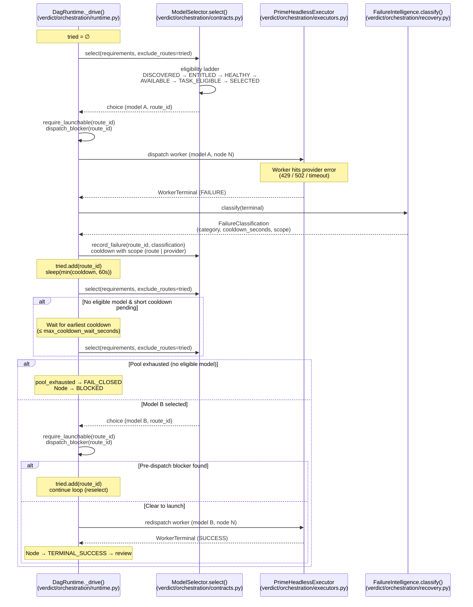

# Failover Sequence — Single Node

What happens when a worker node fails during orchestration execution.
The entire recovery loop is inline in `DagRuntime._drive()`
(`verdict/orchestration/runtime.py`); there is no separate failover engine
or bounded-recovery controller.

**Note:** `ControllerSupervisor` (`verdict/orchestration/supervisor.py`) wraps
the *controller process* via `orchestration/cli.py`, not individual worker
nodes inside the DAG runtime.
