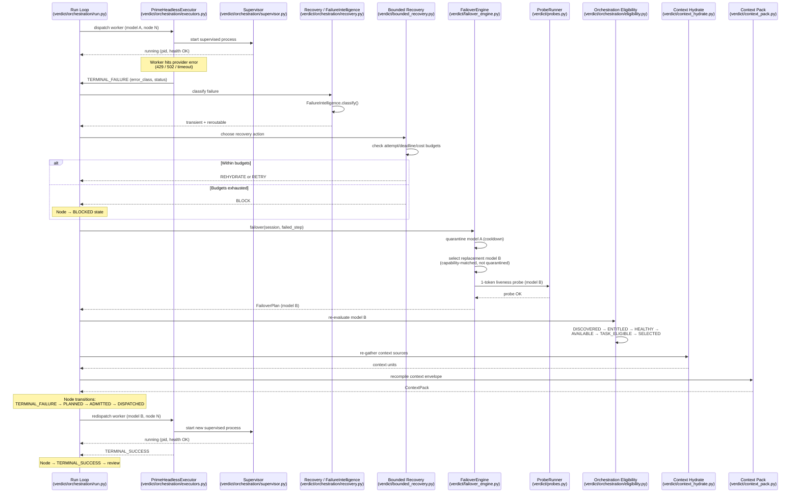

# Failover Sequence — Single Node

What happens when a worker node fails during orchestration execution.

```mermaid
sequenceDiagram
    participant Run as Run Loop<br/>(verdict/orchestration/run.py)
    participant Exec as PrimeHeadlessExecutor<br/>(verdict/orchestration/executors.py)
    participant Sup as Supervisor<br/>(verdict/orchestration/supervisor.py)
    participant Rec as Recovery / FailureIntelligence<br/>(verdict/orchestration/recovery.py)
    participant Bounded as Bounded Recovery<br/>(verdict/bounded_recovery.py)
    participant FE as FailoverEngine<br/>(verdict/failover_engine.py)
    participant Probes as ProbeRunner<br/>(verdict/probes.py)
    participant Elig as Orchestration Eligibility<br/>(verdict/orchestration/eligibility.py)
    participant Hydrate as Context Hydrate<br/>(verdict/context_hydrate.py)
    participant Pack as Context Pack<br/>(verdict/context_pack.py)

    Run->>Exec: dispatch worker (model A, node N)
    Exec->>Sup: start supervised process
    Sup-->>Run: running (pid, health OK)

    Note over Exec: Worker hits provider error<br/>(429 / 502 / timeout)

    Exec->>Run: TERMINAL_FAILURE (error_class, status)
    Run->>Rec: classify failure
    Rec->>Rec: FailureIntelligence.classify()
    Rec-->>Run: transient + reroutable

    Run->>Bounded: choose recovery action
    Bounded->>Bounded: check attempt/deadline/cost budgets
    alt Within budgets
        Bounded-->>Run: REHYDRATE or RETRY
    else Budgets exhausted
        Bounded-->>Run: BLOCK
        Note over Run: Node → BLOCKED state
    end

    Run->>FE: failover(session, failed_step)
    FE->>FE: quarantine model A (cooldown)
    FE->>FE: select replacement model B<br/>(capability-matched, not quarantined)
    FE->>Probes: 1-token liveness probe (model B)
    Probes-->>FE: probe OK

    FE-->>Run: FailoverPlan (model B)

    Run->>Elig: re-evaluate model B
    Elig->>Elig: DISCOVERED → ENTITLED → HEALTHY →<br/>AVAILABLE → TASK_ELIGIBLE → SELECTED

    Run->>Hydrate: re-gather context sources
    Hydrate-->>Run: context units
    Run->>Pack: recompile context envelope
    Pack-->>Run: ContextPack

    Note over Run: Node transitions:<br/>TERMINAL_FAILURE → PLANNED → ADMITTED → DISPATCHED

    Run->>Exec: redispatch worker (model B, node N)
    Exec->>Sup: start new supervised process
    Sup-->>Run: running (pid, health OK)
    Exec-->>Run: TERMINAL_SUCCESS

    Note over Run: Node → TERMINAL_SUCCESS → review
```
