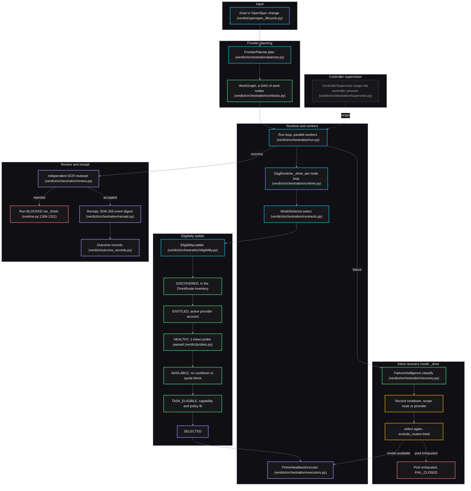

# Goal-to-Receipt Pipeline

How a goal becomes a verified receipt through the orchestration pipeline.

Source: [`diagrams/goal-to-receipt.mmd`](../../diagrams/goal-to-receipt.mmd).
The fenced block below is byte-identical to that file.

