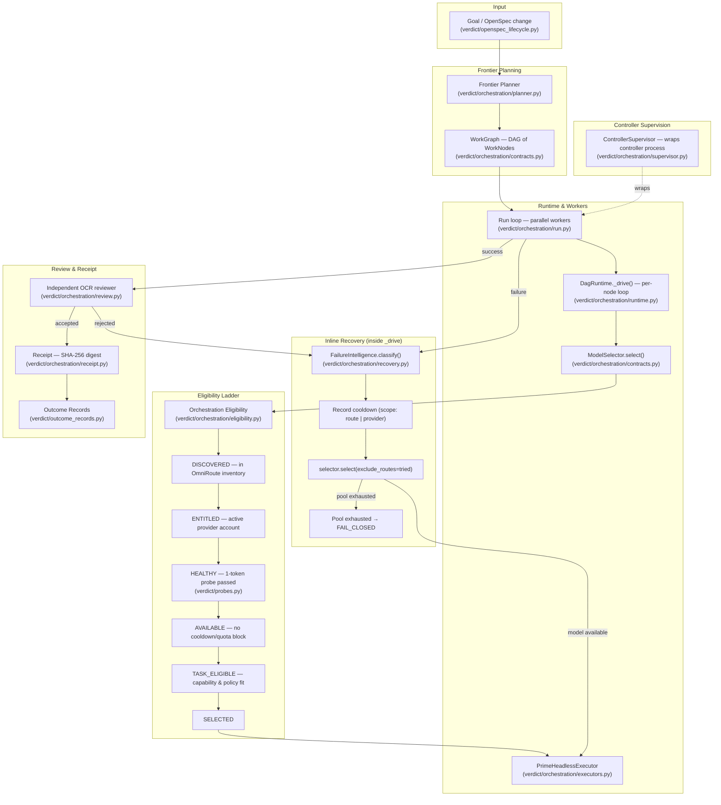

# Goal-to-Receipt Pipeline

How a goal becomes a verified receipt through the orchestration pipeline.

```mermaid
flowchart TD
    subgraph Input
        GOAL["Goal / OpenSpec change\n(verdict/openspec_lifecycle.py)"]
    end

    subgraph Planning ["Frontier Planning"]
        PLANNER["Frontier Planner\n(verdict/orchestration/planner.py)"]
        WORKGRAPH["WorkGraph — DAG of WorkNodes\n(verdict/orchestration/contracts.py)"]
    end

    subgraph Execution ["Runtime & Workers"]
        RUNTIME["DagRuntime._drive() — per-node loop\n(verdict/orchestration/runtime.py)"]
        SELECTOR["ModelSelector.select()\n(verdict/orchestration/contracts.py)"]
        EXECUTORS["PrimeHeadlessExecutor\n(verdict/orchestration/executors.py)"]
        RUN["Run loop — parallel workers\n(verdict/orchestration/run.py)"]
    end

    subgraph Eligibility ["Eligibility Ladder"]
        ELIG["Orchestration Eligibility\n(verdict/orchestration/eligibility.py)"]
        STAGE_D["DISCOVERED — in OmniRoute inventory"]
        STAGE_E["ENTITLED — active provider account"]
        STAGE_H["HEALTHY — 1-token probe passed\n(verdict/probes.py)"]
        STAGE_A["AVAILABLE — no cooldown/quota block"]
        STAGE_T["TASK_ELIGIBLE — capability & policy fit"]
        STAGE_S["SELECTED"]
    end

    subgraph Recovery ["Inline Recovery (inside _drive)"]
        CLASSIFY["FailureIntelligence.classify()\n(verdict/orchestration/recovery.py)"]
        COOLDOWN["Record cooldown (scope: route | provider)"]
        RESELECT["selector.select(exclude_routes=tried)"]
        FAILCLOSED["Pool exhausted → FAIL_CLOSED"]
    end

    subgraph Verification ["Review & Receipt"]
        REVIEW["Independent OCR reviewer\n(verdict/orchestration/review.py)"]
        RECEIPT["Receipt — SHA-256 digest\n(verdict/orchestration/receipt.py)"]
        OUTCOME["Outcome Records\n(verdict/outcome_records.py)"]
    end

    subgraph Controller ["Controller Supervision"]
        SUP["ControllerSupervisor — wraps controller process\n(verdict/orchestration/supervisor.py)"]
    end

    GOAL --> PLANNER
    PLANNER --> WORKGRAPH
    WORKGRAPH --> RUN
    RUN --> RUNTIME
    RUNTIME --> SELECTOR
    SELECTOR --> ELIG
    ELIG --> STAGE_D --> STAGE_E --> STAGE_H --> STAGE_A --> STAGE_T --> STAGE_S
    STAGE_S --> EXECUTORS
    RUN -->|success| REVIEW
    RUN -->|failure| CLASSIFY
    CLASSIFY --> COOLDOWN
    COOLDOWN --> RESELECT
    RESELECT -->|model available| EXECUTORS
    RESELECT -->|pool exhausted| FAILCLOSED
    REVIEW -->|accepted| RECEIPT
    REVIEW -->|rejected| CLASSIFY
    RECEIPT --> OUTCOME
    SUP -.->|wraps| RUN
```
