# Ownership Map

Authority boundaries across Verdict subsystems. Each box names the module that implements it.

```mermaid
flowchart TB
    subgraph Core ["Core — Routing / Admission / Context / Receipts Authority"]
        INTEL["IntelligenceService — route()\n(verdict/intelligence.py)"]
        EGATE["EligibilityGate — evaluate()\n(verdict/eligibility.py)"]
        ROUTER["select_best_eligible_model()\n(verdict/router.py)"]
        ADMISSION["AdmittedSet — admit()\n(verdict/admission.py)"]
        EXEC_PATH["ExecutionPathDecision\n(verdict/execution_path.py)"]
        CONTRACTS["TaskSpec / RoutingDecision\n(verdict/contracts.py)"]
        CONTEXT_PACK["ContextPackCompiler\n(verdict/context_pack.py)"]
        CONTEXT_HYDRATE["Context gather & hydrate\n(verdict/context_hydrate.py)"]
        RECEIPT_STORE["ReceiptStore\n(verdict/receipt_store.py)"]
        RECEIPT_VERIFY["IndependentReceiptVerifier\n(verdict/receipt_verifier.py)"]
        ROUTING_RECEIPT["RoutingReceiptV1\n(verdict/routing_receipt.py)"]
        PROOF["ProofReceipt\n(verdict/proof_receipts.py)"]
        EVIDENCE["EvidenceReceipt\n(verdict/evidence_receipts.py)"]
        ADVISORY["advisory — advise_order()\n(verdict/decision_signals/advisory.py)"]
        OPENJEV["OpenJev — signal extraction\n(verdict/decision_signals/openjev.py)"]
        CALIBRATION["Calibration — shadow/promote\n(verdict/decision_signals/calibration.py)"]
        AVAIL["AvailabilityReport\n(verdict/availability.py)"]
        AVAIL_CACHE["AvailabilityCache — TTL/SWR\n(verdict/availability_cache.py)"]
        CATALOG["Model catalog & filters\n(verdict/catalog.py)"]
        METADATA["Metadata store — models.dev + LiteLLM\n(verdict/metadata/store.py)"]
        PROBES["ProbeRunner — 1-token liveness\n(verdict/probes.py)"]
        FAILOVER_ENG["FailoverEngine\n(verdict/failover_engine.py)"]
        BOUNDED_REC["Bounded recovery policy\n(verdict/bounded_recovery.py)"]
        COST["CostLedger\n(verdict/cost_ledger.py)"]
        CTRL_SEL["Controller selection\n(verdict/controller_selection.py)"]
    end

    subgraph Node ["Node — Envelope Enforcement Only"]
        API["FastAPI server — /v1/route, /v1/chat/completions\n(verdict/api.py)"]
        RELAY["build_attempts() — retry/idempotency\n(verdict/relay.py)"]
        PROXY["UpstreamProxy — HTTP forwarding\n(verdict/proxy.py)"]
        ENFORCEMENT["Enforcement\n(verdict/enforcement.py)"]
    end

    subgraph Cockpit ["Cockpit — Decision & Outcome Log Viewer"]
        DASHBOARD["Streamlit dashboard\n(verdict/dashboard.py)"]
        FIXTURES["Fixture paths\n(verdict/fixture_paths.py)"]
        OUTCOME_LOG["Outcome log reader\n(verdict/outcome_log.py)"]
    end

    subgraph OmniRoute ["OmniRoute — Transport / Inventory Only"]
        OMNI["OmniRouteHTTPTransport\n(verdict/omniroute.py)"]
        OMNI_CAT["OmniRoute catalog stats\n(verdict/omniroute_catalog.py)"]
    end

    subgraph Prime ["Prime — Harness"]
        HARNESS["Prime harness switching\n(verdict/harness_prime.py)"]
        EXECUTORS["PrimeHeadlessExecutor\n(verdict/orchestration/executors.py)"]
        ORCH_RUN["Orchestration run loop\n(verdict/orchestration/run.py)"]
        ORCH_PLAN["Frontier planner\n(verdict/orchestration/planner.py)"]
        ORCH_ELIG["Orchestration eligibility\n(verdict/orchestration/eligibility.py)"]
        ORCH_RECV["Orchestration recovery\n(verdict/orchestration/recovery.py)"]
        ORCH_REV["Independent OCR review\n(verdict/orchestration/review.py)"]
        ORCH_RCPT["Orchestration receipt\n(verdict/orchestration/receipt.py)"]
        ORCH_SUP["Supervisor\n(verdict/orchestration/supervisor.py)"]
        OUTCOME_REC["Outcome records\n(verdict/outcome_records.py)"]
        DISPATCHER["SwarmDispatcher\n(verdict/dispatcher.py)"]
    end

    API -->|"calls"| INTEL
    INTEL -->|"evaluates"| EGATE
    EGATE -->|"ranks"| ROUTER
    ROUTER -->|"reads"| ADMISSION
    API -->|"relays"| RELAY
    RELAY -->|"forwards"| PROXY
    PROXY -->|"transport"| OMNI
    DASHBOARD -->|"reads"| OUTCOME_LOG
    ORCH_RUN -->|"dispatches"| EXECUTORS
    EXECUTORS -->|"uses harness"| HARNESS
    ORCH_RUN -->|"eligibility"| ORCH_ELIG
    ORCH_RUN -->|"recovery"| ORCH_RECV
    ORCH_RUN -->|"review"| ORCH_REV
    ORCH_RUN -->|"receipt"| ORCH_RCPT
```

OpenJev advises only within the admitted set. It never admits, revives drops,
invents identities, or overrides live health/quota/cooldown.
