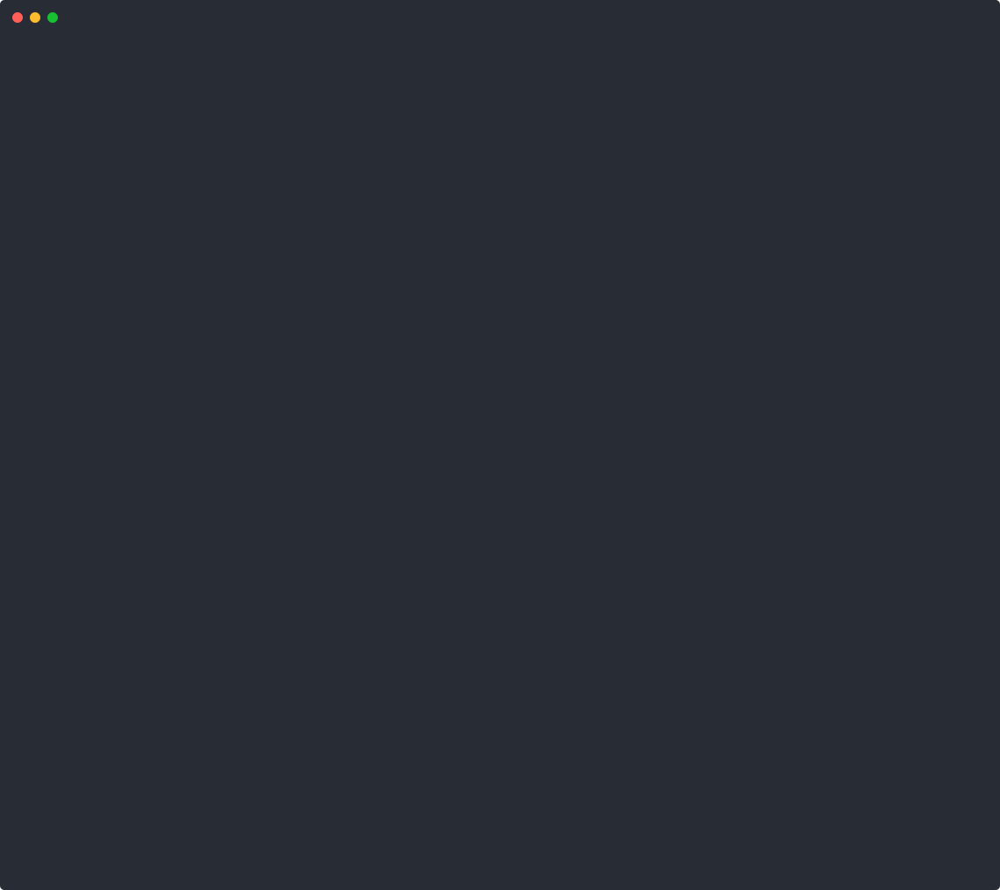

# Offline demo (fixture, no model calls)

> **Offline fixture.** Everything on this page is produced by scripted workers, fixture
> routes and injected faults. No model is called. It is a self-test that shows the
> pipeline mechanics. It is **not** evidence of live behavior, model quality or savings.
> For live evidence, see [Proof from a live run](../../README.md#proof-from-a-live-run)
> and [`docs/proof/`](../proof/).

Fixture route names such as `alpha/claude-a`, `beta/gpt-b`, `gamma/gemini-c`,
`demo-sub/atlas-coder` and `demo/frontier-tools` are invented. They are not real providers.

## Contents

- [Offline intro recording](#offline-intro-recording)
- [`verdict demo` trace](#verdict-demo-trace)
- [Committed fixture run](#committed-fixture-run)
- [Offline TUI walkthrough](#offline-tui-walkthrough)
- [Offline 0.5.0 feature recording](#offline-050-feature-recording)
- [Fixture charts](#fixture-charts)
- [Deterministic mock and offline failover](#deterministic-mock-and-offline-failover)
- [Regenerating the demo assets](#regenerating-the-demo-assets)

## Offline intro recording

<picture><source media="(prefers-reduced-motion: reduce)" srcset="../assets/demo-poster.svg"></picture>

<sub>Fixture run, credential-free, no model calls, replayed at real time. Recorded with <a href="../../scripts/record_tui_demo.py"><code>scripts/record_tui_demo.py --scenario</code></a>. This cast is separate from the three-fault <a href="../proof/demo-run/"><code>docs/proof/demo-run/</code></a> fixture. Full cast: <a href="../assets/demo.cast"><code>docs/assets/demo.cast</code></a>. Still frame: <a href="../assets/demo-poster.svg"><code>docs/assets/demo-poster.svg</code></a>.</sub>

## `verdict demo` trace

`verdict demo` is an **offline scenario** with scripted workers and injected faults. It runs
the real orchestration pipeline (planner, admission, DAG runtime, failure intelligence,
integration barrier, reviewer-independence policy, receipt writer) against fixture routes.
No model is called. The output:

```text
trace  run=offline-flagship-failover
goal: flagship failover test
steps: 34  schema: trace-view-v1

seq   kind            node      detail
--------------------------------------
1     request                   goal=flagship failover test
2     classification            
3     plan                      
4     plan                      
5     routing         node-1    
6     selection       node-1    route=alpha/claude-a
8     routing         node-2    
9     selection       node-2    route=alpha/claude-a
12    dispatch        node-1    
14    context         node-1    
15    terminal        node-1    model=alpha/claude-a  failed
17    failure         node-1    category=rate_limited
18    cooldown        node-1    key=alpha  until=...
20    dispatch        node-2    
22    context         node-2    
23    terminal        node-2    model=alpha/claude-a  ok
26    routing         node-1    
27    selection       node-1    route=beta/gpt-b
28    reassign        node-1    alpha/claude-a -> beta/gpt-b
30    barrier         node-2    
31    verify          node-2    passed=True
33    dispatch        node-1    
35    context         node-1    
36    terminal        node-1    model=beta/gpt-b  ok
38    barrier         node-1    
39    verify          node-1    passed=True
45    terminal        integrate model=(mechanical merge)  ok
47    verify          integrate passed=True
48    barrier         integrate 
50    integrate                 
51    barrier                   
53    review                    attempt 1  reviewer=gamma/gemini-c  PASS
54    review                    verdict  blocking=0  reviewer=gamma/gemini-c  PASS
55    run_finished              outcome=COMPLETE

OFFLINE SCENARIO: scripted workers, injected faults

CLAIMS VERIFIED
------------------------------------------------------------
  + VERIFIED  Task-aware model selection  (event:6, event:9, event:27)
  + VERIFIED  Capability filtering reduced candidate pool  (event:5, event:8, event:26)
  + VERIFIED  Provider/model health considered in routing  (event:5, event:26)
  + VERIFIED  Explicit concrete worker assignment  (event:12, event:20, event:33)
  + VERIFIED  Worker failure isolated from controller  (event:17, event:20, event:55)
  + VERIFIED  Automatic bounded failover  (event:28)
  + VERIFIED  Cooldown recorded  (event:18)
  + VERIFIED  Context assembled within budget  (event:14, event:22, event:35)
  + VERIFIED  Replacement completed successfully on alternate route  (event:36)
  + VERIFIED  Validation passed  (event:31, event:40, event:47)
  + VERIFIED  Independent review passed  (event:54)
  + VERIFIED  Receipt integrity verified  (receipt:verify)
```

What happened: `node-1` was assigned to `alpha/claude-a`, hit an injected `rate_limited`
fault, was cooled down, reassigned to `beta/gpt-b`, and passed. `node-2` ran on
`alpha/claude-a` without fault. An independent reviewer on `gamma/gemini-c` (a route no
worker used) passed the merged result. Each CLAIM VERIFIED line cites the event sequence
numbers that prove it.

The demo is tested in CI ([`tests/test_demo_trace.py`](../../tests/test_demo_trace.py)).

## Committed fixture run

You can also inspect the committed fixture run the same way:

```bash
verdict trace docs/proof/demo-run
verdict run-receipt --runs-dir . docs/proof/demo-run
```

The [`docs/proof/demo-run/`](../proof/demo-run) directory is a verified fixture run with
three injected faults. `run-receipt` recomputes the SHA-256 digest and confirms integrity:

```text
COMPLETE: all implement/integrate nodes validated, barrier ok, review PASS
integrity: OK (events digest verified)
  parser             VALIDATED        demo-sub/atlas-coder[failure:quota_exhausted*] -> demo-free/birch-coder[failure:rate_limited*] -> demo-free2/elm-coder[success]
  cli_flag           VALIDATED        demo-sub/atlas-coder[failure:no_final_answer*] -> demo-free/cedar-coder[success]
  integrate          VALIDATED        merge[success]
  review: PASS by fixture-reviewer (no model call) on demo-metered/delta-coder
```

`*` marks an injected fault. `parser` started on the subscription route, hit an injected quota
fault, moved to a free route, hit an injected rate limit, then passed on a third provider.
`cli_flag` got `no_final_answer` and moved to another free route. The review went to the only
admitted candidate left (metered) because all cooled providers and routes without tool calling
were excluded.

Source: [`scripts/demo_orchestrate.py`](../../scripts/demo_orchestrate.py).
Test: [`tests/test_readme_assets.py`](../../tests/test_readme_assets.py).

## Offline TUI walkthrough

**Recorded TUI walkthrough** (offline scenario: scripted workers, one injected fault, failover to another route, a scripted review PASS, then a receipt check and a tampered copy that fails it)

<picture><source media="(prefers-reduced-motion: reduce)" srcset="../assets/demo-tui-poster.svg"></picture>

<sub>Offline scenario, no model calls: scripted workers, a scripted reviewer, and an injected rate limit, replayed at 1x from the recorded terminal timing (gaps over 1.5 s capped). It opens on the Verdict home, plays the cockpit to COMPLETE, then runs `verdict run-receipt` on the run (integrity OK, exit 0) and on a copy with one event byte changed (digest mismatch, exit 1). Recorded with `python scripts/record_tui_demo.py --scenario --speed 1`. The live-model evidence is the [proof bundle above](../../README.md#proof-from-a-live-run); replay a real run yourself with `verdict watch docs/proof/live-controller-run --replay --speed 1`. Still frame: [`docs/assets/demo-tui-poster.svg`](../assets/demo-tui-poster.svg).</sub>

## Offline 0.5.0 feature recording

<picture><source media="(prefers-reduced-motion: reduce)" srcset="../assets/verified-models-poster.svg"></picture>

<sub>Offline scenario, fixture health cache, no live calls: the demo gateway is a loopback-only fixture HTTP server started by the recorder itself. Recorded with <a href="../../scripts/record_verified_demo.py"><code>scripts/record_verified_demo.py</code></a>. Full cast: <a href="../assets/verified-models.cast"><code>docs/assets/verified-models.cast</code></a>.</sub>

## Fixture charts


<sub>Data: [`docs/proof/demo-run/admission.json`](../proof/demo-run/admission.json), the canonical admission receipt of the demo inventory. Fixture data.</sub>


<sub>Data: [`docs/proof/demo-run/receipt.json`](../proof/demo-run/receipt.json), the demo run receipt. Fixture data with injected faults.</sub>


<sub>Data: [`benchmarks/fixtures/legit_paired_savings.json`](../../benchmarks/fixtures/legit_paired_savings.json). Fixture values
stated for the offline simulation, not observed. The bench refuses to claim savings from them
(`claims_allowed=false`); see [`docs/benchmarks/paired-savings.md`](../benchmarks/paired-savings.md) for what a live claim requires.</sub>

## Deterministic mock and offline failover

**Deterministic mock — no provider spend.**

```bash
uv run python -m verdict.routing_demo --mock
```

The deterministic mock compares 100 requests using fixed price estimates against a
class-aware route. See [`docs/benchmarks/routing-demo.md`](../benchmarks/routing-demo.md)
for the baseline definition and live/recorded limitations.

**Failover holds without a network.**

```bash
uv run python -m verdict failover-proof --memory-path /tmp/verdict-failover.db --json
VERDICT_MEMORY_DB=/tmp/verdict-failover.db uv run python -m verdict replay <session-id> --json
```

## Regenerating the demo assets

All assets come from committed code and committed data. None of the tools below is a project dependency.

| Asset | Size | Source data | Regenerate |
|---|---|---|---|
| [`docs/proof/demo-run/`](../proof/demo-run) | ~35 KB | fixture inventory in `scripts/demo_orchestrate.py` | `python scripts/demo_orchestrate.py --out docs/proof/demo-run` |
| [`docs/assets/demo.cast`](../assets/demo.cast) | ~1 MB | separate offline scenario with an injected rate limit, recorded in a pty | `python scripts/record_tui_demo.py --scenario --speed 1` (stdlib only; does not regenerate `docs/proof/demo-run/`) |
| [`docs/assets/demo.svg`](../assets/demo.svg) | ~165 KB | `demo.cast` | `python scripts/render_demo_svg.py docs/assets/demo.cast docs/assets/demo.svg docs/assets/demo-poster.svg` |
| [`docs/assets/demo-poster.svg`](../assets/demo-poster.svg) | ~22 KB | first COMPLETE cockpit frame of `demo.cast` | same command as `demo.svg` |
| [`docs/assets/demo-tui.cast`](../assets/demo-tui.cast) | ~1 MB | offline scenario (scripted workers, injected fault), replayed at 1x; gaps over 1.5 s capped | `python scripts/record_tui_demo.py --scenario --speed 1` |
| [`docs/assets/demo-tui.svg`](../assets/demo-tui.svg) | ~290 KB | `demo-tui.cast` | `python scripts/render_demo_svg.py docs/assets/demo-tui.cast docs/assets/demo-tui.svg docs/assets/demo-tui-poster.svg` |
| [`docs/assets/demo-tui-poster.svg`](../assets/demo-tui-poster.svg) | ~23 KB | first COMPLETE cockpit frame of `demo-tui.cast` | same command as `demo-tui.svg` |
| `docs/assets/chart-*.svg` | ~65-95 KB each (text as paths) | `docs/proof/demo-run/*.json`, `benchmarks/fixtures/legit_paired_savings.json` | `uv run --with matplotlib==3.10.* --no-project python scripts/render_charts.py` |
| [`docs/assets/verified-models.cast`](../assets/verified-models.cast) | ~45 KB | offline, fixture health cache (no live calls); shows `/eligibility`, Tab-completion of `/bootstrap prime`, a Prime picker preview answered N, and `/bootstrap claude` | `python scripts/record_verified_demo.py` |
| [`docs/assets/verified-models.svg`](../assets/verified-models.svg) | ~250 KB | `verified-models.cast` | `python scripts/render_demo_svg.py docs/assets/verified-models.cast docs/assets/verified-models.svg docs/assets/verified-models-poster.svg` |
| [`docs/assets/verified-models-poster.svg`](../assets/verified-models-poster.svg) | ~20 KB | final frame of `verified-models.cast` | same command as `verified-models.svg` |

The recording's typing and line pacing are synthetic. Its text is the real output of each command.
[`tests/test_readme_assets.py`](../../tests/test_readme_assets.py) checks that every linked asset and chart
source exists, that the cast is valid asciinema v2, and that the committed demo run still verifies.
